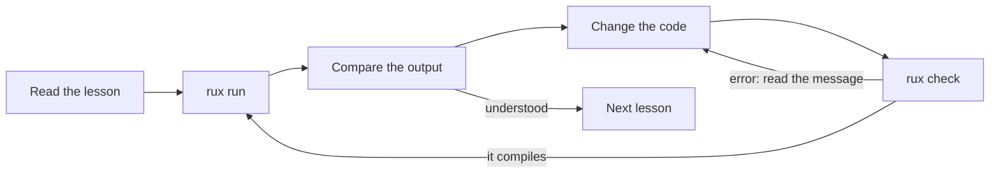

# Learn Rux

::warning
Rux is still in active development. As the language matures some syntax and features may change, and the course changes with it — every lesson is checked against the current compiler.
::

Welcome to Rux — a fast, compiled, strongly typed, multi-paradigm language that ships as a single small binary. This course takes you from installing the toolchain to writing complete programs. It assumes no Rux at all, and only a little programming: if you know what a variable and a loop are, you are ready.

## How the course works

Every lesson teaches **one idea** and is backed by **one small package** in the [Rux Examples repository](https://github.com/rux-lang/Examples). The package is a real program: it compiles, it runs, and its comments explain each line. A lesson page walks you through that program, shows what it prints, and points out the mistakes beginners usually make.

- **Read** the lesson page, top to bottom.
- **Run** the package with `rux run` and compare the output with the page.
- **Change** something — a value, a condition, a type — and run it again. Breaking a program on purpose and reading the compiler's message is one of the fastest ways to learn.
- **Move on** with the _Next_ link at the bottom of the page. Each lesson lists the lessons it needs, so you can also jump around.

## The road map

Parts 1–17 build the language step by step and are best read in order. Parts 18–24 tour the standard packages: once the language parts are done, take them in any order. Part 25 holds complete small programs, each one a _checkpoint_ you can attempt as soon as you have finished the part marked with its flag.

:learn-roadmap

## Start here

::steps{level="3"}

### Install the toolchain

Install `rux` on [Windows](/docs/learn/install/windows), [Linux](/docs/learn/install/linux), [macOS](/docs/learn/install/macos) or [FreeBSD](/docs/learn/install/freebsd) — or [build it from source](/docs/learn/build) on any other platform. Prebuilt binaries cover x86-64 and AArch64.

### Set up your editor

Add Rux syntax highlighting to [Visual Studio Code](/docs/learn/editors/vscode), [Sublime Text](/docs/learn/editors/sublime) or [Zed](/docs/learn/editors/zed).

### Build your first project

[Create, build and run a project](/docs/learn/first-project) of your own, then clone the Examples repository the lessons are built on.

### Take the first lesson

Start with [1.1 Hello, World](/docs/learn/hello) and follow the _Next_ links from there.

::

::tip
**No install yet?**\
The [Playground](/play) runs the compiler in your browser. Paste any snippet from a lesson to try it straight away.
::

## Checkpoint projects

Each project in Part 25 combines what the earlier parts taught into one complete program. Try to write it yourself first, then compare with the lesson.

| After            | Projects                                                                                                           |
| ---------------- | ------------------------------------------------------------------------------------------------------------------ |
| 3. Control flow  | [Thanks](/docs/learn/thanks), [FizzBuzz](/docs/learn/fizz-buzz)                                                    |
| 4. Functions     | [Temperature](/docs/learn/temperature)                                                                             |
| 5. Sequences     | [Prime](/docs/learn/prime)                                                                                         |
| 9. Errors        | [Calculator](/docs/learn/calculator)                                                                               |
| 16. Numbers      | [Circle](/docs/learn/circle), [Quadratic](/docs/learn/quadratic)                                                   |
| 17. Collections  | [Word count](/docs/learn/word-count), [Inventory](/docs/learn/inventory)                                           |
| 18. Algorithms   | [Statistics](/docs/learn/statistics)                                                                               |
| 20. Utilities    | [Guess](/docs/learn/guess), [Age](/docs/learn/age), [Password](/docs/learn/password), [Launch](/docs/learn/launch) |
| 21. Data formats | [Notes](/docs/learn/notes)                                                                                         |
| 24. Platform     | [Melody](/docs/learn/melody)                                                                                       |

## Learn with an AI assistant

Claude Code, Codex and similar coding assistants make good study partners: they can explain a lesson line by line, quiz you, and review your own version of a program. Rux is a new language, so they need a little context first — [Learn Rux with AI](/docs/learn/ai) shows how to set that up. Every lesson page also has **Copy page** and **Open in Claude / ChatGPT** buttons that hand the lesson to an assistant for you.

## Going further

The course teaches by example. When you want the full rules, the [Rux Reference](/docs/lang) specifies the language, the [CLI Reference](/docs/cli) documents every `rux` command, and the [API Reference](/docs/api) lists the standard packages. The [cheat sheet](/docs/learn/cheatsheet) puts the syntax from the whole course on one page.
