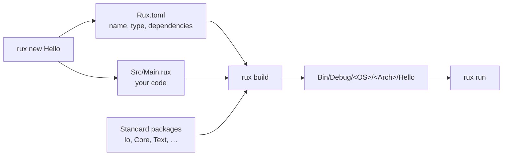

# Your First Project

This page takes you from an empty folder to a running program, and then sets up the [Examples repository](https://github.com/rux-lang/Examples) that every lesson of the course is built on. It assumes `rux` is [installed](/docs/learn/install/windows) and on your `PATH`; check with:

```sh
rux --version
```

## How a Rux project is built

Rux code lives in **packages**. A package is a folder with a manifest, `Rux.toml`, that names the package and lists what it depends on, and a `Src/` folder with the source files. The `rux` tool reads the manifest, compiles the sources together with their dependencies, and writes the program into `Bin/`.



## 1. Create the project

```sh
rux new Hello
cd Hello
```

`rux new` creates three files:

```
Hello/
├── .gitignore      ignores the Bin/ and Temp/ build folders
├── Rux.toml        the package manifest
└── Src/
    └── Main.rux    the program
```

The generated program is the smallest one Rux accepts — a `Main` function that does nothing and reports success:

```rux [Src/Main.rux]
func Main() -> int {
    return 0;
}
```

`Main` is the program's [entry point](/docs/lang/functions/main). The `int` it returns becomes the process exit status, and `0` means _success_.

## 2. Print a line

To print you need `PrintLine`, which lives in the standard `Io` package. A package can only use what its manifest lists, so first add `Io` to `Rux.toml`:

```toml [Rux.toml]
[Manifest]
Version = 1

[Package]
Name = "Hello"
Version = "0.1.0"
Type = "Executable"

[Dependencies]
Io = { Namespace = "Rux", Version = "*" }
```

`Namespace = "Rux"` marks `Io` as one of the standard packages that ship with the compiler, and `Version = "*"` accepts whichever version is installed. Now replace `Src/Main.rux`:

```rux [Src/Main.rux]
import Io::PrintLine;

func Main() -> int {
    PrintLine("Hello, World!");
    return 0;
}
```

`import Io::PrintLine;` brings one function from the `Io` package into scope, so the program can call it by its short name.

## 3. Build and run

```sh
rux run
```

```
Hello, World!
```

`rux run` builds the package if anything changed and then starts the program. To only compile, use `rux build`; it reports where the executable went:

```
Built Hello (Debug, Windows x86-64) in 525 ms
  Output: Bin\Debug\Windows\x86-64\Hello.exe
```

Two more commands you will use all the time:

| Command             | What it does                                                         |
| ------------------- | -------------------------------------------------------------------- |
| `rux check`         | Compiles without writing a program — the fastest way to find errors. |
| `rux run --release` | Builds an optimised program into `Bin/Release/` and runs it.         |

The [CLI Reference](/docs/cli) documents every command and flag.

## 4. Read your first error

Delete the semicolon after `PrintLine("Hello, World!")` and run `rux check`:

```
Src\Main.rux:5:5: error: expected ';' after expression, but found 'return'
  5 |     return 0;
    |     ^
  note: compiler phase: Parsing
```

Every message names the file, line and column, quotes the line, and points at the spot. Here the compiler reached `return` while still waiting for the `;` that ends the previous statement. Put the semicolon back and the error goes away.

::tip
**Make mistakes on purpose.**\
Throughout the course, when a lesson says "the compiler refuses this", try it. Reading real error messages is a large part of learning a language, and the lessons quote the exact messages so you know what to expect.
::

## 5. Get the course examples

Every lesson is a package in the [Rux Examples repository](https://github.com/rux-lang/Examples). Clone it once:

```sh
git clone https://github.com/rux-lang/Examples.git
cd Examples
```

The repository is organised by course part, one folder per lesson:

```
Examples/
├── Basics/
│   ├── Hello/
│   │   ├── README.md     the lesson's goal and expected output
│   │   ├── Rux.toml
│   │   └── Src/
│   │       └── Main.rux  the program, explained in its comments
│   ├── Comment/
│   └── …
├── ControlFlow/
├── …
├── Projects/
├── Run.ps1               check or test every lesson (PowerShell)
└── Run.sh                the same for POSIX shells
```

To run a lesson, move into its folder and run it:

```sh
cd Basics/Hello
rux run
```

To check that every lesson compiles with your installed `rux` — useful after upgrading — use the runner script from the repository root:

::code-group

```powershell [Windows]
./Run.ps1 check
./Run.ps1 test -Filter Basics
```

```sh [Linux / macOS / FreeBSD]
sh Run.sh check
sh Run.sh test --filter Basics
```

::

`check` type-checks every package; `test` also runs them and reports any that exit with an error.

## Next

You are set up. Start the course with [1.1 Hello, World](/docs/learn/hello) — or, if you would like an AI assistant to study with, read [Learn Rux with AI](/docs/learn/ai) first.
