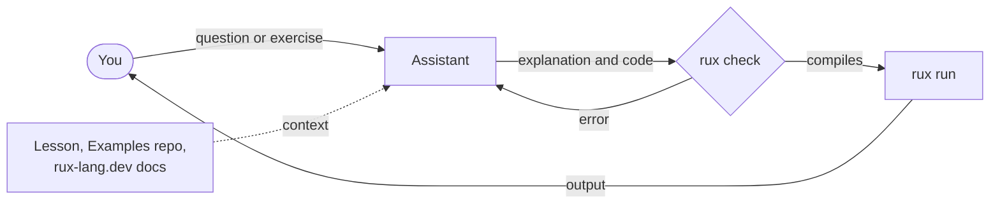

# Learn Rux with AI

A coding assistant makes a patient study partner. It can explain a lesson line by line, answer "why?" as often as you ask, quiz you, invent exercises, and review the program you wrote. This page shows how to use one with the course — and how to avoid its one big weakness with a language as new as Rux.

## The one rule: the compiler has the last word

Assistants learned to program from millions of examples in older languages, and very few in Rux. Left to guess, they fill gaps with Rust, C or Swift — a `_` default arm where Rux wants `else`, a `fn` where Rux writes `func`, a library function that does not exist. Three habits keep you safe:

1. **Give the assistant Rux context** — the lesson, the Examples repository, the documentation. The setup below does this.
2. **Ask it to run `rux check`** on anything it writes, and to fix what the compiler reports.
3. **Trust the compiler and the docs over the assistant.** When they disagree, the assistant is wrong — and working out _why_ teaches you more than the right answer would.



## Option 1: a coding agent in the Examples repository

A coding agent runs in your terminal or editor, reads the files in the folder you open it in, and can run commands such as `rux check` and `rux run` itself. Open it in the [Examples repository](https://github.com/rux-lang/Examples) and every lesson is already in its reach.

### Install an agent

::tabs

:::tabs-item{label="Claude Code" icon="i-simple-icons-anthropic"}

[Claude Code](https://claude.com/claude-code) is Anthropic's coding agent. It needs a Claude subscription or a Claude Console account.

::::code-group

```sh [macOS / Linux]
curl -fsSL https://claude.ai/install.sh | bash
```

```powershell [Windows]
irm https://claude.ai/install.ps1 | iex
```

::::

Then start it inside the repository with `claude`. Claude Code is also available as a desktop app and as extensions for VS Code and JetBrains IDEs — see the [Claude Code documentation](https://code.claude.com/docs).

:::

:::tabs-item{label="Codex" icon="i-simple-icons-openai"}

[Codex](https://developers.openai.com/codex) is OpenAI's coding agent. It signs in with a ChatGPT account.

::::code-group

```sh [npm]
npm install -g @openai/codex
```

```sh [macOS / Linux]
curl -fsSL https://chatgpt.com/codex/install.sh | sh
```

```powershell [Windows]
powershell -ExecutionPolicy ByPass -c "irm https://chatgpt.com/codex/install.ps1 | iex"
```

::::

Then start it inside the repository with `codex`. Codex also has an IDE extension — see the [Codex documentation](https://developers.openai.com/codex) and the [source on GitHub](https://github.com/openai/codex).

:::

::

### Open the course in it

```sh
git clone https://github.com/rux-lang/Examples.git
cd Examples
claude        # or: codex
```

The repository root carries an `AGENTS.md` file — Codex reads it automatically, and Claude Code reads it through the repository's `CLAUDE.md`. It tells the agent what Rux is, how the course is laid out, which syntax differs from the languages it knows, and to verify everything with `rux check`. You do not have to explain any of that yourself.

### Add the Rux skill (optional)

The Examples repository also publishes a Rux _skill_: a compact reference an agent loads when it works with Rux code, in any project. Install it once and your agent knows Rux everywhere, not just inside the course:

```sh
npx skills add rux-lang/Examples
```

## Option 2: a chat assistant, straight from a lesson

You do not need to install anything to study with a chat assistant. Every lesson page has a **Copy page** button and a menu next to it:

- **Open in Claude** or **Open in ChatGPT** starts a conversation that already points the assistant at the lesson and its program, and asks it to explain the lesson and check your understanding.
- **Copy page** puts the lesson's Markdown on your clipboard, to paste into any assistant you like.

A chat assistant cannot run the compiler for you, so paste what it writes into a lesson package — or the [Playground](/play) — and check it yourself.

## Prompts that work

Copy these into your agent, replacing the lesson name. Each one keeps the assistant tied to the course and the compiler.

**Explain a lesson**

```
Read the lesson in ControlFlow/DoWhile (README.md and Src/Main.rux).
Explain the program step by step for a beginner, then ask me one
question at a time to check I understood. Do not move on until I answer.
```

**Practise**

```
Give me a small exercise that uses only what lessons 1.1 to 3.5 teach.
Do not show a solution. When I say I am done, read my code, run
rux check and rux run in that folder, and review it.
```

**Understand an error**

```
I ran rux check in Basics/Convert and got the error below. Explain what
the compiler means in plain words and give me a hint — not the fix.

<paste the error>
```

**Compare with a language you know**

```
I know Python. Compare how Rux handles optional values (lessons in
Optionals/) with Python's None. Only use Rux syntax that appears in
this repository, and point to the lesson for each claim.
```

**Review your own program**

```
Here is my FizzBuzz solution in Projects/MyFizzBuzz. Run rux check,
then review it against Projects/FizzBuzz: what is idiomatic Rux, what
is not, and why?
```

::tip
**Ask for hints, not answers.**\
An assistant that writes every exercise for you teaches you to read code, not to write it. Ask it to wait for your attempt, to give the smallest useful hint, and to explain its reasoning — then type the code yourself.
::

## Context for any assistant

When you work outside the Examples repository, point your assistant at these:

| Source                                                               | What it gives the assistant                                    |
| -------------------------------------------------------------------- | -------------------------------------------------------------- |
| [Learn Rux](/docs/learn)                                             | This course, lesson by lesson                                  |
| [github.com/rux-lang/Examples](https://github.com/rux-lang/Examples) | Every lesson as a package that compiles with the current `rux` |
| [Rux Reference](/docs/lang)                                          | The full language rules                                        |
| [API Reference](/docs/api)                                           | The standard packages and their functions                      |

## Next

Start the course with [1.1 Hello, World](/docs/learn/hello), with or without a study partner.
