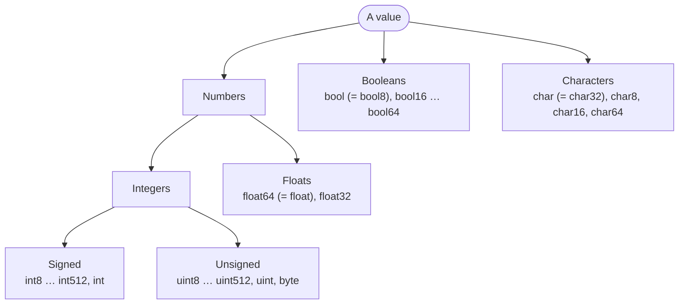

# Part 1: Basics

Your first programs: printing, naming values, and the types those values have. By the end of this part you can write a program that prints a formatted report of numbers, characters and text — and you will have met the compiler's error messages often enough to read them without fear.

## What you will learn

- The shape of every Rux program: `import`, `func Main() -> int`, and the exit status.
- Comments of all three kinds, including documentation comments.
- Naming values with `let`, `var` and `const`, and when to use each.
- The primitive types — integers, floats, booleans and characters — and how literals get their types.
- Printing values with `Print`, `PrintLine` and `{}` placeholders.
- Converting between types with `as`, and what happens when a value does not fit.

## The primitive types at a glance



## Lessons

<!-- sync:lessons:start -->

|      | Lesson                             | What you will learn                                                                     |
| ---- | ---------------------------------- | --------------------------------------------------------------------------------------- |
| 1.1  | [Hello, World](/docs/learn/hello)  | print "Hello, World!", the minimal Rux application                                      |
| 1.2  | [Comment](/docs/learn/comment)     | explain code with `//` and `/* */` comments, which can nest                             |
| 1.3  | [Variable](/docs/learn/variable)   | name a value with `let`, and let the compiler infer its type                            |
| 1.4  | [Mutable](/docs/learn/mutable)     | declare a binding with `var` so it can be reassigned                                    |
| 1.5  | [Integer](/docs/learn/integer)     | whole numbers: signed and unsigned widths, `int` and `uint`                             |
| 1.6  | [Float](/docs/learn/float)         | fractional numbers: `float32`, `float64`, and why `0.1 + 0.2` is not `0.3`              |
| 1.7  | [Boolean](/docs/learn/boolean)     | `true`, `false` and the `bool` type                                                     |
| 1.8  | [Character](/docs/learn/character) | single characters, character literals and the `char` type                               |
| 1.9  | [Literal](/docs/learn/literal)     | write numbers in other bases, with separators and suffixes                              |
| 1.10 | [Console](/docs/learn/console)     | write to the console with `Print` and `PrintLine`, and fill `{}` placeholders           |
| 1.11 | [Const](/docs/learn/const)         | name a value the compiler folds in, and see where it differs from `let`                 |
| 1.12 | [Convert](/docs/learn/convert)     | convert between numeric types with `as`, and see what a value that does not fit becomes |

<!-- sync:lessons:end -->

## Before you start

You need `rux` installed and the Examples repository cloned — [Your first project](/docs/learn/first-project) covers both. Each lesson's package is in the repository's `Basics/` folder:

```sh
cd Examples/Basics/Hello
rux run
```

## After this part

[Part 2: Operators](/docs/learn/operators) combines the values you can now name into new ones, and [Part 3: Control flow](/docs/learn/control-flow) makes programs choose and repeat. After Part 3 you are ready for the first checkpoint projects, [Thanks](/docs/learn/thanks) and [FizzBuzz](/docs/learn/fizz-buzz).

For the full rules behind this part, see [Variables](/docs/lang/variables/overview), [Literals](/docs/lang/lexical/literals) and the [primitive types](/docs/lang/appendix/primitives) in the Rux Reference.
