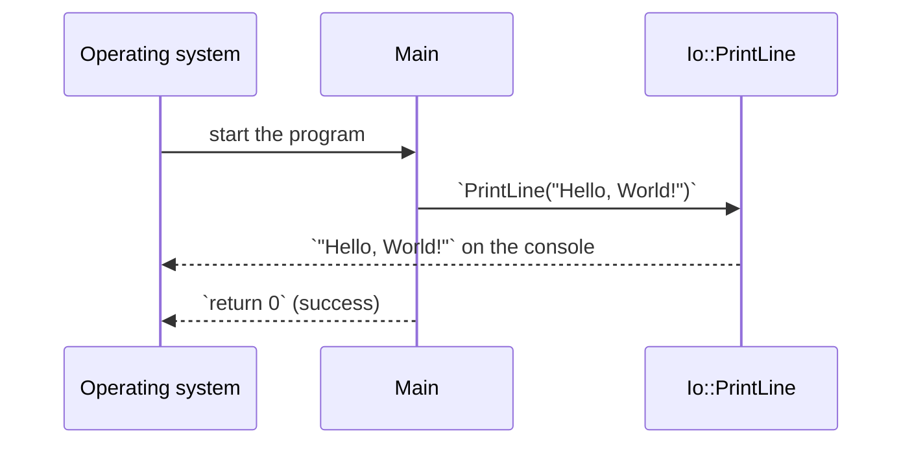

# Hello, World

::note
<!-- sync:needs:start -->

**You'll need**: nothing — this is the first lesson.
<!-- sync:needs:end -->

::

Every programming course starts by printing one line, and for good reason: it proves the whole toolchain works — the compiler, the standard library and your terminal — before you write anything harder. This lesson's program is only four lines, but each one shows something you will use in every Rux program you write.

## Anatomy of a program

```rux
import Io::PrintLine;

func Main() -> int {
    PrintLine("Hello, World!");
    return 0;
}
```

| Line                          | What it does                                                                    |
| ----------------------------- | ------------------------------------------------------------------------------- |
| `import Io::PrintLine;`       | Brings the name `PrintLine` from the standard `Io` package into this file.      |
| `func Main() -> int {`        | Declares the function `Main`, where every program starts. It returns an `int`.  |
| `PrintLine("Hello, World!");` | Calls `PrintLine` with one piece of text. It prints the text and ends the line. |
| `return 0;`                   | Ends `Main` and hands `0` back to the operating system: _success_.              |

Statements end with a semicolon, and a function's body sits between braces.

## Imports and dependencies

`PrintLine` is not built into the language. It lives in `Io`, one of the standard packages that ship with the compiler. Two things make it usable:

1. The package's manifest, `Rux.toml`, lists `Io` under `[Dependencies]`:

   ```toml
   [Dependencies]
   Io = { Namespace = "Rux", Version = "*" }
   ```

2. The source file imports the name it needs with `import Io::PrintLine;`. The `::` separates the package from the name inside it.

Together they keep every dependency visible: the manifest says which packages a program uses, and each file says which names it takes from them.

## Main and the exit status

When the program starts, the operating system calls `Main`. When `Main` returns, the number it returns becomes the program's **exit status** — the value scripts and other programs see. By convention `0` means the program succeeded and anything else means it failed.



You can see the exit status yourself. Run the program, then ask the shell for it — `echo $?` in Bash or zsh, `$LASTEXITCODE` in PowerShell. Change `return 0;` to `return 3;`, run again, and the shell reports 3.

## The program

The whole lesson is one package in the [Examples repository](https://github.com/rux-lang/Examples/tree/main/Basics/Hello). Its comments explain every step.

<!-- sync:program:start -->

```rux [Src/Main.rux]
// The smallest complete Rux program: an import, an entry point and one line of output. Running
// `rux run` in this directory builds the program and then runs it.
//
// `import` brings a name from another package into this file. `PrintLine` lives in `Io`, the
// standard input and output package, and the `[Dependencies]` table in Rux.toml is what makes
// `Io` available to import from.
import Io::PrintLine;

// `Main` is where every program starts. The `int` it returns is the exit status, and zero means
// the program finished successfully.
func Main() -> int {
    // `PrintLine` writes the text in the quotes and then ends the line.
    PrintLine("Hello, World!");
    return 0;
}
```

<!-- sync:program:end -->

## Run it

```sh
cd Examples/Basics/Hello
rux run
```

<!-- sync:output:start -->

```
Hello, World!
```

<!-- sync:output:end -->

## Common mistakes

::mistake
**Forgetting the dependency.**\
Remove the `Io = …` line from `Rux.toml` and the import has nothing to import from. The compiler says the package `Io` is not listed in `[Dependencies]` and suggests adding it.
::

::mistake
**Leaving out a semicolon.**\
`PrintLine("Hello, World!")` with no `;` makes the compiler stop at the next line:

```text
error: expected ';' after expression, but found 'return'
```

The error points at the token _after_ the gap, so look one line up.
::

## Try it yourself

1. Print your own name on a second line, with a second `PrintLine` call.
2. Make `Main` return `1`, run the program and read the exit status in your shell.
3. Change `import Io::PrintLine;` to `import Io::Print;` and replace both calls with `Print`. What happens to the line breaks? The [Console](/docs/learn/console) lesson explains it.

## Learn more

- [The `Main` function](/docs/lang/functions/main) in the Rux Reference
- [Imports](/docs/lang/modules/imports) and [modules](/docs/lang/modules/overview)
- [Your first project](/docs/learn/first-project) — create this package yourself with `rux new`
