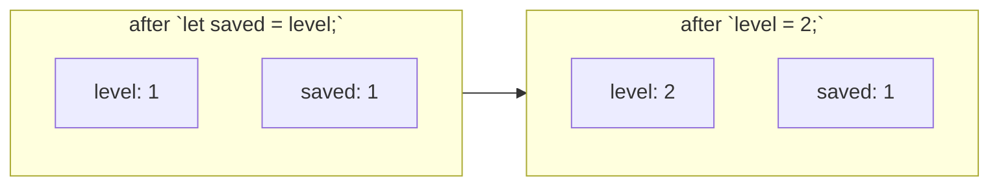

# Mutable

::note
<!-- sync:needs:start -->

**You'll need**: [Variable](/docs/learn/variable)
<!-- sync:needs:end -->

::

A `let` variable keeps its first value for good. A `var` variable may change: after it is declared, `=` gives it a new value as often as the program needs. That is the whole difference — and the reason `let` is the default. Writing `var` tells the reader "watch this name, it moves".

## Declaring and assigning

`var` is declared exactly like `let`, with the type inferred the same way. Assignment then replaces the value:

```rux
var score = 10;
score = 25;
score = score + 5;
```

The right-hand side is worked out first, so `score = score + 5` reads the old value (25) and stores the new one (30).

## Declaring now, assigning later

A `var` may be declared with a type and no value — as long as it gets one before anything reads it:

```rux
var bonus: int;
bonus = score * 2;
```

## Assignment copies the value

`saved` takes the value `level` holds _at that moment_. Changing `level` afterwards does not reach back into it:

```rux
var level = 1;
let saved = level;
level = 2;
```



Each variable owns its own copy. Later, the [Ownership](/docs/learn/copy) part shows what happens with larger values, and how to _move_ one instead of copying it.

## let or var?

| Use   | When                                                             |
| ----- | ---------------------------------------------------------------- |
| `let` | The value is set once — most variables.                          |
| `var` | The value has to change: a counter, a running total, a position. |

Start with `let`. If the compiler tells you a variable needs to change, switch that one to `var`.

## The program

The whole lesson is one package in the [Examples repository](https://github.com/rux-lang/Examples/tree/main/Basics/Mutable). Its comments explain every step.

<!-- sync:program:start -->

```rux [Src/Main.rux]
// A `let` variable keeps its first value for good. A `var` variable may change: after it is
// declared, `=` gives it a new value, as often as the program needs. That is the whole difference,
// and it is why `let` is the default — `var` says "watch this name, it moves".
import Io::PrintLine;

func Main() -> int {
    // `var` is declared exactly like `let`, and its type is inferred the same way.
    var score = 10;
    PrintLine("score   {}", score);

    // Assignment replaces the value. The right-hand side is worked out first, so it may use the
    // variable's own old value.
    score = 25;
    PrintLine("score   {}", score);
    score = score + 5;
    PrintLine("score   {}", score);

    // A `var` may be declared with a type and no value, so long as it is given one before
    // anything reads it.
    var bonus: int;
    bonus = score * 2;
    PrintLine("bonus   {}", bonus);

    // Assigning copies the value. `saved` took the 1 that `level` held at that moment, and
    // changing `level` afterwards does not reach back into it.
    var level = 1;
    let saved = level;
    level = 2;
    PrintLine("level   {}", level);
    PrintLine("saved   {}", saved);

    // What may change is the value, never the type. `score` became an `int` when it was declared
    // and stays one, and a variable cannot be read before it has a value:
    //
    //     score = 2.5;
    //         error: cannot assign 'float64' to 'int'
    //
    //     var total: int;
    //     PrintLine("{}", total);
    //         error: variable 'total' is used before it is initialized
    return 0;
}
```

<!-- sync:program:end -->

## Run it

```sh
cd Examples/Basics/Mutable
rux run
```

<!-- sync:output:start -->

```
score   10
score   25
score   30
bonus   60
level   2
saved   1
```

<!-- sync:output:end -->

## Common mistakes

::mistake
**Changing the type.**\
The value of a `var` may change; its type never does. `score` became an `int` when it was declared, so `score = 2.5;` fails with:

```text
error: cannot assign 'float64' to 'int'
```
::

::mistake
**Reading a variable before it has a value.**\
`var total: int;` followed by `PrintLine("{}", total);` fails with:

```text
error: variable 'total' is used before it is initialized
```
::

## Try it yourself

1. Start a `var count = 0;`, add 1 to it three times, and print it after each step.
2. Declare `var message: char8[..];` with no value, assign it on the next line, and print it.
3. Change `var score` back to `let score` and read the message the compiler gives for the first assignment.

## Learn more

- [`var`](/docs/lang/bindings/overview#var) and [mutability](/docs/lang/bindings/overview#mutability) in the Rux Reference
- [Assignment](/docs/learn/assignment) — `+=`, `++` and the other ways to update a variable
