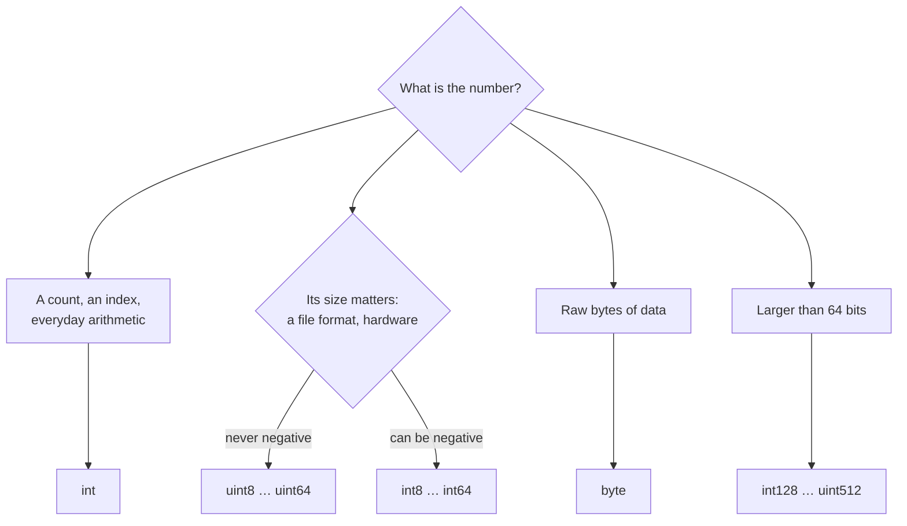

# Integer

::note
<!-- sync:needs:start -->

**You'll need**: [Variable](/docs/learn/variable)
<!-- sync:needs:end -->

::

An integer is a whole number stored in a fixed number of bits, and in Rux the type's name says how many. Choosing a width is a trade between range and space — and choosing _signed_ or _unsigned_ decides whether negative numbers are allowed.

## Signed and unsigned

| Family   | Types                                                                  | Range                     |
| -------- | ---------------------------------------------------------------------- | ------------------------- |
| Signed   | `int8`, `int16`, `int32`, `int64`, `int128`, `int256`, `int512`        | negative and positive     |
| Unsigned | `uint8`, `uint16`, `uint32`, `uint64`, `uint128`, `uint256`, `uint512` | zero and up, twice as far |

An unsigned type spends the bit a signed type uses for the sign on reaching twice as far. Each extra byte of width multiplies the range by 256:

| Type    | Smallest          | Largest          |
| ------- | ----------------- | ---------------- |
| `int8`  | −128              | 127              |
| `uint8` | 0                 | 255              |
| `int16` | −32 768           | 32 767           |
| `int32` | −2 147 483 648    | 2 147 483 647    |
| `int64` | about −9.2 × 10¹⁸ | about 9.2 × 10¹⁸ |

The wide types — `int128` up to `uint512` — are for numbers no machine register holds, such as the ones cryptography and exact arithmetic work with. They are ordinary integers all the same.

## Asking a type for its limits

Every integer type knows its own limits as `Min` and `Max`, and its size as `Bits`. Those names come from the standard `Core` package, so the lesson imports each type it asks about:

```rux
import Core::{ int, int128, int16, int32, int64, int8 };
import Core::{ uint, uint16, uint32, uint512, uint64, uint8 };
```

```rux
PrintLine("int8     {} to {}", int8::Min, int8::Max);
```

and lists `Core` next to `Io` in `Rux.toml`.

## int, uint and byte

`int` and `uint` have no number in their name because the target machine picks their width: they are as wide as a memory address — 64 bits on today's desktop systems. A whole number with no type written is an `int`, which is why `Main` returns one.

```rux
PrintLine("int      {} bits", int::Bits);
```

`byte` is another name for `uint8`, used when a value is raw storage rather than a number:

```rux
let level: byte = 200;
```

## Which one should I use?



When in doubt, use `int`.

## The program

The whole lesson is one package in the [Examples repository](https://github.com/rux-lang/Examples/tree/main/Basics/Integer). Its comments explain every step.

<!-- sync:program:start -->

```rux [Src/Main.rux]
// An integer is a whole number stored in a fixed number of bits, and the type's name says how
// many. `int8`, `int16`, `int32`, `int64`, `int128`, `int256` and `int512` are signed: they hold
// negative and positive numbers. `uint8` through `uint512` are unsigned: they hold only zero and
// up, and spend the bit a signed type uses for the sign on reaching twice as far.
//
// Every integer type knows its own limits, as `Min` and `Max`. Those two names are declared in the
// standard `Core` package, so this lesson imports each type it asks about, and its Rux.toml lists
// `Core` as a dependency next to `Io`.
import Core::{ int, int128, int16, int32, int64, int8 };
import Core::{ uint, uint16, uint32, uint512, uint64, uint8 };
import Io::PrintLine;

func Main() -> int {
    // Signed: each extra byte of width multiplies the range by 256.
    PrintLine("int8     {} to {}", int8::Min, int8::Max);
    PrintLine("int16    {} to {}", int16::Min, int16::Max);
    PrintLine("int32    {} to {}", int32::Min, int32::Max);
    PrintLine("int64    {} to {}", int64::Min, int64::Max);

    // Unsigned: the same widths, starting at zero.
    PrintLine("uint8    {} to {}", uint8::Min, uint8::Max);
    PrintLine("uint16   {} to {}", uint16::Min, uint16::Max);
    PrintLine("uint32   {} to {}", uint32::Min, uint32::Max);
    PrintLine("uint64   {} to {}", uint64::Min, uint64::Max);

    // The wide types are for numbers no machine register holds, such as the ones cryptography
    // and exact arithmetic work with. They are ordinary integers all the same.
    PrintLine("int128   max {}", int128::Max);
    PrintLine("uint512  max {}", uint512::Max);

    // `int` and `uint` have no number in their name because the target machine picks their
    // width: they are as wide as a memory address, 64 bits on today's desktop systems. A whole
    // number with no type written is an `int`, which is why `Main` returns one.
    PrintLine("int      {} bits", int::Bits);
    PrintLine("uint     {} bits", uint::Bits);

    // `byte` is another name for `uint8`, used when a value is raw storage rather than a number.
    let level: byte = 200;
    PrintLine("byte     {}", level);

    // A value has to fit the type it is given, and the compiler checks every literal:
    //
    //     let tooBig: uint8 = 256;
    //         error: integer literal is out of range for type 'uint8'
    //
    // And `Min`, `Max` and `Bits` exist only once their type is imported from `Core`. Without
    // the import the compiler reports "'Max' not found in extend for type 'int8'".
    return 0;
}
```

Besides `Io`, its `Rux.toml` lists `Core` under `[Dependencies]`.
<!-- sync:program:end -->

## Run it

```sh
cd Examples/Basics/Integer
rux run
```

<!-- sync:output:start -->

```
int8     -128 to 127
int16    -32768 to 32767
int32    -2147483648 to 2147483647
int64    -9223372036854775808 to 9223372036854775807
uint8    0 to 255
uint16   0 to 65535
uint32   0 to 4294967295
uint64   0 to 18446744073709551615
int128   max 170141183460469231731687303715884105727
uint512  max 13407807929942597099574024998205846127479365820592393377723561443721764030073546976801874298166903427690031858186486050853753882811946569946433649006084095
int      64 bits
uint     64 bits
byte     200
```

The `int` and `uint` lines show 64 bits on a 64-bit target.
<!-- sync:output:end -->

## Common mistakes

::warning
**A literal that does not fit.**\
The compiler checks every literal against its type: `let tooBig: uint8 = 256;` fails with `error: integer literal is out of range for type 'uint8'`.
::

::warning
**Asking for limits without importing the type.**\
`Min`, `Max` and `Bits` exist only once the type is imported from `Core`. Without the import the compiler reports `'Max' not found in extend for type 'int8'`.
::

## Try it yourself

1. Print the limits of `int16` and `uint16` side by side.
2. Add `uint128` to the imports and print its `Max`. How many digits does it have?
3. Declare `let level: byte = 255;`, then try `256` and read the error.

## Learn more

- [Signed integers](/docs/lang/types/integers) and [unsigned integers](/docs/lang/types/integers) in the Rux Reference
- [Literal](/docs/learn/literal) — writing numbers in hexadecimal, binary and with separators
- [Number limit](/docs/learn/number-limit) and [Wide integer](/docs/learn/wide-integer) — more in Part 16
