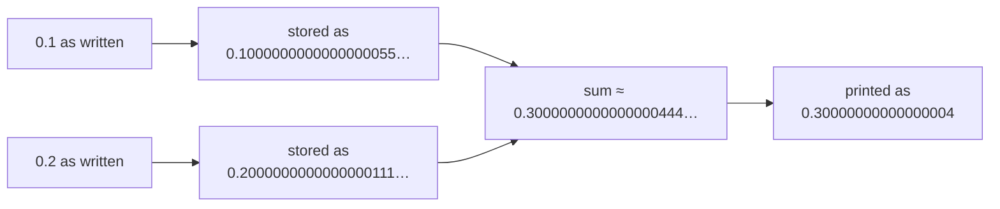

# Float

::note
<!-- sync:needs:start -->

**You'll need**: [Variable](/docs/learn/variable), [Integer](/docs/learn/integer)
<!-- sync:needs:end -->

::

A floating-point number — a _float_ — has a fractional part and an enormous range. The price is exactness: a float is stored in binary with a fixed number of significant digits, so most decimal fractions are kept as the _nearest value it can represent_, not the value you wrote.

## Two widths

| Type                     | Size    | Significant digits | Literal            |
| ------------------------ | ------- | ------------------ | ------------------ |
| `float64` (also `float`) | 8 bytes | about 16           | `4.99`, `384400.0` |
| `float32`                | 4 bytes | about 7            | `0.75f32`          |

A number with a decimal point is a `float64` unless something says otherwise:

```rux
let price = 4.99;
let ratio: float = 0.75;
let distance: float64 = 384400.0;
```

A `float32` value is written with the `f32` suffix. Without it the literal is a `float64` — and a `float64` is never squeezed into a `float32` behind your back, because digits would be lost:

```rux
let single: float32 = 0.75f32;
```

## Precision you can see

A third has no exact binary form, so each type stops where its digits run out:

```rux
let third64 = 1.0 / 3.0;
let third32 = 1.0f32 / 3.0f32;
```

```
1/3       0.3333333333333333 as float64
1/3       0.33333334 as float32
```

## Why 0.1 + 0.2 is not 0.3

Neither 0.1 nor 0.2 is exact in binary, and their two tiny errors add up to a sum that is not quite 0.3:

```rux
let sum = 0.1 + 0.2;
```

```
0.1 + 0.2 0.30000000000000004
```



This is how floats behave in every language that uses them, not a Rux quirk. It is why money is usually counted in whole cents, with an integer.

## Floats always look like floats

A float always prints with a decimal point, even when the value is whole, so it cannot be mistaken for an integer: `let whole = 2.0;` prints `2.0`.

## The program

The whole lesson is one package in the [Examples repository](https://github.com/rux-lang/Examples/tree/main/Basics/Float). Its comments explain every step.

<!-- sync:program:start -->

```rux [Src/Main.rux]
// A floating-point number, or float, has a fractional part and an enormous range. The price is
// exactness: a float is stored in binary with a fixed number of significant digits, so most
// decimal fractions are kept as the nearest value it can represent, not the value written.
//
// Rux has two float types. `float64` keeps about 16 significant digits and `float32` about 7, in
// half the space. `float` is another name for `float64`, and it is what a number with a decimal
// point becomes when nothing says otherwise.
import Io::PrintLine;

func Main() -> int {
    // Three ways to end up with a float64.
    let price = 4.99;
    let ratio: float = 0.75;
    let distance: float64 = 384400.0;
    PrintLine("price     {}", price);
    PrintLine("ratio     {}", ratio);
    PrintLine("distance  {}", distance);

    // A float32 value is written with the `f32` suffix. Without it the literal is a float64, and
    // a float64 is never squeezed into a float32 behind your back, because digits would be lost.
    let single: float32 = 0.75f32;
    PrintLine("single    {}", single);

    // The same division at both widths shows the difference in precision. A third has no exact
    // binary form, so each type stops where its digits run out.
    let third64 = 1.0 / 3.0;
    let third32 = 1.0f32 / 3.0f32;
    PrintLine("1/3       {} as float64", third64);
    PrintLine("1/3       {} as float32", third32);

    // Neither 0.1 nor 0.2 is exact in binary either, and their two tiny errors add up to a sum
    // that is not quite 0.3. This is how floats behave in every language that uses them, not a
    // Rux quirk. It is why money is usually counted in whole cents with an integer.
    let sum = 0.1 + 0.2;
    PrintLine("0.1 + 0.2 {}", sum);

    // A float always prints with a decimal point, even when the value is whole, so it cannot be
    // mistaken for an integer.
    let whole = 2.0;
    PrintLine("whole     {}", whole);

    // A float and an integer are different types even when they hold the same number:
    //
    //     let count: int = 2.0;
    //         error: cannot assign 'float64' to 'int'
    //
    //     let single: float32 = 0.75;
    //         error: cannot assign 'float64' to 'float32'
    return 0;
}
```

<!-- sync:program:end -->

## Run it

```sh
cd Examples/Basics/Float
rux run
```

<!-- sync:output:start -->

```
price     4.99
ratio     0.75
distance  384400.0
single    0.75
1/3       0.3333333333333333 as float64
1/3       0.33333334 as float32
0.1 + 0.2 0.30000000000000004
whole     2.0
```

<!-- sync:output:end -->

## Common mistakes

::warning
**Mixing floats and integers.**\
They are different types even when they hold the same number: `let count: int = 2.0;` fails with `error: cannot assign 'float64' to 'int'`. Write `2`, or convert with [`as`](/docs/learn/convert).
::

::warning
**Forgetting the `f32` suffix.**\
`let single: float32 = 0.75;` fails with `error: cannot assign 'float64' to 'float32'`. Write `0.75f32`.
::

::warning
**Comparing floats for exact equality.**\
After arithmetic, `0.1 + 0.2 == 0.3` is false. Compare against a small tolerance instead — Part 16 covers [special float values](/docs/learn/float-special) and limits such as `Epsilon`.
::

## Try it yourself

1. Compute the area of a circle with radius `2.5`, using `3.14159` for π.
2. Repeat the `1/3` experiment with `2.0 / 3.0`. Where does each width round?
3. Add `0.1` to a `var total = 0.0;` ten times and print it. Is it exactly `1.0`?

## Learn more

- [`float64`](/docs/lang/floating/float64) and [`float32`](/docs/lang/floating/float32) in the Rux Reference
- [Float special](/docs/learn/float-special) — infinity, NaN and negative zero
- [Math](/docs/learn/math) — square roots, powers and trigonometry
