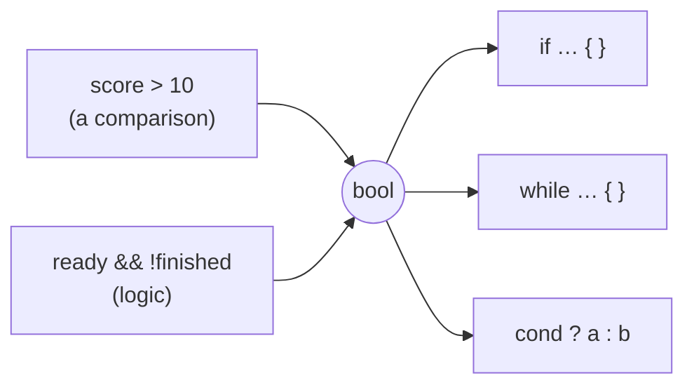

# Boolean

::note
<!-- sync:needs:start -->

**You'll need**: [Variable](/docs/learn/variable), [Integer](/docs/learn/integer)
<!-- sync:needs:end -->

::

A boolean holds one of exactly two values: `true` or `false`. It is the answer to a yes-or-no question — is the file open, has the player won — and the rest of the course leans on it constantly: every comparison produces one, and `if` and `while` choose what to run by one.

## true and false

`true` and `false` are the only boolean literals, and either one makes a `bool`:

```rux
let ready = true;
let finished = false;
let visible: bool = true;
```

## The boolean family

`bool` is the everyday spelling. It is another name for `bool8`, a boolean stored in one byte. The wider types hold the same two values in more space:

| Type             | Size    | Use                                |
| ---------------- | ------- | ---------------------------------- |
| `bool` = `bool8` | 1 byte  | Everyday code                      |
| `bool16`         | 2 bytes | Talking to code in other languages |
| `bool32`         | 4 bytes | The Windows API's `BOOL`, for one  |
| `bool64`         | 8 bytes | Matching other 8-byte layouts      |

```rux
let flag32: bool32 = true;
```

They exist for [interoperating with C and operating-system APIs](/docs/learn/c-interop), where a boolean's size is part of the agreement. In your own code, use `bool`.

## Where booleans come from

You will rarely write `true` or `false` by hand. Most booleans are produced by questions the program asks:



[Comparison](/docs/learn/comparison) and [Logical](/docs/learn/logical) show how to produce them; [If](/docs/learn/if) and [While](/docs/learn/while) show how to use them.

## The program

The whole lesson is one package in the [Examples repository](https://github.com/rux-lang/Examples/tree/main/Basics/Boolean). Its comments explain every step.

<!-- sync:program:start -->

```rux [Src/Main.rux]
// A boolean holds one of exactly two values, `true` or `false`. It is the answer to a yes-or-no
// question — is the file open, has the player won — and later parts lean on it constantly: a
// comparison produces one, and `if` and `while` choose what to run by one.
//
// `bool` is the everyday spelling. It is another name for `bool8`, a boolean stored in one byte.
// `bool16`, `bool32` and `bool64` hold the same two values in two, four and eight bytes. They
// exist for talking to code written in other languages: the Windows API, for one, uses a
// four-byte boolean, which is a `bool32` here.
import Io::PrintLine;

func Main() -> int {
    // `true` and `false` are the only boolean literals, and either one makes a `bool`.
    let ready = true;
    let finished = false;
    PrintLine("ready     {}", ready);
    PrintLine("finished  {}", finished);

    // The type can be written out, as with any variable.
    let visible: bool = true;
    PrintLine("visible   {}", visible);

    // The wider types print the same way. Only their size differs.
    let flag8: bool8 = true;
    let flag16: bool16 = false;
    let flag32: bool32 = true;
    let flag64: bool64 = false;
    PrintLine("bool8     {}", flag8);
    PrintLine("bool16    {}", flag16);
    PrintLine("bool32    {}", flag32);
    PrintLine("bool64    {}", flag64);

    // A boolean is not a number. Some languages treat 0 as false and 1 as true; Rux does not mix
    // them up on its own:
    //
    //     let on: bool = 1;
    //         error: cannot assign 'int' to 'bool8'
    //
    // The message names `bool8` because that is what `bool` is. Turning a number into a boolean,
    // or back, is a conversion you ask for, and the Convert lesson shows how.
    return 0;
}
```

<!-- sync:program:end -->

## Run it

```sh
cd Examples/Basics/Boolean
rux run
```

<!-- sync:output:start -->

```
ready     true
finished  false
visible   true
bool8     true
bool16    false
bool32    true
bool64    false
```

<!-- sync:output:end -->

## Common mistakes

::warning
**Using a number as a boolean.**\
Some languages treat 0 as false and 1 as true; Rux does not mix them up on its own. `let on: bool = 1;` fails with `error: cannot assign 'int' to 'bool8'` — the message names `bool8` because that is what `bool` is. Converting is something you ask for with `as`, as the [Convert](/docs/learn/convert) lesson shows.
::

## Try it yourself

1. Declare `let raining = true;` and `let umbrella = false;` and print a sentence using both.
2. Try `let on: bool = 1;` and read the message.
3. Look ahead: in the [Comparison](/docs/learn/comparison) lesson, find the line that produces a `bool` without writing `true` or `false`.

## Learn more

- [`bool`](/docs/lang/boolean/bool) in the Rux Reference
- [Logical](/docs/learn/logical) — combining booleans with `&&`, `||` and `!`
