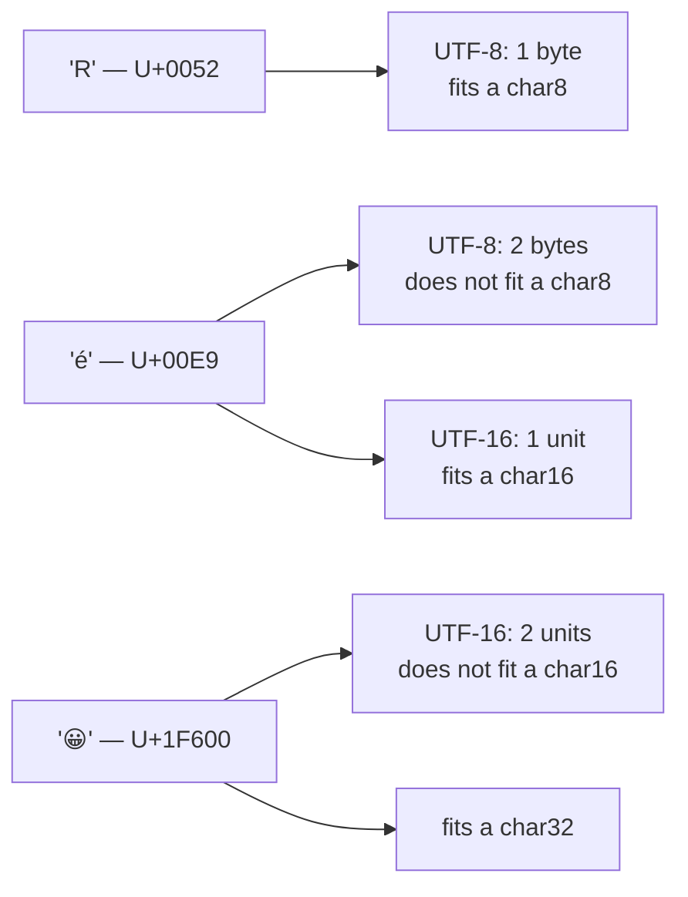

# Character

::note
<!-- sync:needs:start -->

**You'll need**: [Variable](/docs/learn/variable), [Integer](/docs/learn/integer)
<!-- sync:needs:end -->

::

A character is one Unicode _code point_: a letter, a digit, a symbol, an emoji. A character literal is written in **single** quotes, `'A'`. Double quotes make a string instead — a sequence of characters, and a topic of its own in [Part 14](/docs/learn/text).

## The char type

`char` is the everyday type. It is another name for `char32`: four bytes, enough for every code point there is. Any character fits:

```rux
let letter = 'A';
let accented = 'é';
let greek: char = 'π';
let emoji = '😀';
```

## Escapes

A backslash starts an escape, for characters that are awkward to type between quotes:

| Escape       | Character                                             |
| ------------ | ----------------------------------------------------- |
| `'\''`       | a single quote                                        |
| `'\\'`       | a backslash                                           |
| `'\n'`       | a line break                                          |
| `'\t'`       | a tab                                                 |
| `'\u{263A}'` | any code point, by its number in hexadecimal — here ☺ |

```rux
let quote = '\'';
let backslash = '\\';
let smile = '\u{263A}';
```

## Code units and code points

A prefix picks another character type, and two of them are different in kind:

```rux
let unit8 = c8'R';
let unit16 = c16'Ж';
let scalar32 = c32'€';
let scalar64 = c64'😀';
```

| Prefix          | Type              | Holds                                |
| --------------- | ----------------- | ------------------------------------ |
| `c8`            | `char8`           | One **byte** of UTF-8 text           |
| `c16`           | `char16`          | One **unit** of UTF-16 text          |
| `c32` (or none) | `char32` = `char` | One whole code point                 |
| `c64`           | `char64`          | One whole code point, in eight bytes |

A `char8` or `char16` is a _piece_ of an encoding, and a piece is a whole character only when the code point is small enough to fit in one:



Plain ASCII fits a `char8`; most living scripts fit a `char16`; everything fits a `char`. The [Encoding](/docs/learn/encoding) and [UTF-8](/docs/learn/utf8) lessons go deeper.

## A literal takes its binding's type

Without a prefix, a literal is a `char32` — unless its binding names a narrower type, which it then takes. So `let initial: char8 = 'R';` works too, as long as the character fits in one unit.

## The program

The whole lesson is one package in the [Examples repository](https://github.com/rux-lang/Examples/tree/main/Basics/Character). Its comments explain every step.

<!-- sync:program:start -->

```rux [Src/Main.rux]
// A character is one Unicode code point: a letter, a digit, a symbol, an emoji. A character
// literal is written in single quotes, 'A'. Double quotes make a string instead, which is a
// sequence of characters and a topic of its own.
//
// `char` is the everyday type. It is another name for `char32`, four bytes, enough for every code
// point there is, and it is the type a quoted character gets when nothing says otherwise.
import Io::PrintLine;

func Main() -> int {
    // Any code point fits in a `char`, from plain ASCII to an emoji.
    let letter = 'A';
    let accented = 'é';
    let greek: char = 'π';
    let emoji = '😀';
    PrintLine("letter    {}", letter);
    PrintLine("accented  {}", accented);
    PrintLine("greek     {}", greek);
    PrintLine("emoji     {}", emoji);

    // A backslash starts an escape, for characters that are awkward to type between quotes:
    // '\'' is a single quote, '\\' a backslash, '\n' a line break and '\t' a tab. `\u{...}`
    // names any code point by its number in hexadecimal.
    let quote = '\'';
    let backslash = '\\';
    let smile = '\u{263A}';
    PrintLine("quote     {}", quote);
    PrintLine("backslash {}", backslash);
    PrintLine("smile     {}", smile);

    // A prefix picks another width. `c32` spells the default out, and `c64` holds the same code
    // points in eight bytes. `c8` and `c16` are different in kind: a `char8` holds one byte of
    // UTF-8 text and a `char16` one unit of UTF-16 text. Those are pieces of an encoding, and a
    // piece is a whole character only for the code points small enough to fit in one: plain
    // ASCII for `char8`, and most living scripts for `char16`.
    let unit8 = c8'R';
    let unit16 = c16'Ж';
    let scalar32 = c32'€';
    let scalar64 = c64'😀';
    PrintLine("char8     {}", unit8);
    PrintLine("char16    {}", unit16);
    PrintLine("char32    {}", scalar32);
    PrintLine("char64    {}", scalar64);

    // Without a prefix, a literal is a `char32` unless its binding names a narrower type; then it
    // takes that type, so `let initial: char8 = 'R';` works too. Either way the character has to
    // fit in one unit, and one that does not is refused:
    //
    //     let accent = c8'é';
    //         error: character 'é' (U+00E9) does not fit one 'char8' code unit
    //         help: write a string literal such as c8"é", or a byte such as 0xE9u8
    //
    // é takes two bytes of UTF-8, and one `char8` holds only one of them. Text that needs several
    // units is a string, which has a lesson of its own.
    return 0;
}
```

<!-- sync:program:end -->

## Run it

```sh
cd Examples/Basics/Character
rux run
```

<!-- sync:output:start -->

```
letter    A
accented  é
greek     π
emoji     😀
quote     '
backslash \
smile     ☺
char8     R
char16    Ж
char32    €
char64    😀
```

<!-- sync:output:end -->

## Common mistakes

::warning
**A character too big for its code unit.**\
`let accent = c8'é';` fails with `error: character 'é' (U+00E9) does not fit one 'char8' code unit`, and the compiler suggests a string literal such as `c8"é"` instead. é takes two bytes of UTF-8, and one `char8` holds only one of them.
::

::warning
**Double quotes for a character.**\
`"A"` is a string, not a character. Use single quotes for one character.
::

## Try it yourself

1. Print the first letter of your name, a digit and an emoji, each as a `char`.
2. Print a tab character between two letters using `'\t'`.
3. Find a code point in a table (for example U+2665, a heart) and print it with `'\u{…}'`.
4. Try `c8'ж'` and read the message. Which prefix makes it fit?

## Learn more

- [`char`](/docs/lang/types/characters) and [`char8`](/docs/lang/types/characters) in the Rux Reference
- [Character pattern](/docs/learn/character-pattern) — matching characters with `match`
- [Encoding](/docs/learn/encoding) and [UTF-8](/docs/learn/utf8) — characters inside text
