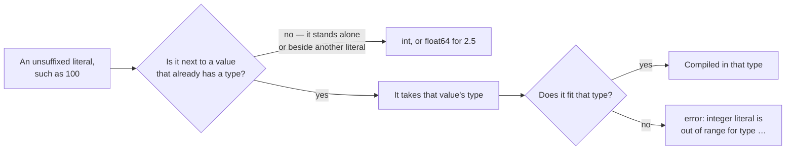

# Literal

::note
<!-- sync:needs:start -->

**You'll need**: [Integer](/docs/learn/integer), [Float](/docs/learn/float)
<!-- sync:needs:end -->

::

A _literal_ is a value written straight into the source: `42`, `2.5`, `'A'`, `true`. This lesson is about the numeric ones — the many ways one number can be spelled — and about a rule that surprises people: how a literal gets its **type**.

## Four bases

A prefix picks the base. The base is only how the source spells the value, so all four variables hold the same 255:

```rux
let decimal = 255;
let hex = 0xFF;
let octal = 0o377;
let binary = 0b11111111;
```

| Prefix | Base | Typical use                            |
| ------ | ---- | -------------------------------------- |
| none   | 10   | Everyday numbers                       |
| `0x`   | 16   | Colours, memory addresses, byte values |
| `0o`   | 8    | File permissions                       |
| `0b`   | 2    | Bit flags and masks                    |

## Digit separators

An underscore between digits is ignored. It groups them the way a comma does on paper:

```rux
let population = 8_100_000_000;
let mask = 0xFFFF_0000;
let flags = 0b1010_0101;
```

## Exponents

A float literal may carry an exponent: `e8` means "times ten to the eighth".

```rux
let light = 2.998e8;
let charge = 1.6e-19;
```

## Suffixes

A suffix fixes the type inside the literal itself:

```rux
let small = 200u8;
let wide = 5i64;
let single = 0.5f32;
```

`u8` makes a `uint8`, `i64` an `int64`, `f32` a `float32`; plain `u` and `i` mean `uint` and `int`.

## How a literal gets its type

This is the part worth slowing down for:



Here `100` sits next to `level`, a `uint8`, so it becomes a `uint8` too, and the sum is worked out in eight bits. 300 does not fit in eight bits: the result wraps around past 255 and lands on 44.

```rux
let level: uint8 = 200;
let raised = level + 100;
```

Two literals together have no typed partner, so both are `int` and the sum is plain 300:

```rux
let plain = 200 + 100;
```

Wrapping is covered properly in [Arithmetic](/docs/learn/arithmetic) and [Wrapping arithmetic](/docs/learn/wrapping-arithmetic).

## The program

The whole lesson is one package in the [Examples repository](https://github.com/rux-lang/Examples/tree/main/Basics/Literal). Its comments explain every step.

<!-- sync:program:start -->

```rux [Src/Main.rux]
// A literal is a value written straight into the source: 42, 2.5, 'A', true. This lesson is about
// the numeric ones — the many ways one number can be spelled, and how a literal gets its type.
import Io::PrintLine;

func Main() -> int {
    // The same number in four bases. A prefix picks the base: `0x` for hexadecimal, `0o` for
    // octal and `0b` for binary. The base is only how the source spells the value, so all four
    // variables hold the same 255 and print it the same way.
    let decimal = 255;
    let hex = 0xFF;
    let octal = 0o377;
    let binary = 0b11111111;
    PrintLine("bases      {} {} {} {}", decimal, hex, octal, binary);

    // An underscore between digits is ignored. It groups them the way a comma does on paper.
    let population = 8_100_000_000;
    let mask = 0xFFFF_0000;
    let flags = 0b1010_0101;
    PrintLine("separators {} {} {}", population, mask, flags);

    // A float literal may carry an exponent: `e8` means "times ten to the eighth".
    let light = 2.998e8;
    let charge = 1.6e-19;
    PrintLine("exponents  {} {}", light, charge);

    // A suffix fixes the type inside the literal itself: `u8` makes a uint8, `i64` an int64 and
    // `f32` a float32. Plain `u` and `i` mean `uint` and `int`.
    let small = 200u8;
    let wide = 5i64;
    let single = 0.5f32;
    PrintLine("suffixes   {} {} {}", small, wide, single);

    // With no suffix, a literal standing alone is an `int` or a `float64`. Next to a value that
    // already has a type, it takes that value's type instead. Here 100 becomes a uint8, the sum
    // is worked out in eight bits, and 300 does not fit in eight bits: the result wraps around
    // past 255 and lands on 44.
    let level: uint8 = 200;
    let raised = level + 100;
    PrintLine("uint8      {}", raised);

    // Two literals together have no typed partner, so both are `int` and the sum is plain 300.
    let plain = 200 + 100;
    PrintLine("int        {}", plain);

    // Because the literal takes the other side's type, it must also fit that type. These two are
    // refused rather than quietly turned into something else:
    //
    //     let over = level + 300;
    //         error: integer literal is out of range for type 'uint8'
    //
    //     let count: uint = 3;
    //     let missing = count == -1;
    //         error: integer literal is out of range for type 'uint'
    return 0;
}
```

<!-- sync:program:end -->

## Run it

```sh
cd Examples/Basics/Literal
rux run
```

<!-- sync:output:start -->

```
bases      255 255 255 255
separators 8100000000 4294901760 165
exponents  299800000.0 1.6e-19
suffixes   200 5 0.5
uint8      44
int        300
```

<!-- sync:output:end -->

## Common mistakes

::warning
**A literal that does not fit its partner's type.**\
Because the literal takes the other side's type, it must also fit it. `level + 300` with a `uint8` `level` fails with `error: integer literal is out of range for type 'uint8'` — 300 is not a `uint8`.
::

::warning
**A negative literal next to an unsigned value.**\
With `let count: uint = 3;`, the comparison `count == -1` fails the same way: `-1` would have to be a `uint`, and no `uint` is negative.
::

## Try it yourself

1. Print `0b1111_0000`, `0xF0` and `0o360`. Are they the same number?
2. Write the speed of light in km/s as `2.998e5` and the mass of an electron as `9.109e-31`.
3. Change `level + 100` to `level + 300` and read the error. Then make it compile by giving `level` a wider type.

## Learn more

- [Literals](/docs/lang/lexical/literals) in the Rux Reference
- [Integer](/docs/learn/integer) and [Float](/docs/learn/float) — the types literals become
- [Format number](/docs/learn/format-number) — printing numbers in hexadecimal and binary
