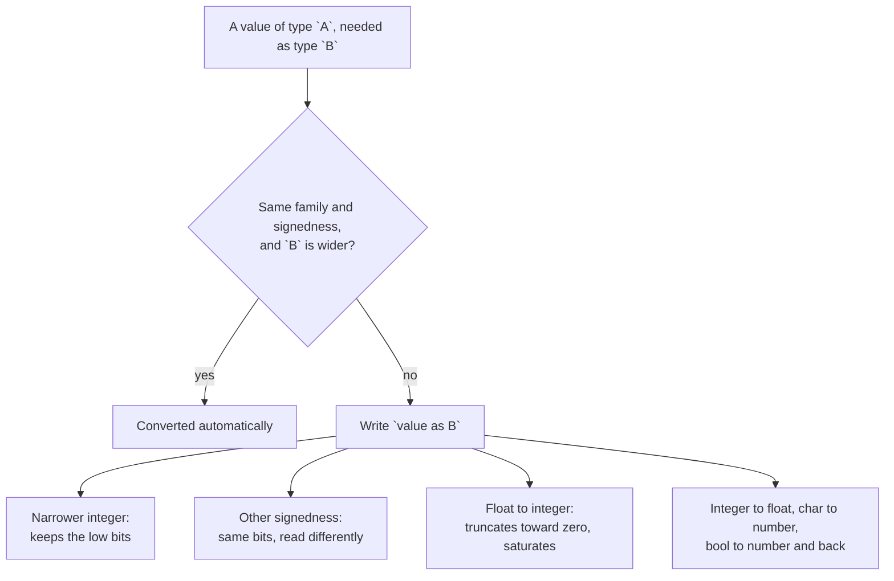

# Convert

::note
<!-- sync:needs:start -->

**You'll need**: [Integer](/docs/learn/integer), [Float](/docs/learn/float), [Boolean](/docs/learn/boolean), [Character](/docs/learn/character)
<!-- sync:needs:end -->

::

Rux converts between types on its own only when nothing can be lost. Every other conversion has to be asked for with `as` — because every other conversion can change the value. Writing `as` is how you tell the compiler, and the next reader, that the change is intended.

## Widening happens on its own

Widening within one family and one signedness — `int8` to `int32`, `float32` to `float64` — can never lose anything, so the compiler does it silently:

```rux
let small: int8 = 100;
let widened: int32 = small;
```

## Everything else needs as



### Narrowing keeps the low bits

300 needs nine bits; an `int8` has eight, and what survives is 300 − 256 = 44:

```rux
let big: int32 = 300;
let narrowed = big as int8;
```

### Changing signedness re-reads the bits

−1 has every bit set, and eight set bits read as an unsigned number are 255:

```rux
let negative: int32 = -1;
let reinterpreted = negative as uint8;
```

### Floats and integers

Integers and floats are different families, so crossing between them always needs `as`. Float to integer drops the fraction — it truncates toward zero rather than rounding:

```rux
let ratio = 3.9;
let negativeRatio = -3.9;
```

`ratio as int32` is `3`, and `negativeRatio as int32` is `-3`. A float too large for the integer type does not keep low bits the way narrowing does: it **saturates** to the largest (or smallest) value the type holds, so `1e10 as int32` is `2147483647`.

A narrower float keeps fewer digits, so `float64` to `float32` needs `as` as well: `3.141592653589793` becomes `3.1415927`.

### Characters and booleans

A character is a number underneath — its code point — and `as` shows it: `'A' as uint32` is `65`. A boolean becomes `1` or `0`; in the other direction, zero is `false` and anything else is `true`.

## as never fails

None of these conversions reports a problem. A conversion with `as` always produces a value, and when the original does not fit, that value is simply a different one. To find out first whether a value fits, compare it with the target type's limits — or use the checked conversions of [Checked convert](/docs/learn/checked-convert).

| Conversion           | Example                    | Result     |
| -------------------- | -------------------------- | ---------- |
| Widen                | `int8` 100 → `int32`       | 100        |
| Narrow               | `int32` 300 `as int8`      | 44         |
| Signedness           | `int32` −1 `as uint8`      | 255        |
| Float → int          | 3.9 `as int32`             | 3          |
| Float → int, too big | 1e10 `as int32`            | 2147483647 |
| Int → float          | 7 `as float64`             | 7.0        |
| Char → int           | 'A' `as uint32`            | 65         |
| Bool ↔ int           | `true as int`, `5 as bool` | 1, true    |

## The program

The whole lesson is one package in the [Examples repository](https://github.com/rux-lang/Examples/tree/main/Basics/Convert). Its comments explain every step.

<!-- sync:program:start -->

```rux [Src/Main.rux]
// A conversion happens on its own only when nothing can be lost: widening within one family and
// one signedness, such as `int8` to `int32` or `float32` to `float64`. Every other conversion is
// asked for with `as`, because every other conversion can change the value. Writing `as` is how
// you tell the compiler, and the next reader, that the change is intended.
import Io::PrintLine;

func Main() -> int {
    // Widening needs no `as`. Every `int8` is also an `int32`, so the compiler converts silently.
    let small: int8 = 100;
    let widened: int32 = small;
    PrintLine("widen        int8 {} becomes int32 {}", small, widened);

    // Narrowing must be asked for, and keeps only the low bits that fit. 300 needs nine bits, an
    // `int8` has eight, and what survives is 300 - 256.
    let big: int32 = 300;
    let narrowed = big as int8;
    PrintLine("narrow       int32 {} becomes int8 {}", big, narrowed);

    // Changing signedness keeps the bits and reads them differently: -1 has every bit set, and
    // eight set bits read as an unsigned number are 255.
    let negative: int32 = -1;
    let reinterpreted = negative as uint8;
    PrintLine("sign         int32 {} becomes uint8 {}", negative, reinterpreted);

    // Integers and floats are different families, so crossing between them always needs `as`.
    // Float to integer drops the fraction: it truncates toward zero rather than rounding.
    let ratio = 3.9;
    let negativeRatio = -3.9;
    PrintLine("float->int   {} becomes {}", ratio, ratio as int32);
    PrintLine("float->int   {} becomes {}", negativeRatio, negativeRatio as int32);

    // A float too large for the integer type does not keep low bits the way narrowing does. It
    // saturates: it becomes the largest value the type holds, or the smallest, below the range.
    let huge = 1e10;
    PrintLine("float->int   {} becomes {}", huge, huge as int32);

    let count: int32 = 7;
    PrintLine("int->float   {} becomes {}", count, count as float64);

    // A narrower float keeps fewer digits, so float64 to float32 needs `as` as well.
    let pi = 3.141592653589793;
    PrintLine("narrow float {} becomes {}", pi, pi as float32);

    // A character is a number underneath, its code point, and `as` shows it.
    let letter = 'A';
    PrintLine("char->int    {} becomes {}", letter, letter as uint32);

    // A boolean becomes 1 or 0. In the other direction, zero is false and anything else is true.
    let yes = true;
    let five = 5;
    PrintLine("bool->int    {} becomes {}", yes, yes as int);
    PrintLine("int->bool    {} becomes {}", five, five as bool);

    // None of the conversions above reported a problem. A conversion with `as` never fails: it
    // always produces a value, and when the original does not fit, that value is simply a
    // different one. To find out first whether a value fits, compare it with the target type's
    // limits — comparisons are the next part, and choosing what to do with the answer the one
    // after.
    return 0;
}
```

<!-- sync:program:end -->

## Run it

```sh
cd Examples/Basics/Convert
rux run
```

<!-- sync:output:start -->

```
widen        int8 100 becomes int32 100
narrow       int32 300 becomes int8 44
sign         int32 -1 becomes uint8 255
float->int   3.9 becomes 3
float->int   -3.9 becomes -3
float->int   10000000000.0 becomes 2147483647
int->float   7 becomes 7.0
narrow float 3.141592653589793 becomes 3.1415927
char->int    A becomes 65
bool->int    true becomes 1
int->bool    5 becomes true
```

<!-- sync:output:end -->

## Common mistakes

::mistake
**Expecting rounding.**\
`2.99 as int32` is `2`, not `3`: conversion truncates toward zero. Round first if that is what you mean — the [Math](/docs/learn/math) lesson has `Round`.
::

::mistake
**Expecting an error on overflow.**\
`as` never fails. `300 as int8` quietly becomes `44`. When the value might not fit, check it first or use [Checked convert](/docs/learn/checked-convert).
::

## Try it yourself

1. Convert `-1 as uint16` and `-1 as uint32`. Predict the results before you run.
2. Print the code points of the letters in `R`, `u`, `x` with `as uint32`.
3. Convert `-1e10` to `int32` and check that it saturates to the smallest value.

## Learn more

- [Type casts](/docs/lang/expressions/casts) in the Rux Reference
- [Checked convert](/docs/learn/checked-convert) — conversions that report whether the value fits
- [Wrapping arithmetic](/docs/learn/wrapping-arithmetic) — what happens when arithmetic overflows
