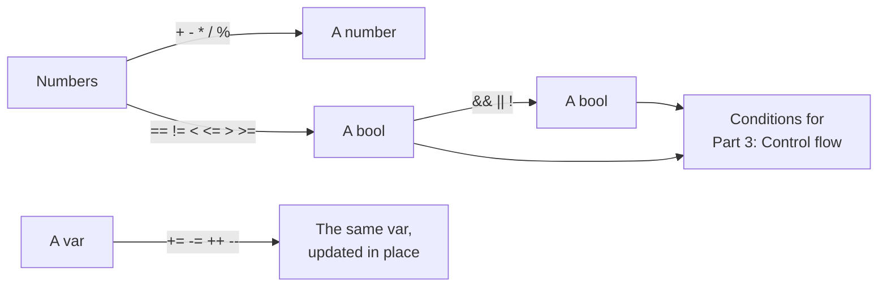

# Part 2: Operators

Part 1 gave you values and names for them. This part combines them: adding and dividing numbers, comparing them, joining yes-or-no answers into bigger conditions, and updating a variable in place. It is a short part — five lessons — but every program you write from here on is built from these operators, and the comparisons and conditions are exactly what [Part 3](/docs/learn/control-flow) needs to make decisions.

## What you will learn

- Arithmetic with `+ - * / %`, and why `17 / 5` is 3 for integers but 3.4 for floats.
- Comparing values with `== != < <= > >=`, and why exact `==` between floats is risky.
- Combining conditions with `&&`, `||` and `!`, and how short-circuiting lets one side guard the other.
- Updating a variable with `+=`, `-=` and friends, and stepping it with `++` and `--`.
- Which operator applies first, how same-rank operators group, and when to add parentheses.

## What each kind of operator produces



## Lessons

<!-- sync:lessons:start -->

|     | Lesson                               | What you will learn                                                                                      |
| --- | ------------------------------------ | -------------------------------------------------------------------------------------------------------- |
| 2.1 | [Arithmetic](/docs/learn/arithmetic) | add, subtract, multiply, divide and take the remainder                                                   |
| 2.2 | [Comparison](/docs/learn/comparison) | compare two values with `==`, `!=`, `<`, `<=`, `>` and `>=`                                              |
| 2.3 | [Logical](/docs/learn/logical)       | Combine bools with `&& \|\| !`, and watch short-circuiting skip the right side once the left has decided |
| 2.4 | [Assignment](/docs/learn/assignment) | update a variable in place with `+=`, `-=`, `++` and friends                                             |
| 2.5 | [Precedence](/docs/learn/precedence) | which operator binds first, and how parentheses change it                                                |

<!-- sync:lessons:end -->

## Before you start

Finish [Part 1: Basics](/docs/learn/basics) first — especially [Variable](/docs/learn/variable), [Mutable](/docs/learn/mutable), the number types and [Convert](/docs/learn/convert). Each lesson's package is in the Examples repository's `Operators/` folder:

```sh
cd Examples/Operators/Arithmetic
rux run
```

## After this part

[Part 3: Control flow](/docs/learn/control-flow) puts the conditions you can now write to work, making programs choose between paths and repeat. After it come the first checkpoint projects, [Thanks](/docs/learn/thanks) and [FizzBuzz](/docs/learn/fizz-buzz) — FizzBuzz in particular is built on `%`, `==` and `+=` from this part.

For the full rules, see [Operations](/docs/lang/operations/overview) — [arithmetic](/docs/lang/operations/arithmetic), [comparison](/docs/lang/operations/comparison) and [logical](/docs/lang/operations/logical) — and the [operator list](/docs/lang/lexical/operators) in the Rux Reference.
