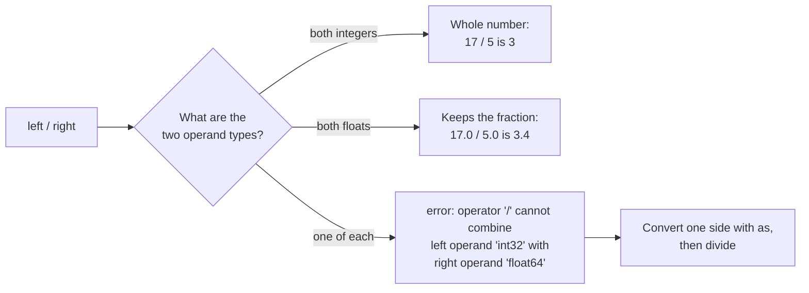

# Arithmetic

::note
<!-- sync:needs:start -->

**You'll need**: [Variable](/docs/learn/variable), [Integer](/docs/learn/integer), [Float](/docs/learn/float), [Console](/docs/learn/console), [Convert](/docs/learn/convert)
<!-- sync:needs:end -->

::

Arithmetic is the first thing most programs do with their values: add up a bill, split it between friends, work out what is left over. Rux has five arithmetic operators, and they look the way they do in maths. The one surprise is division — dividing two whole numbers gives a whole number, and the fraction is quietly dropped.

## The five operators

| Operator | Meaning        | `17` and `5` give |
| -------- | -------------- | ----------------- |
| `+`      | Addition       | `22`              |
| `-`      | Subtraction    | `12`              |
| `*`      | Multiplication | `85`              |
| `/`      | Division       | `3`               |
| `%`      | Remainder      | `2`               |

Each one takes a value on either side and produces a new value. Neither operand changes — `a + b` reads `a` and `b` and hands back their sum:

```rux
let a: int32 = 17;
let b: int32 = 5;
PrintLine("{} + {} = {}", a, b, a + b);
```

## Integer division drops the fraction

On paper, 17 divided by 5 is 3.4. Two integers cannot hold 3.4, so integer division **truncates**: it keeps the whole part and throws the rest away. The `%` operator gives back the part that was dropped, the remainder:

```rux
PrintLine("{} / {} = {}", a, b, a / b);
PrintLine("{} % {} = {}", a, b, a % b);
```

17 is three fives and two left over, so `/` says `3` and `%` says `2`. The pair is useful far beyond maths homework — `%` is how a program asks "is this number even?" (`n % 2 == 0`) or "which minute of the hour is it?" (`seconds / 60 % 60`).

Truncation goes **towards zero**, so −3.4 becomes −3 rather than −4. The remainder keeps the sign of the number being divided:

```rux
PrintLine("{} / {} = {}", -a, b, -a / b);
PrintLine("{} % {} = {}", -a, b, -a % b);
```

## Floats keep the fraction

Divide two floats and the fraction stays. `%` works on floats too, and gives what is left after taking out as many whole fives as fit:

```rux
let x: float64 = 17.0;
let y: float64 = 5.0;
PrintLine("{} / {} = {}", x, y, x / y);
PrintLine("{} % {} = {}", x, y, x % y);
```

What `/` does depends only on the types of its two operands:



## Both sides must have the same type

Rux never mixes an `int32` and a `float64` on its own, because either choice could lose something. To divide two integers and keep the fraction, convert them first with `as` — the operator from [Convert](/docs/learn/convert):

```rux
PrintLine("{} / {} as floats = {}", a, b, (a as float64) / (b as float64));
```

Converting _after_ the division is too late: `(a / b) as float64` is `3.0`, because the fraction was already gone. [Precedence](/docs/learn/precedence) looks at that case again.

## Overflow wraps around

Every integer type has a largest value. A `uint8` holds 0 to 255, and a sum that goes past the top wraps around and starts again from 0 — with no warning:

```rux
let level: uint8 = 250;
PrintLine("uint8 {} + 10 = {}", level, level + 10);
```

250 + 10 is 260, and 260 − 256 lands on 4. The `10` is a `uint8` here because an unsuffixed literal takes the type of the value beside it, as [Literal](/docs/learn/literal) showed. Choosing a type wide enough for your numbers is the everyday fix; [Wrapping arithmetic](/docs/learn/wrapping-arithmetic) and [Checked arithmetic](/docs/learn/checked-arithmetic) cover the tools for when it is not enough.

## The program

The whole lesson is one package in the [Examples repository](https://github.com/rux-lang/Examples/tree/main/Operators/Arithmetic). Its comments explain every step.

<!-- sync:program:start -->

```rux [Src/Main.rux]
// The five arithmetic operators: `+`, `-`, `*`, `/` and `%`. They work on
// integers and floats alike, but division means something different for each:
// two integers give a whole-number answer and throw the fraction away, while two
// floats keep it.
import Io::PrintLine;

func Main() -> int {
    let a: int32 = 17;
    let b: int32 = 5;
    PrintLine("{} + {} = {}", a, b, a + b);
    PrintLine("{} - {} = {}", a, b, a - b);
    PrintLine("{} * {} = {}", a, b, a * b);

    // Integer division truncates: 17 / 5 is 3, not 3.4. The `%` operator gives
    // back the part that division dropped, the remainder.
    PrintLine("{} / {} = {}", a, b, a / b);
    PrintLine("{} % {} = {}", a, b, a % b);

    // Truncation goes towards zero, so -3.4 becomes -3 rather than -4, and the
    // remainder keeps the sign of the number being divided.
    PrintLine("{} / {} = {}", -a, b, -a / b);
    PrintLine("{} % {} = {}", -a, b, -a % b);

    // Floats keep the fraction. `%` works on them too.
    let x: float64 = 17.0;
    let y: float64 = 5.0;
    PrintLine("{} / {} = {}", x, y, x / y);
    PrintLine("{} % {} = {}", x, y, x % y);

    // Both operands must have the same type: `a / y` is rejected, an `int32`
    // divided by a `float64`. To divide integers and keep the fraction, convert
    // them first with `as`.
    PrintLine("{} / {} as floats = {}", a, b, (a as float64) / (b as float64));

    // An integer that outgrows its type wraps around without any warning. A
    // `uint8` holds 0 to 255, so 250 + 10 lands on 4.
    let level: uint8 = 250;
    PrintLine("uint8 {} + 10 = {}", level, level + 10);
    return 0;
}
```

<!-- sync:program:end -->

## Run it

```sh
cd Examples/Operators/Arithmetic
rux run
```

<!-- sync:output:start -->

```
17 + 5 = 22
17 - 5 = 12
17 * 5 = 85
17 / 5 = 3
17 % 5 = 2
-17 / 5 = -3
-17 % 5 = -2
17.0 / 5.0 = 3.4
17.0 % 5.0 = 2.0
17 / 5 as floats = 3.4
uint8 250 + 10 = 4
```

<!-- sync:output:end -->

## Common mistakes

::warning
**Mixing an integer and a float.**\
When `a` is an `int32` and `y` is a `float64`, `a / y` fails with `error: operator '/' cannot combine left operand 'int32' with right operand 'float64'`. Convert one side with `as` so both have the same type.
::

::warning
**Expecting a fraction from two integers.**\
`17 / 5` is `3`, not `3.4`, and `(a / b) as float64` is `3.0`. Convert the operands _before_ dividing, not the result after.
::

::warning
**Dividing an integer by zero.**\
The compiler does not catch it. The program stops while running with `Panic: division by zero` and the line it happened on. When the divisor might be zero, test it first — [Logical](/docs/learn/logical) shows a neat way to do that.
::

## Try it yourself

1. Turn `1000` seconds into minutes and seconds using `/` and `%`, and print a line like `16 min 40 s`.
2. Change `a` and `b` to `-17` and `-5`. Predict both `/` and `%` before you run.
3. Work out the average of three `int32` scores, `7`, `8` and `10`, once as an integer and once as a `float64`.
4. Change the `uint8` example to `level - 251`. Which number does it wrap around to?

## Learn more

- [Arithmetic operations](/docs/lang/expressions/arithmetic) in the Rux Reference
- [Precedence](/docs/learn/precedence) — the order in which mixed operators apply
- [Wrapping arithmetic](/docs/learn/wrapping-arithmetic) and [Checked arithmetic](/docs/learn/checked-arithmetic) — taking control of overflow
- [Math](/docs/learn/math) — powers, roots and rounding
