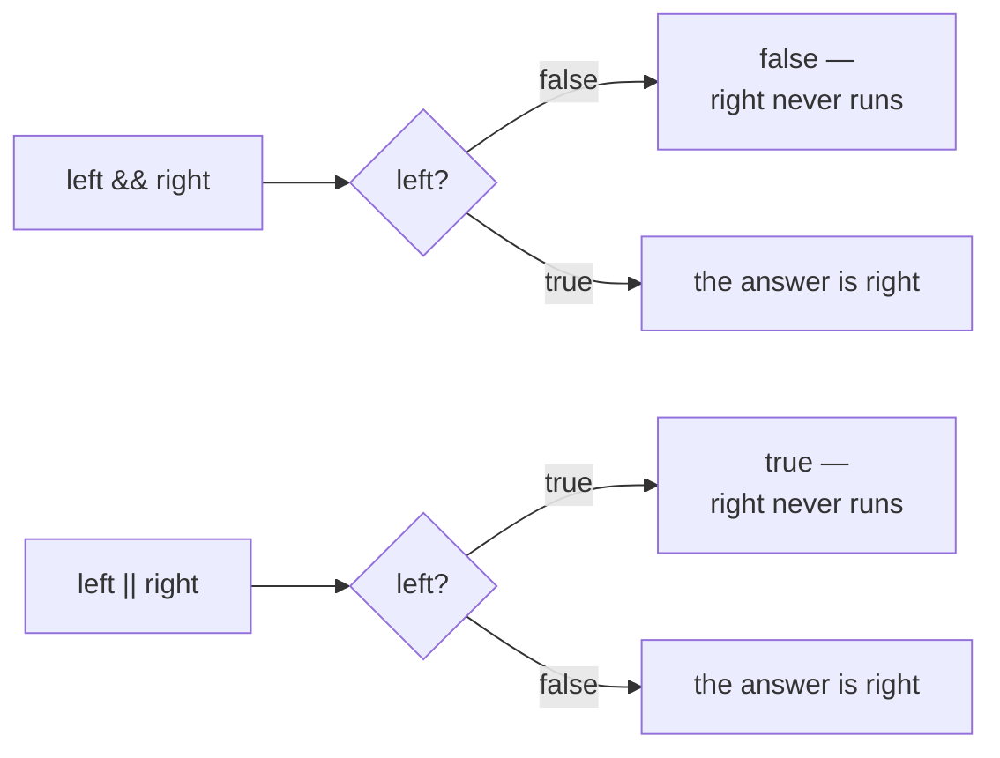

# Logical

::note
<!-- sync:needs:start -->

**You'll need**: [Comparison](/docs/learn/comparison), [Boolean](/docs/learn/boolean)
<!-- sync:needs:end -->

::

One comparison answers one question. Real conditions are rarely that simple: "it is raining **and** cold", "the user is an admin **or** the owner", "the file is **not** empty". The logical operators combine `bool` values into new ones, so several small questions become one answer.

## And, or, not

```rux
let raining = true;
let cold = false;
PrintLine("raining && cold  is {}", raining && cold);
PrintLine("raining || cold  is {}", raining || cold);
PrintLine("!raining         is {}", !raining);
```

`&&` (and) is `true` only when both sides are. `||` (or) is `true` when at least one side is. `!` (not) takes a single `bool` and flips it. Every combination fits in one table:

| `a`     | `b`     | `a && b` | `a \|\| b` | `!a`    |
| ------- | ------- | -------- | ---------- | ------- |
| `false` | `false` | `false`  | `false`    | `true`  |
| `false` | `true`  | `false`  | `true`     | `true`  |
| `true`  | `false` | `false`  | `true`     | `false` |
| `true`  | `true`  | `true`   | `true`     | `false` |

The operands must be `bool`s. Rux has no "truthy" numbers, so `items && true` with an `int32` `items` is an error — write the comparison you mean, `items != 0`.

## Short-circuiting

The table has a pattern: once the left side of `&&` is `false`, the answer is `false` whatever the right side is. Once the left side of `||` is `true`, the answer is `true`. So both operators work out the left side first, and **skip the right side** when the left one has already settled the answer:



The program makes this visible with a small helper. `Side` is a _function_ — a named piece of work, which [Part 4](/docs/learn/functions) teaches properly. For now, all you need to know is that calling it prints which side is being evaluated, then hands back the answer it was given:

```rux
func Side(name: char8[..], answer: bool) -> bool {
    PrintLine("    evaluated {}", name);
    return answer;
}
```

```rux
PrintLine("false && true:");
PrintLine("    result {}", Side("left", false) && Side("right", true));
```

For `false && true` the output shows only `evaluated left`: the right side never ran. For `true && false` both sides run, because a `true` on the left does not decide an `&&`.

## A guard on the left

Short-circuiting is not just a speed-up. It lets the left side **protect** the right one. Dividing an integer by zero stops the program, so the average below must not be computed when there are no items:

```rux
let items: int32 = 0;
let total: int32 = 120;
PrintLine("average above 10: {}", items != 0 && total / items > 10);
```

`items != 0` is `false`, so `&&` already knows its answer and `total / items` is never reached. Put the guard first; written the other way round, the division would run before the check.

## The program

The whole lesson is one package in the [Examples repository](https://github.com/rux-lang/Examples/tree/main/Operators/Logical). Its comments explain every step.

<!-- sync:program:start -->

```rux [Src/Main.rux]
// The logical operators combine bools. `a && b` is true when both are true,
// `a || b` when at least one is, and `!a` flips a single bool.
//
// They also short-circuit: they evaluate the left side first, and skip the right
// side when the left one has already settled the answer. `false && anything` is
// false and `true || anything` is true, so in those cases the right side never
// runs at all.
import Io::PrintLine;

// A preview of functions, which Part 4 teaches: calling `Side` prints which side
// is being evaluated, then hands back the answer it was given unchanged.
func Side(name: char8[..], answer: bool) -> bool {
    PrintLine("    evaluated {}", name);
    return answer;
}

func Main() -> int {
    let raining = true;
    let cold = false;
    PrintLine("raining && cold  is {}", raining && cold);
    PrintLine("raining || cold  is {}", raining || cold);
    PrintLine("!raining         is {}", !raining);

    // Watch which sides get evaluated. The right side runs only when the left
    // one could not decide the answer alone.
    PrintLine("false && true:");
    PrintLine("    result {}", Side("left", false) && Side("right", true));
    PrintLine("true && false:");
    PrintLine("    result {}", Side("left", true) && Side("right", false));
    PrintLine("true || false:");
    PrintLine("    result {}", Side("left", true) || Side("right", false));
    PrintLine("false || true:");
    PrintLine("    result {}", Side("left", false) || Side("right", true));

    // This is what makes short-circuiting useful: the left side can guard the
    // right. An integer division by zero stops the program on the spot, with
    // "Panic: division by zero" and the line it happened on. With no items, the
    // guard settles the answer first and the division is never reached.
    let items: int32 = 0;
    let total: int32 = 120;
    PrintLine("average above 10: {}", items != 0 && total / items > 10);
    return 0;
}
```

<!-- sync:program:end -->

## Run it

```sh
cd Examples/Operators/Logical
rux run
```

<!-- sync:output:start -->

```
raining && cold  is false
raining || cold  is true
!raining         is false
false && true:
    evaluated left
    result false
true && false:
    evaluated left
    evaluated right
    result false
true || false:
    evaluated left
    result true
false || true:
    evaluated left
    evaluated right
    result true
average above 10: false
```

<!-- sync:output:end -->

## Common mistakes

::warning
**Using a number as a condition.**\
`items && true` fails with `error: operator '&&' requires a bool left operand, but found 'int32'`, and `!items` with `error: operator '!' requires a bool operand, but found 'int32'`. Compare explicitly: `items != 0`.
::

::warning
**Writing `&` or `|` instead of `&&` or `||`.**\
The single-character forms compile on `bool`s, but they are the _bitwise_ operators of [Bitwise](/docs/learn/bitwise), and they always evaluate both sides. Swap `&&` for `&` in the guard above and the program stops with `Panic: division by zero`.
::

::warning
**Putting the guard second.**\
`total / items > 10 && items != 0` divides before it checks. The guard only protects what comes after it.
::

## Try it yourself

1. Add `let windy = true;` and print whether it is raining and windy but not cold.
2. Swap the two `Side` calls in each pair and predict which lines of `evaluated` appear.
3. Set `items` to `8` and run again. Which part of the condition decides the answer now?
4. Write a `bool` named `weekend` that is `true` when an `int32` `day` is `6` or `7`.

## Learn more

- [Logical operations](/docs/lang/expressions/logical) in the Rux Reference
- [Precedence](/docs/learn/precedence) — how `&&`, `||` and `!` bind next to comparisons
- [Bitwise](/docs/learn/bitwise) — `&`, `|` and `^` on the bits of integers
