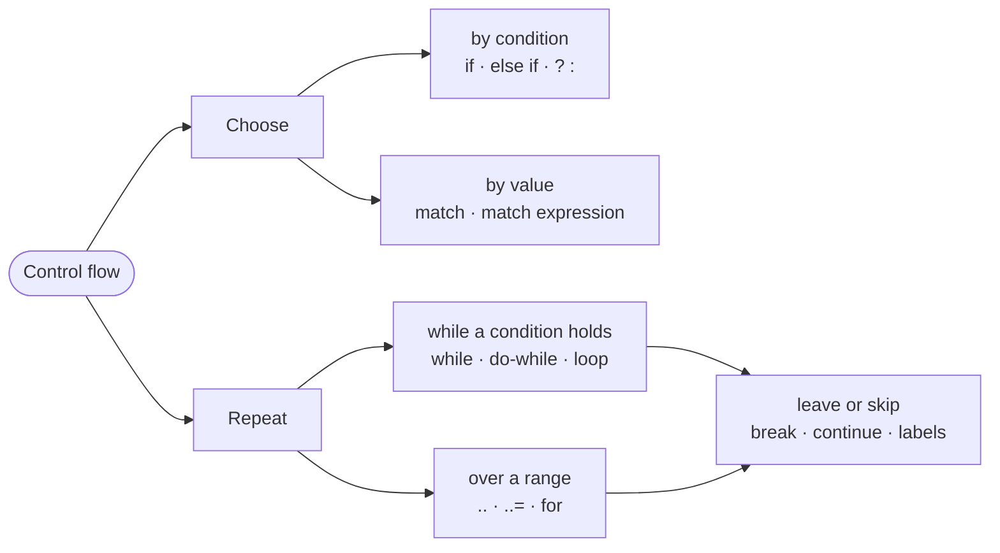

# Part 3: Control flow

So far every program has run each line once, top to bottom. This part makes programs **choose** — run one block or another depending on a condition — and **repeat** — run a block again and again until the job is done. With these two abilities and the operators of Part 2, you can write real little programs: the part ends with the first checkpoint projects.

## What you will learn

- Choosing with `if`, `else` and `else if` chains, and why the order of a chain matters.
- Choosing a value inside an expression with the conditional `? :`.
- Repeating with `while`, `do`-`while` and `loop`, and where each one tests its condition.
- Leaving a loop early with `break` and skipping a pass with `continue`, including from nested loops with labels.
- Describing a run of numbers with ranges `..` and `..=`, and walking one with `for`.
- Selecting a branch by value with `match`, and using `match` as an expression that produces a value.

## Choosing and repeating



## Lessons

<!-- sync:lessons:start -->

|      | Lesson                                           | What you will learn                                              |
| ---- | ------------------------------------------------ | ---------------------------------------------------------------- |
| 3.1  | [If](/docs/learn/if)                             | run code only when a condition holds, with `if` and `else`       |
| 3.2  | [Else if](/docs/learn/else-if)                   | choose one of several branches with an `else if` chain           |
| 3.3  | [Ternary](/docs/learn/ternary)                   | pick one of two values inside an expression with `? :`           |
| 3.4  | [While](/docs/learn/while)                       | repeat while a condition holds — possibly zero times             |
| 3.5  | [Do-while](/docs/learn/do-while)                 | run the body first and test afterwards, so it runs at least once |
| 3.6  | [Loop](/docs/learn/loop)                         | repeat forever with `loop` until a `break` leaves                |
| 3.7  | [Break](/docs/learn/break)                       | leave a loop early when the answer is found                      |
| 3.8  | [Continue](/docs/learn/continue)                 | skip the rest of one iteration and carry on with the next        |
| 3.9  | [Range](/docs/learn/range)                       | describe a run of numbers with `..` and `..=`                    |
| 3.10 | [For](/docs/learn/for)                           | walk a range with `for`                                          |
| 3.11 | [Label](/docs/learn/label)                       | name a loop, so `break` can leave an outer one                   |
| 3.12 | [Match](/docs/learn/match)                       | select a branch by value with `match`, and default with `else`   |
| 3.13 | [Match expression](/docs/learn/match-expression) | use `match` as a value, not only as a statement                  |

<!-- sync:lessons:end -->

## Before you start

Finish [Part 1: Basics](/docs/learn/basics) and [Part 2: Operators](/docs/learn/operators) first — every condition in this part is a comparison or a logical expression from Part 2. Each lesson's package is in the Examples repository's `ControlFlow/` folder:

```sh
cd Examples/ControlFlow/If
rux run
```

## After this part

You are ready for the first checkpoint projects: [Thanks](/docs/learn/thanks), which prints a banner using loops and `match` expressions, and [FizzBuzz](/docs/learn/fizz-buzz), the classic test of getting an `else if` chain in the right order. Then [Part 4: Functions](/docs/learn/functions) gives a piece of work a name, so you can reuse it instead of repeating it.

For the full rules behind this part, see [Statements](/docs/lang/statements/overview) — [`if`](/docs/lang/statements/if), [`match`](/docs/lang/statements/match), [`while`](/docs/lang/statements/while), [`for`](/docs/lang/statements/for), [`loop`](/docs/lang/statements/loop) and [`break` / `continue`](/docs/lang/statements/break-continue) — and [Ranges](/docs/lang/ranges/overview) in the Rux Reference.
