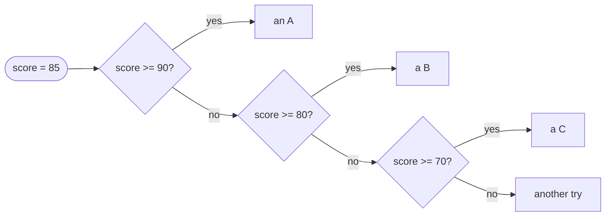

# Else if

::note
<!-- sync:needs:start -->

**You'll need**: [If](/docs/learn/if)
<!-- sync:needs:end -->

::

`if` and `else` choose between two paths. Many decisions have more than two: a grade is an A, a B, a C or a fail; a temperature is a heat warning, a frost warning or nothing at all. `else if` adds another condition to an `if`, and a chain of them chooses among as many cases as you need.

## A chain of conditions

```rux
let score: int32 = 85;

if score >= 90 {
    PrintLine("{} earns an A", score);
} else if score >= 80 {
    PrintLine("{} earns a B", score);
} else if score >= 70 {
    PrintLine("{} earns a C", score);
} else {
    PrintLine("{} needs another try", score);
}
```

The chain tests its conditions from the top, runs the block of the **first** one that holds, and skips everything after it. A final plain `else` catches whatever no condition matched. So at most one block in a chain runs — exactly one, when the chain ends with `else`.



85 fails the first test and passes the second, so the chain prints `85 earns a B` and never looks at `>= 70`.

## Each test may assume the ones above it failed

By the time the chain reaches `score >= 80`, the score is already known to be below 90 — otherwise the first block would have run. So the chain needs no `score >= 80 && score < 90`. Each condition only has to draw the next line, not repeat the ones above it.

## Order is part of the meaning

Because the first match wins, the order of a chain changes what it does. Here are the same conditions, loosest first:

```rux
if score >= 70 {
    PrintLine("reordered chain: a C");
} else if score >= 80 {
    PrintLine("reordered chain: a B");
} else if score >= 90 {
    PrintLine("reordered chain: an A");
}
```

85 is also at least 70, so the first test already holds and the chain stops there. Worse, the `>= 80` and `>= 90` blocks can now never run for _anyone_: every score that would reach them has already been caught by `>= 70`. The compiler cannot tell this from a deliberate choice, so it is up to you. A good rule for ranges like these: test the narrowest case first.

## A chain may run nothing

Without a final `else`, it is possible for no condition to hold:

```rux
let temperature: int32 = 18;
if temperature > 30 {
    PrintLine("heat warning");
} else if temperature < 0 {
    PrintLine("frost warning");
}
PrintLine("{} degrees needs no warning", temperature);
```

Leave out the `else` only when "nothing happens" is a real answer, as it is here.

## A chain, or separate ifs?

A chain and a row of separate `if` statements look alike but behave differently:

| Shape                          | Tests                                | Blocks that run            |
| ------------------------------ | ------------------------------------ | -------------------------- |
| `if … else if … else if …`     | until the first condition that holds | at most one                |
| `if …` then `if …` then `if …` | every condition, every time          | every one whose test holds |

```rux
if temperature > 10 {
    PrintLine("above 10");
}
if temperature > 15 {
    PrintLine("above 15");
}
```

Both of these print, because they are two separate statements. Written as a chain, only `above 10` would.

## The program

The whole lesson is one package in the [Examples repository](https://github.com/rux-lang/Examples/tree/main/ControlFlow/ElseIf). Its comments explain every step.

<!-- sync:program:start -->

```rux [Src/Main.rux]
// `else if` adds another condition to an `if`, and a chain of them chooses among many cases. The
// chain tests its conditions from the top, runs the block of the first one that holds, and skips
// everything after it. So at most one block in a chain runs, and a final plain `else` catches
// whatever no condition matched.
//
// Because the first match wins, the order of a chain is part of its meaning. The two chains below
// test the same score with the same conditions, in different orders, and disagree.
import Io::PrintLine;

func Main() -> int {
    let score: int32 = 85;

    // Each test may assume the ones above it failed: by the `>= 80` line, the score is known to be
    // below 90, so the chain needs no `score >= 80 && score < 90`.
    if score >= 90 {
        PrintLine("{} earns an A", score);
    } else if score >= 80 {
        PrintLine("{} earns a B", score);
    } else if score >= 70 {
        PrintLine("{} earns a C", score);
    } else {
        PrintLine("{} needs another try", score);
    }

    // The same conditions, loosest first. 85 is also at least 70, so the first test already
    // holds, the chain stops there, and the `>= 80` and `>= 90` blocks can never run for anyone.
    if score >= 70 {
        PrintLine("reordered chain: a C");
    } else if score >= 80 {
        PrintLine("reordered chain: a B");
    } else if score >= 90 {
        PrintLine("reordered chain: an A");
    }

    // Without a final `else`, a chain may run nothing at all.
    let temperature: int32 = 18;
    if temperature > 30 {
        PrintLine("heat warning");
    } else if temperature < 0 {
        PrintLine("frost warning");
    }
    PrintLine("{} degrees needs no warning", temperature);

    // Compare a chain with separate `if` statements: separate statements test every condition,
    // and each one that holds runs. Both of these print, where a chain would print only the first.
    if temperature > 10 {
        PrintLine("above 10");
    }
    if temperature > 15 {
        PrintLine("above 15");
    }
    return 0;
}
```

<!-- sync:program:end -->

## Run it

```sh
cd Examples/ControlFlow/ElseIf
rux run
```

<!-- sync:output:start -->

```
85 earns a B
reordered chain: a C
18 degrees needs no warning
above 10
above 15
```

<!-- sync:output:end -->

## Common mistakes

::warning
**Testing the loosest case first.**\
With `score >= 70` at the top, every passing score stops there, and the A and B blocks become unreachable. The compiler does not warn about it — the program simply gives the wrong answer. Put the narrowest condition first.
::

::warning
**Using separate `if`s where only one case should win.**\
Two separate `if` statements both run when both conditions hold. When the cases are meant to exclude each other, join them with `else if`.
::

## Try it yourself

1. Change `score` to `95`, `72` and `40` and predict each line before you run.
2. Add an `A+` grade for scores of 97 and above. Where in the chain does it have to go?
3. Rewrite the temperature check so it prints `"mild"` when there is no warning, using a final `else`.
4. Turn the two separate `if`s at the end into one chain, and check that only one line prints.

## Learn more

- [`if` / `else`](/docs/lang/statements/if) in the Rux Reference
- [Match](/docs/learn/match) — a tidier chain when every test compares one value with `==`
- [If](/docs/learn/if) — the two-way choice this lesson extends
