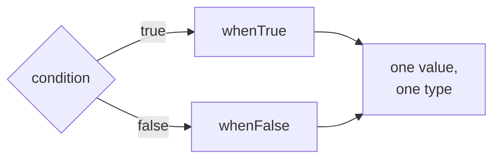

# Ternary

::note
<!-- sync:needs:start -->

**You'll need**: [If](/docs/learn/if)
<!-- sync:needs:end -->

::

`if` chooses which _statements_ run. Sometimes the choice is smaller than that: you only need one of two _values_, right in the middle of an expression — "even" or "odd", the larger of two numbers, an `s` for a plural or nothing. The conditional operator makes that choice without leaving the expression. It is often called the _ternary_ operator, because it is the only operator with three operands.

## condition ? whenTrue : whenFalse

The condition comes first, then `?`, the value for `true`, `:`, and the value for `false`:

```rux
let label = n % 2 == 0 ? "even" : "odd";
```

With `n` at 7, `n % 2 == 0` is `false`, so `label` becomes `"odd"`. Only the chosen side is evaluated; the other is skipped, just as an untaken `if` block is.

## Why not just use if?

Here is the same choice written with `if`:

```rux
var labelTheLongWay = "";
if n % 2 == 0 {
    labelTheLongWay = "even";
} else {
    labelTheLongWay = "odd";
}
```

It works, but the binding has to be declared first with a placeholder value and filled in later, in whichever branch runs — so it must be a `var`. The conditional gives the binding its value where it is declared, so it can be a `let`. That is the real gain, more than the shorter line: a `let` cannot be changed by accident later on.

## A value goes anywhere

Because the whole conditional is a value, it can be passed straight to a call:

```rux
PrintLine("the larger of {} and {} is {}", a, b, a > b ? a : b);
```

```rux
PrintLine("{} item{}", count, count == 1 ? "" : "s");
```

or used inside arithmetic:

```rux
let total = price - (member ? 5 : 0);
```

The parentheses matter in that last line. The conditional ranks below arithmetic, just above assignment, so without them `price - member` would be worked out first — and an `int32` minus a `bool` makes no sense. When a conditional sits inside a larger expression, wrap it.

## One value, one type

The conditional produces one value, so both sides must have the same type. `ready ? "yes" : 0` is refused, because one side is text and the other a number:



## Chains of conditionals

A conditional may take the place of the false side of another. It reads as a list of cases tested from the left:

```rux
let sign = n < 0 ? "negative" : n == 0 ? "zero" : "positive";
```

`n < 0` is tested first; if it fails, `n == 0`; if that fails too, the answer is `"positive"`. Two or three cases read well like this. Past that, an [`else if` chain](/docs/learn/else-if) — or a [`match` expression](/docs/learn/match-expression) — is clearer.

## The program

The whole lesson is one package in the [Examples repository](https://github.com/rux-lang/Examples/tree/main/ControlFlow/Ternary). Its comments explain every step.

<!-- sync:program:start -->

```rux [Src/Main.rux]
// `if` chooses which statements run. Sometimes the choice is smaller than that: one of two
// *values*, in the middle of an expression. `condition ? whenTrue : whenFalse` makes that choice.
// It is an expression, so it goes anywhere a value goes.
//
// The whole conditional is one value with one type, so both sides must have the same type:
//
//     let answer = ready ? "yes" : 0;
//         error: conditional branch type mismatch: expected 'char8[..]', found 'int'
//         help: make both branches produce the same type
//
// Give both sides text, or both numbers.
import Io::PrintLine;

func Main() -> int {
    let n: int32 = 7;

    // Written with `if`, choosing a label needs a `var`: the binding is declared first and given
    // its value later, in whichever branch runs.
    var labelTheLongWay = "";
    if n % 2 == 0 {
        labelTheLongWay = "even";
    } else {
        labelTheLongWay = "odd";
    }

    // Written as a conditional, the binding gets its value where it is declared, so it can be a
    // `let`. That is the real gain, more than the shorter line.
    let label = n % 2 == 0 ? "even" : "odd";
    PrintLine("{} is {} ({} the long way)", n, label, labelTheLongWay);

    // Being a value, it can be passed straight to a call or used inside arithmetic.
    let a: int32 = 3;
    let b: int32 = 5;
    PrintLine("the larger of {} and {} is {}", a, b, a > b ? a : b);

    let count: int32 = 3;
    PrintLine("{} item{}", count, count == 1 ? "" : "s");

    let price: int32 = 40;
    let member = true;
    let total = price - (member ? 5 : 0);
    PrintLine("members pay {}", total);

    // A conditional may take the place of the false side of another, which reads as a list of
    // cases tested from the left. Past two or three cases, an `else if` chain is clearer.
    let sign = n < 0 ? "negative" : n == 0 ? "zero" : "positive";
    PrintLine("{} is {}", n, sign);
    return 0;
}
```

<!-- sync:program:end -->

## Run it

```sh
cd Examples/ControlFlow/Ternary
rux run
```

<!-- sync:output:start -->

```
7 is odd (odd the long way)
the larger of 3 and 5 is 5
3 items
members pay 35
7 is positive
```

<!-- sync:output:end -->

## Common mistakes

::warning
**Giving the two sides different types.**\
`let answer = ready ? "yes" : 0;` fails with `error: conditional branch type mismatch: expected 'char8[..]', found 'int'`, and the help says to make both branches produce the same type.
::

::warning
**Forgetting the parentheses inside arithmetic.**\
`price - member ? 5 : 0` is read as `(price - member) ? 5 : 0`, and fails with `error: operator '-' cannot combine left operand 'int32' with right operand 'bool8'`. Write `price - (member ? 5 : 0)`.
::

::warning
**Using a number as the condition.**\
`n % 2 ? "odd" : "even"` fails with `error: condition for '?:' must have type 'bool', but found 'int32'`. As with `if`, write the comparison: `n % 2 != 0`.
::

## Try it yourself

1. Print `"pass"` or `"fail"` for a `score` depending on whether it is at least 50.
2. Use a conditional to print the smaller of `a` and `b`.
3. Set `count` to `1` and check that the plural `s` disappears.
4. Extend `sign` so that numbers above 100 print `"large"`. Is it still easy to read?

## Learn more

- [Precedence](/docs/learn/precedence) — the order in which operators apply
- [If](/docs/learn/if) — choosing between blocks of statements
- [Match expression](/docs/learn/match-expression) — choosing a value from many cases
