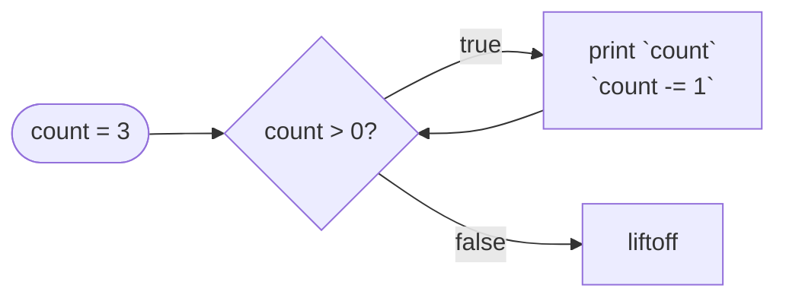

# While

::note
<!-- sync:needs:start -->

**You'll need**: [If](/docs/learn/if), [Assignment](/docs/learn/assignment)
<!-- sync:needs:end -->

::

Computers are good at doing the same thing many times without getting bored. A _loop_ runs a block of code again and again, and `while` is the most basic one: it repeats its block for as long as a condition holds. Everything else in this part about repeating — `do`-`while`, `loop`, `for` — is a variation on it.

## Test, run, repeat

A `while` looks like an `if`: the keyword, a condition, and a block. The difference is what happens at the closing brace. An `if` carries on; a `while` goes back and tests its condition again.

```rux
var count: int32 = 3;
while count > 0 {
    PrintLine("{}...", count);
    count -= 1;
}
PrintLine("liftoff");
```



The condition is tested before every pass, the first one included. It holds for 3, 2 and 1; after the third pass `count` is 0, the test fails, and the program carries on after the loop.

## Something must change

A `while` ends only when something inside it makes the condition false. That is usually a `var` the condition reads, changed on every pass — here, `count -= 1`. Leave that line out and `count` stays at 3 forever: the program prints `3...` again and again and never reaches `liftoff`. If that happens to you, press **Ctrl+C** to stop it.

Most loops need two things: a variable that says where the loop has got to, and often another that carries the result. Adding up 1 + 2 + … + 10 uses both:

```rux
var n: int32 = 1;
var sum: int32 = 0;
while n <= 10 {
    sum += n;
    n += 1;
}
PrintLine("1 + 2 + ... + 10 = {}", sum);
```

## When the number of passes is unknown

`while` suits a loop whose number of passes you cannot know in advance. How many doublings take 1 past 1000? The loop finds out by doing them:

```rux
var value: int32 = 1;
var doublings: int32 = 0;
while value <= 1000 {
    value *= 2;
    doublings += 1;
}
PrintLine("{} doublings reach {}", doublings, value);
```

The condition describes when to _keep going_, and the loop counts how many passes it took: 10 doublings reach 1024.

## Zero passes is possible

Because the test comes first, a loop whose condition starts out false never runs its body at all:

```rux
var fuel: int32 = 0;
while fuel > 0 {
    PrintLine("driving");
    fuel -= 1;
}
```

That is usually exactly right — with an empty tank there is nothing to drive. When the body must run at least once, the [next lesson](/docs/learn/do-while) has the loop for it.

## The program

The whole lesson is one package in the [Examples repository](https://github.com/rux-lang/Examples/tree/main/ControlFlow/While). Its comments explain every step.

<!-- sync:program:start -->

```rux [Src/Main.rux]
// `while` repeats a block for as long as its condition holds. The condition is tested before
// every pass, the first one included, so a loop whose condition starts out false runs zero times.
//
// The loop ends only when something inside it makes the condition false. That is usually a `var`
// the condition reads, changed on every pass. Forget the change (`count -= 1` below) and the
// condition never becomes false: the program repeats the same pass forever.
import Io::PrintLine;

func Main() -> int {
    // A countdown: the condition reads `count`, and the body brings it one step closer to 0.
    var count: int32 = 3;
    while count > 0 {
        PrintLine("{}...", count);
        count -= 1;
    }
    PrintLine("liftoff");

    // Adding up 1 + 2 + ... + 10. One variable says where the loop is, another carries the result.
    var n: int32 = 1;
    var sum: int32 = 0;
    while n <= 10 {
        sum += n;
        n += 1;
    }
    PrintLine("1 + 2 + ... + 10 = {}", sum);

    // `while` suits loops whose number of passes is not known in advance. How many doublings take
    // 1 past 1000? The loop finds out by doing them.
    var value: int32 = 1;
    var doublings: int32 = 0;
    while value <= 1000 {
        value *= 2;
        doublings += 1;
    }
    PrintLine("{} doublings reach {}", doublings, value);

    // Here the condition is false before the first pass, so the body never runs.
    var fuel: int32 = 0;
    while fuel > 0 {
        PrintLine("driving");
        fuel -= 1;
    }
    PrintLine("the tank was empty, so the loop ran zero times");
    return 0;
}
```

<!-- sync:program:end -->

## Run it

```sh
cd Examples/ControlFlow/While
rux run
```

<!-- sync:output:start -->

```
3...
2...
1...
liftoff
1 + 2 + ... + 10 = 55
10 doublings reach 1024
the tank was empty, so the loop ran zero times
```

<!-- sync:output:end -->

## Common mistakes

::warning
**Forgetting to change the condition's variable.**\
Without `count -= 1`, the loop's condition never becomes false and the program runs forever. Nothing warns you: it compiles cleanly. Check that every pass moves the loop towards its end.
::

::warning
**Off by one.**\
`while n < 10` stops before adding 10; `while n <= 10` includes it. When a loop gives an answer that is slightly wrong, check the comparison in its condition first.
::

::warning
**Using a number as the condition.**\
`while count { }` fails with `error: condition for 'while' must have type 'bool', but found 'int32'`. Write `while count != 0`.
::

## Try it yourself

1. Make the countdown start from 10 and print `liftoff` at the end.
2. Add up only the even numbers from 2 to 20 by stepping `n` by 2.
3. Find how many times 1,000,000 can be halved with `/= 2` before it reaches 0.
4. Change `while n <= 10` to `while n < 10` and explain the new sum.

## Learn more

- [`while`](/docs/lang/statements/loops#while) in the Rux Reference
- [Do-while](/docs/learn/do-while) — test at the bottom, so the body runs at least once
- [For](/docs/learn/for) — the loop that handles its own counter
