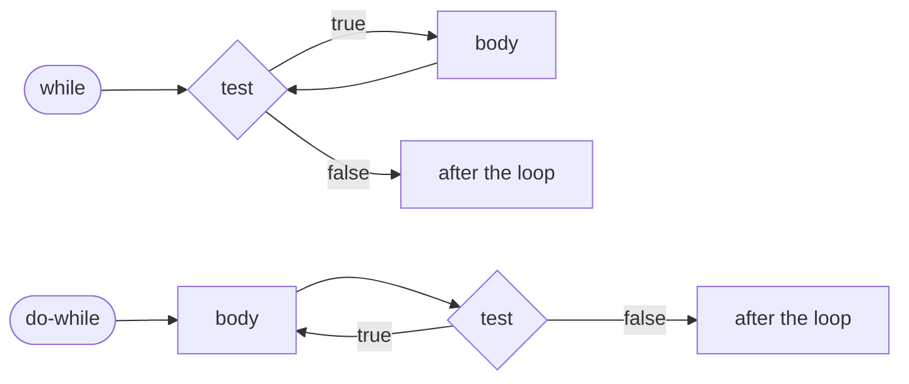

# Do-while

::note
<!-- sync:needs:start -->

**You'll need**: [While](/docs/learn/while)
<!-- sync:needs:end -->

::

A `while` loop tests first and runs second, so it may run zero times. Some jobs need the opposite order: do the work once, then decide whether to do it again. Asking a user for input until it is valid is one — you cannot check an answer before you have asked. `do`-`while` puts the test at the bottom, so the body always runs at least once.

## The test at the bottom

```rux
do {
    doPasses += 1;
} while doPasses > 5;
```

The body comes first, after `do`. The condition comes last, after `while`, and the whole statement ends with a semicolon. Apart from where the test sits, it behaves like a `while`: after each pass the condition is tested, and the loop repeats while it holds.



## The same false condition, both ways

The program runs both loops with a condition that is false from the start:

```rux
var whilePasses: int32 = 0;
while whilePasses > 5 {
    whilePasses += 1;
}
var doPasses: int32 = 0;
do {
    doPasses += 1;
} while doPasses > 5;
PrintLine("while ran {} times, do-while ran {} time", whilePasses, doPasses);
```

`while` never runs its body, and `do`-`while` runs it once. That guarantee is the only difference between them, and the reason to choose one over the other.

## Where the guarantee matters

Counting the digits of a number is a natural fit: divide by 10 until nothing is left, counting as you go.

```rux
var number: int32 = 4096;
var digits: int32 = 0;
do {
    digits += 1;
    number /= 10;
} while number != 0;
PrintLine("4096 has {} digits", digits);
```

4096 becomes 409, 40, 4 and 0 — four passes, four digits. Now consider 0. It has one digit, but it is already `0` before the first pass. The `do`-`while` runs once anyway and gets the right answer, `1`. The same loop written with `while` tests `number != 0` first, never runs, and reports that 0 has no digits at all:

```rux
while number != 0 {
    digits += 1;
    number /= 10;
}
```

| Number | `do`-`while` says | `while` says |
| ------ | ----------------- | ------------ |
| 4096   | 4 digits          | 4 digits     |
| 0      | 1 digit           | 0 digits     |

Both are correct for every other number. Edge cases like 0 are where the choice of loop shows.

## The program

The whole lesson is one package in the [Examples repository](https://github.com/rux-lang/Examples/tree/main/ControlFlow/DoWhile). Its comments explain every step.

<!-- sync:program:start -->

```rux [Src/Main.rux]
// `do { ... } while condition;` runs its body first and tests the condition afterwards. So the
// body always runs at least once, even when the condition is false from the start. That
// guarantee is the only difference from `while`, and the reason to choose one over the other.
//
// The test sits at the end, so the statement ends with a semicolon after the condition. Leave it
// out and the compiler stops at whatever comes next:
//
//     error: expected ';' after the 'do while' condition before 'PrintLine'
import Io::PrintLine;

func Main() -> int {
    // The same false condition, both ways round: `while` never runs its body, `do` runs it once.
    var whilePasses: int32 = 0;
    while whilePasses > 5 {
        whilePasses += 1;
    }
    var doPasses: int32 = 0;
    do {
        doPasses += 1;
    } while doPasses > 5;
    PrintLine("while ran {} times, do-while ran {} time", whilePasses, doPasses);

    // Where the guarantee matters: counting the digits of a number by dividing by 10 until
    // nothing is left. Every number has at least one digit, and 0 is the case that shows it.
    var number: int32 = 4096;
    var digits: int32 = 0;
    do {
        digits += 1;
        number /= 10;
    } while number != 0;
    PrintLine("4096 has {} digits", digits);

    number = 0;
    digits = 0;
    do {
        digits += 1;
        number /= 10;
    } while number != 0;
    PrintLine("0 has {} digit", digits);

    // Written with `while`, the same loop never runs for 0 and reports no digits at all.
    number = 0;
    digits = 0;
    while number != 0 {
        digits += 1;
        number /= 10;
    }
    PrintLine("the while version says 0 has {} digits", digits);
    return 0;
}
```

<!-- sync:program:end -->

## Run it

```sh
cd Examples/ControlFlow/DoWhile
rux run
```

<!-- sync:output:start -->

```
while ran 0 times, do-while ran 1 time
4096 has 4 digits
0 has 1 digit
the while version says 0 has 0 digits
```

<!-- sync:output:end -->

## Common mistakes

::warning
**Forgetting the semicolon after the condition.**\
`do { … } while number != 0` must end with `;`. Without it the compiler stops at whatever comes next: `error: expected ';' after the 'do while' condition before 'PrintLine'`.
::

::warning
**Choosing `do`-`while` when zero passes is a valid answer.**\
If the body must not run for some starting values — an empty list, a balance of 0 — the guarantee of one pass is a bug, not a feature. Use `while` there.
::

## Try it yourself

1. Count the digits of `7`, `10` and `1000000` with the `do`-`while` loop.
2. Change the digit counter to add up the digits instead (`number % 10` is the last digit). What does `4096` give?
3. Write a `do`-`while` that doubles a `var value: int32 = 1;` until it passes 100, and print how many passes it took.

## Learn more

- [`while`](/docs/lang/statements/loops#while) in the Rux Reference
- [While](/docs/learn/while) — the loop that tests first
- [Loop](/docs/learn/loop) — for a loop whose exit belongs in the middle
