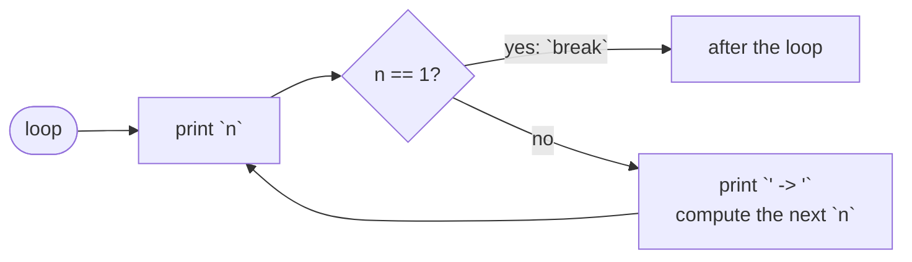

# Loop

::note
<!-- sync:needs:start -->

**You'll need**: [While](/docs/learn/while), [Do-while](/docs/learn/do-while)
<!-- sync:needs:end -->

::

`while` tests at the top of each pass, and `do`-`while` at the bottom. Some loops want the test in the **middle**: there is work to do before the question can be asked, and different work after it. `loop` is the keyword for that — a loop with no condition at all, whose way out is a `break` written wherever it belongs.

## A loop with no condition

```rux
loop {
    total += odd;
    if total > 50 {
        break;
    }
    odd += 2;
}
```

On its own, `loop { … }` would repeat forever. The `break` inside is what ends it: it leaves the loop at once, and the program carries on with the statement after the closing brace. The [next lesson](/docs/learn/break) looks at `break` in every kind of loop; here it is simply the way out.

## The exit in the middle

The Collatz sequence is a good example of a loop that wants its test in the middle. Start from a number; halve it if it is even, triple it and add one if it is odd; stop on reaching 1. The program prints the whole sequence with arrows between the numbers:

```rux
var n: int32 = 6;
var steps: int32 = 0;
loop {
    Print("{}", n);
    if n == 1 {
        break;
    }
    Print(" -> ");
    if n % 2 == 0 {
        n /= 2;
    } else {
        n = 3 * n + 1;
    }
    steps += 1;
}
```



Each number is printed _before_ the test, so the final 1 is printed too. The arrow and the next number come _after_ the test, so nothing is printed or computed past the end. Move the test to the top of the body or to the bottom, and either way the line ends in a stray arrow with the final 1 missing. `Print`, unlike `PrintLine`, does not end the line, which is how the sequence stays on one row — the `PrintLine()` after the loop finishes it.

## The exit can depend on the work

In the second loop, the test reads a value the body has only just computed:

```rux
var odd: int32 = 1;
var total: int32 = 0;
loop {
    total += odd;
    if total > 50 {
        break;
    }
    odd += 2;
}
PrintLine("adding odd numbers up to {} passes 50, at {}", odd, total);
```

The total is updated first, then tested, and only if the loop goes on does `odd` move to the next odd number. That way `odd` still holds the number that pushed the total past 50 when the loop ends.

## loop or while true?

`while true { … }` with a `break` inside does the same job and compiles fine. `loop` is the better way to say it: the reader sees at once that the loop's ending is decided inside it, instead of reading a condition that is not really one.

| Loop             | Where the test is     | Runs at least once? |
| ---------------- | --------------------- | ------------------- |
| `while`          | at the top            | no                  |
| `do`-`while`     | at the bottom         | yes                 |
| `loop` + `break` | wherever you write it | up to the `break`   |

## The program

The whole lesson is one package in the [Examples repository](https://github.com/rux-lang/Examples/tree/main/ControlFlow/Loop). Its comments explain every step.

<!-- sync:program:start -->

```rux [Src/Main.rux]
// `loop { ... }` repeats its body with no condition at all. On its own it would run forever, so
// somewhere in the body there is a `break`, which leaves the loop at once and carries on with the
// statement after it.
//
// `while` tests at the top of each pass and `do`-`while` at the bottom. `loop` is for the loop
// whose exit belongs in the middle: some work has to happen before the test, and some after it.
// It also says plainly that the loop's ending is decided inside it, which `while true` hides.
//
// The next lesson, Break, looks at `break` in every kind of loop. Here it is just the way out.
import Io::{ Print, PrintLine };

func Main() -> int {
    // The Collatz sequence: halve an even number, triple an odd one and add one, and stop on
    // reaching 1. Each number is printed before the test, so the final 1 is printed too. The arrow
    // and the next number come after the test, so nothing is printed or computed past the end.
    var n: int32 = 6;
    var steps: int32 = 0;
    loop {
        Print("{}", n);
        if n == 1 {
            break;
        }
        Print(" -> ");
        if n % 2 == 0 {
            n /= 2;
        } else {
            n = 3 * n + 1;
        }
        steps += 1;
    }
    PrintLine();
    PrintLine("6 reaches 1 in {} steps", steps);

    // The exit can depend on what the body just computed. Keep adding odd numbers 1 + 3 + 5 + ...
    // and stop once the total passes 50.
    var odd: int32 = 1;
    var total: int32 = 0;
    loop {
        total += odd;
        if total > 50 {
            break;
        }
        odd += 2;
    }
    PrintLine("adding odd numbers up to {} passes 50, at {}", odd, total);
    return 0;
}
```

<!-- sync:program:end -->

## Run it

```sh
cd Examples/ControlFlow/Loop
rux run
```

<!-- sync:output:start -->

```
6 -> 3 -> 10 -> 5 -> 16 -> 8 -> 4 -> 2 -> 1
6 reaches 1 in 8 steps
adding odd numbers up to 15 passes 50, at 64
```

<!-- sync:output:end -->

## Common mistakes

::warning
**A `loop` with no reachable `break`.**\
The compiler does not insist on a `break`, so a `loop` whose `break` is never reached runs forever. Make sure every path through the body moves towards the exit — press **Ctrl+C** to stop a program that is stuck.
::

::warning
**Putting the test in the wrong place.**\
Move `if n == 1 { break; }` to the top or the bottom of the Collatz loop and the output ends `4 -> 2 -> ` — a stray arrow, and no final `1`. Where the `break` sits decides what happens on the last pass.
::

## Try it yourself

1. Start the Collatz sequence from `27` and count the steps. (It takes a while.)
2. Change the second loop to stop once the total passes 100.
3. Rewrite the second loop with `while`. Which variable needs a different starting value, or which test needs to change?

## Learn more

- [`loop`](/docs/lang/statements/loops#loop) in the Rux Reference
- [Break](/docs/learn/break) — leaving any loop early
- [While](/docs/learn/while) and [Do-while](/docs/learn/do-while) — loops with a test at one end
