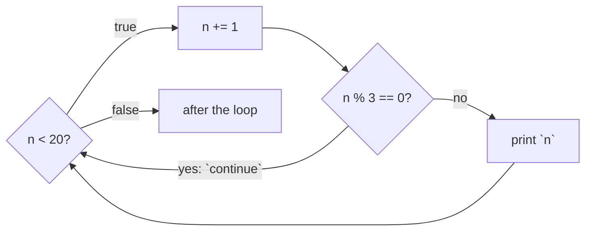

# Continue

::note
<!-- sync:needs:start -->

**You'll need**: [Break](/docs/learn/break)
<!-- sync:needs:end -->

::

`break` gives up on the whole loop. Often you only want to give up on one value — skip the blank line, ignore the negative reading, pass over the multiples of 3 — and carry on with the rest. `continue` abandons the rest of the current pass and starts the next one. It does not leave the loop.

## Skipping a value

```rux
var n: int32 = 0;
while n < 20 {
    n += 1;
    if n % 3 == 0 {
        continue;
    }
    Print(" {}", n);
}
```

For 3, 6, 9 and the other multiples of 3, `continue` jumps over the `Print`. Every other number reaches it. The shape is worth remembering: the test for "not this one" goes at the top of the body, and the work below it runs only for the values that remain.

## Where continue goes next

Where the next pass begins depends on the loop:

| Loop         | After `continue`               |
| ------------ | ------------------------------ |
| `while`      | tests its condition again      |
| `do`-`while` | goes to the test at its bottom |
| `loop`       | starts its body again          |
| `for`        | moves on to the next value     |



## The step goes first

`continue` skips _everything_ after it in the body — including any line that moves the loop on. That is why `n += 1` comes at the top of both loops here. Suppose it were written at the bottom instead:

```rux
while n < 20 {
    if n % 3 == 0 {
        continue;
    }
    Print(" {}", n);
    n += 1;
}
```

`n` starts at 0, which is already a multiple of 3. `continue` jumps back to the test before `n += 1` runs, so `n` is still 0, the test still holds, `continue` runs again — and the loop tests the same value forever, without printing a thing. Step first, then decide whether to skip.

## Skipped passes still happen

A skipped pass is not a pass that never ran; it just ends early. The second loop counts both:

```rux
var passes: int32 = 0;
var kept: int32 = 0;
var sum: int32 = 0;
n = 0;
while n < 10 {
    n += 1;
    passes += 1;
    if n % 2 == 0 {
        continue;
    }
    kept += 1;
    sum += n;
}
```

Ten passes run; five reach the bottom, adding up the odd numbers 1 + 3 + 5 + 7 + 9 = 25.

## continue and break together

The two combine naturally: skip some values, stop at another.

```rux
var k: int32 = 0;
loop {
    k += 1;
    if k % 2 == 0 {
        continue;
    }
    if k > 7 {
        break;
    }
    Print(" {}", k);
}
```

Even numbers are skipped; the first odd number above 7 — which is 9 — ends the loop. So `k` is 9 afterwards, even though the last number printed was 7.

## The program

The whole lesson is one package in the [Examples repository](https://github.com/rux-lang/Examples/tree/main/ControlFlow/Continue). Its comments explain every step.

<!-- sync:program:start -->

```rux [Src/Main.rux]
// `continue` abandons the rest of the current pass and starts the next one. Unlike `break`, it
// does not leave the loop: a `while` goes back to testing its condition, a `do`-`while` goes to
// the test at its bottom, and a `loop` starts its body again.
//
// It suits a loop that has to skip some values: the test for "not this one" goes at the top of
// the body, and the work below it runs only for the values that remain.
//
// The trap: `continue` skips *everything* after it, including the step that moves the loop on.
// Write the step below the `continue` and a skipped value is never stepped past, so the loop
// tests the same value forever. That is why `n += 1` comes first in both loops below.
import Io::{ Print, PrintLine };

func Main() -> int {
    // Numbers from 1 to 20 that are not multiples of 3.
    Print("not multiples of 3:");
    var n: int32 = 0;
    while n < 20 {
        n += 1;
        if n % 3 == 0 {
            continue;
        }
        Print(" {}", n);
    }
    PrintLine();

    // Counting and summing only the values that pass a test. The skipped passes still happen;
    // they just end early.
    var passes: int32 = 0;
    var kept: int32 = 0;
    var sum: int32 = 0;
    n = 0;
    while n < 10 {
        n += 1;
        passes += 1;
        if n % 2 == 0 {
            continue;
        }
        kept += 1;
        sum += n;
    }
    PrintLine("{} passes, {} odd numbers kept, summing to {}", passes, kept, sum);

    // `continue` and `break` together: skip the even numbers, stop at the first odd one above 7.
    Print("odd numbers up to 7:");
    var k: int32 = 0;
    loop {
        k += 1;
        if k % 2 == 0 {
            continue;
        }
        if k > 7 {
            break;
        }
        Print(" {}", k);
    }
    PrintLine();
    PrintLine("stopped at {}", k);
    return 0;
}
```

<!-- sync:program:end -->

## Run it

```sh
cd Examples/ControlFlow/Continue
rux run
```

<!-- sync:output:start -->

```
not multiples of 3: 1 2 4 5 7 8 10 11 13 14 16 17 19 20
10 passes, 5 odd numbers kept, summing to 25
odd numbers up to 7: 1 3 5 7
stopped at 9
```

<!-- sync:output:end -->

## Common mistakes

::mistake
**Stepping after the `continue`.**\
If the line that moves the loop on comes below a `continue`, a skipped value is never stepped past, and the loop runs forever on the same value. The compiler cannot see this — it compiles cleanly. Put the step at the top of the body. ([For](/docs/learn/for) handles the step itself, so the trap disappears there.)
::

::mistake
**`continue` outside a loop.**\
Like `break`, it belongs in a loop:

```text
error: 'continue' can only be used inside 'while', 'for', or 'loop'
```
::

## Try it yourself

1. Print the numbers from 1 to 30 that are multiples of neither 2 nor 3.
2. Add up only the numbers from 1 to 100 that end in 7 (`n % 10 == 7`).
3. Change the last loop to stop at the first odd number above 15.

## Learn more

- [`break` / `continue`](/docs/lang/statements/break-continue) in the Rux Reference
- [Break](/docs/learn/break) — leaving the loop instead of one pass
- [For](/docs/learn/for) — a loop where `continue` can never skip the step
