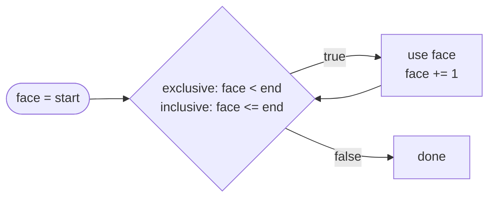

# Range

::note
<!-- sync:needs:start -->

**You'll need**: [While](/docs/learn/while), [Comparison](/docs/learn/comparison)
<!-- sync:needs:end -->

::

"The digits 0 to 9." "Faces one to six." "Hours from 9 until 17." A great deal of counting is about a run of consecutive numbers described by where it starts and where it stops. A _range_ is a value that holds exactly that: two ends. The main use of a range is walking through it, which the [next lesson](/docs/learn/for) does in one line; this lesson looks at what a range is, so that the walk holds no surprises.

## Two spellings, two kinds of end

```rux
let digits = 0..10;
let die = 1..=6;
```

`a..b` starts at `a` and stops **just before** `b` — the end is excluded, so `0..10` is the ten digits 0 to 9. `a..=b` **includes** `b`, so `1..=6` is the six faces of a die.

| Range   | Type        | Values     | How many              |
| ------- | ----------- | ---------- | --------------------- |
| `0..10` | `int..int`  | 0, 1, …, 9 | `end - start` = 10    |
| `1..=6` | `int..=int` | 1, 2, …, 6 | `end - start + 1` = 6 |
| `5..5`  | `int..int`  | none       | 0                     |
| `5..=5` | `int..=int` | 5          | 1                     |

The two spellings make two different types. That is not a detail to memorise — it means the compiler always knows which kind of end a range has.

## A range holds only its bounds

A range does not list its values. It remembers its two ends, which it offers as `.start` and `.end`:

```rux
PrintLine("digits: start {}, end {} (excluded)", digits.start, digits.end);
PrintLine("die:    start {}, end {} (included)", die.start, die.end);
```

Everything else follows from those two numbers. How many values a range holds is a subtraction, plus one for an inclusive end:

```rux
PrintLine("{} digits", digits.end - digits.start);
PrintLine("{} faces", die.end - die.start + 1);
```

Whether a number falls inside is two comparisons — and the one against the end differs by a single character:

```rux
let roll = 7;
let isDigit = roll >= digits.start && roll < digits.end;
let isFace = roll >= die.start && roll <= die.end;
```

## Bounds and their type

The bounds may be any integer expressions, not only literals:

```rux
let first: int32 = 3;
let width: int32 = 4;
let window = first..first + width;
```

`..` ranks below arithmetic, so `first..first + width` is `3..7`. The bounds take the type of the values they are built from — `int32` here. With literal bounds the default is `int`, and an annotation picks another integer type:

```rux
let hours: uint8..uint8 = 0..24;
```

## Walking a range by hand

To visit every value: start at `.start`, step by one, and stop according to the kind of end.

```rux
var face = die.start;
while face <= die.end {
    Print(" {}", face);
    face += 1;
}
```



Every walk over a range has these same three parts — a start, a test, a step — and the only thing that changes is `<` or `<=`. That repetition is exactly what `for` takes off your hands.

## The program

The whole lesson is one package in the [Examples repository](https://github.com/rux-lang/Examples/tree/main/ControlFlow/Range). Its comments explain every step.

<!-- sync:program:start -->

```rux [Src/Main.rux]
// A range is a value that describes a run of consecutive integers by its two ends. `a..b` starts
// at `a` and stops just before `b`, so `b` is excluded; `a..=b` includes `b`. The two spellings
// make two different types: `0..10` is an `int..int` and `1..=6` an `int..=int`.
//
// A range does not list its values; it only remembers its bounds, which it offers as `.start`
// and `.end`. Everything else (how many values, whether a number is inside) follows from them.
//
// The start may not come after the end. A range written backwards with literal bounds is refused:
//
//     let backwards = 5..2;
//         error: range start cannot be greater than its end
//
// The main use of a range is walking through it, which the next lesson, For, does in one line.
// Here a `while` loop does it by hand, to show what a range means.
import Io::{ Print, PrintLine };

func Main() -> int {
    let digits = 0..10;
    let die = 1..=6;
    PrintLine("digits: start {}, end {} (excluded)", digits.start, digits.end);
    PrintLine("die:    start {}, end {} (included)", die.start, die.end);

    // How many values each range holds. The inclusive end is one value more.
    PrintLine("{} digits", digits.end - digits.start);
    PrintLine("{} faces", die.end - die.start + 1);

    // Whether a number falls inside: the comparison against the end differs by one character.
    let roll = 7;
    let isDigit = roll >= digits.start && roll < digits.end;
    let isFace = roll >= die.start && roll <= die.end;
    PrintLine("{} is a digit: {}, a face: {}", roll, isDigit, isFace);

    // Equal bounds: the exclusive range holds nothing at all, the inclusive one holds one value.
    let empty = 5..5;
    let single = 5..=5;
    PrintLine("5..5 holds {} values, 5..=5 holds {}", empty.end - empty.start,
        single.end - single.start + 1);

    // The bounds may be any integer expressions, not only literals.
    let first: int32 = 3;
    let width: int32 = 4;
    let window = first..first + width;
    PrintLine("window: start {}, end {}", window.start, window.end);

    // An annotation picks another integer type for the bounds, and literal bounds take it.
    let hours: uint8..uint8 = 0..24;
    PrintLine("hours:  start {}, end {}", hours.start, hours.end);

    // Walking a range by hand: start at `.start`, step by one, stop according to the kind of end.
    Print("faces:");
    var face = die.start;
    while face <= die.end {
        Print(" {}", face);
        face += 1;
    }
    PrintLine();
    return 0;
}
```

<!-- sync:program:end -->

## Run it

```sh
cd Examples/ControlFlow/Range
rux run
```

<!-- sync:output:start -->

```
digits: start 0, end 10 (excluded)
die:    start 1, end 6 (included)
10 digits
6 faces
7 is a digit: true, a face: false
5..5 holds 0 values, 5..=5 holds 1
window: start 3, end 7
hours:  start 0, end 24
faces: 1 2 3 4 5 6
```

<!-- sync:output:end -->

## Common mistakes

::warning
**A range written backwards.**\
The start may not come after the end. With literal bounds the compiler catches it: `let backwards = 5..2;` fails with `error: range start cannot be greater than its end`. With bounds computed while the program runs, nothing is reported, and a walk over the range runs zero times.
::

::warning
**Off by one at the end.**\
`1..6` stops at 5. When you mean "up to and including", write `..=`. Counting uses `end - start` for `..` but `end - start + 1` for `..=`.
::

## Try it yourself

1. Make a range for the months of the year and print how many values it holds.
2. Test whether `0`, `5` and `10` fall inside `digits`, and whether they fall inside `0..=10`.
3. Walk `digits` by hand with `while`, printing every value. Which comparison does the condition need?
4. Write `let backwards = 5..2;` and read the error.

## Learn more

- [Ranges](/docs/lang/ranges/overview) and [using ranges](/docs/lang/ranges/usage) in the Rux Reference
- [For](/docs/learn/for) — walking a range in one line
- [Range pattern](/docs/learn/range-pattern) — matching a value against a range
