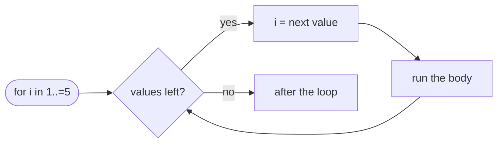

# For

::note
<!-- sync:needs:start -->

**You'll need**: [Range](/docs/learn/range), [Continue](/docs/learn/continue)
<!-- sync:needs:end -->

::

The [Range](/docs/learn/range) lesson walked through a range by hand: a counter, a test against the end, a step on every pass. Three separate lines, and getting any one of them wrong — the wrong comparison, a forgotten step — breaks the loop. `for` does the whole walk in one line. It runs its body once for every value in a range, in order, and hands each value to the body by name.

## for name in range

```rux
for i in 1..5 {
    Print(" {}", i);
}
```

On each pass, `i` is the next value of the range: 1, 2, 3, 4. The end of `..` is excluded, so 5 is not visited; with `..=` it is:

```rux
for i in 1..=5 {
    Print(" {}", i);
}
```

Here is what `for` does for you, compared with the hand-written walk:

| Part       | Hand-written `while`       | `for i in 1..=5`        |
| ---------- | -------------------------- | ----------------------- |
| Start      | `var i = 1;`               | from the range's start  |
| Test       | `while i <= 5`             | from the kind of end    |
| Step       | `i += 1;` — easy to forget | done by the loop        |
| Loop value | a `var` anyone can change  | a fresh `let` each pass |



## Ranges stored in a binding

A range kept in a variable works the same as one written in place. The loop variable takes the type of the bounds, so this `face` is an `int32`, like the `total` it is added to:

```rux
let die: int32..=int32 = 1..=6;
var total: int32 = 0;
for face in die {
    total += face;
}
```

## Bounds are evaluated once

The bounds are worked out once, before the first pass. A factorial — 10! is 1 × 2 × … × 10 — multiplies every number up to and _including_ `n`, so the inclusive form matches its definition exactly:

```rux
let n = 10;
var factorial = 1;
for i in 2..=n {
    factorial *= i;
}
```

Starting at 2 skips a pointless multiplication by 1. An empty range, such as `3..3`, gives the body nothing to run for: the loop runs zero times.

## The loop variable cannot be changed

`i` is a fresh, immutable binding on every pass. The body can read it but cannot assign to it, so it cannot push the loop along or hold it back. When the body really does need to control the stepping — skipping ahead by more than one, or going back — that is a job for `while`.

## break and continue work here too

`break` and `continue` work in `for` as in every other loop. And because the loop does its own stepping, `continue` moves straight on to the next value — the trap from [Continue](/docs/learn/continue), a step skipped by mistake, cannot happen:

```rux
for i in 0..10 {
    if i % 2 == 0 {
        continue;
    }
    Print(" {}", i);
}
```

Whenever a loop visits a known run of numbers, reach for `for` first.

## The program

The whole lesson is one package in the [Examples repository](https://github.com/rux-lang/Examples/tree/main/ControlFlow/For). Its comments explain every step.

<!-- sync:program:start -->

```rux [Src/Main.rux]
// `for name in range { ... }` runs its body once for every value in the range, in order, binding
// the value to `name` on each pass. It is the walk the Range lesson wrote by hand with `while`,
// with the counter, the test and the step all handled by the loop, so none of them can be
// forgotten or got wrong.
//
// The loop variable is a fresh, immutable binding on every pass, so the body cannot move the loop
// along by assigning to it:
//
//     for i in 1..4 { i = 10; }
//         error: cannot modify immutable variable 'i'
//
// When the body needs to control the stepping, use `while`.
import Io::{ Print, PrintLine };

func Main() -> int {
    // The end of `..` is excluded, the end of `..=` is included.
    Print("1..5: ");
    for i in 1..5 {
        Print(" {}", i);
    }
    PrintLine();

    Print("1..=5:");
    for i in 1..=5 {
        Print(" {}", i);
    }
    PrintLine();

    // A range stored in a binding works the same as one written in place. The loop variable takes
    // the type of the bounds, so this `face` is an `int32`, like the `total` it is added to.
    let die: int32..=int32 = 1..=6;
    var total: int32 = 0;
    for face in die {
        total += face;
    }
    PrintLine("the faces of a die add up to {}", total);

    // Bounds are evaluated once, before the first pass. A factorial multiplies every number from
    // 1 up to and including n, so the inclusive form matches its definition.
    let n = 10;
    var factorial = 1;
    for i in 2..=n {
        factorial *= i;
    }
    PrintLine("{}! = {}", n, factorial);

    // An empty range gives the body nothing to run for.
    var passes: int32 = 0;
    for i in 3..3 {
        passes += 1;
    }
    PrintLine("3..3 ran the body {} times", passes);

    // `break` and `continue` work in `for` as in every other loop. `continue` moves straight on to
    // the next value, with no step to forget.
    Print("odd numbers below 10:");
    for i in 0..10 {
        if i % 2 == 0 {
            continue;
        }
        Print(" {}", i);
    }
    PrintLine();
    return 0;
}
```

<!-- sync:program:end -->

## Run it

```sh
cd Examples/ControlFlow/For
rux run
```

<!-- sync:output:start -->

```
1..5:  1 2 3 4
1..=5: 1 2 3 4 5
the faces of a die add up to 21
10! = 3628800
3..3 ran the body 0 times
odd numbers below 10: 1 3 5 7 9
```

<!-- sync:output:end -->

## Common mistakes

::warning
**Assigning to the loop variable.**\
`for i in 1..4 { i = 10; }` fails with `error: cannot modify immutable variable 'i'`. The compiler's help suggests declaring `i` with `var`, but a `for` variable cannot be — `for var i in …` does not parse. Use `while` when the body must control the stepping.
::

::warning
**Counting down with a backwards range.**\
A range only counts up. `for i in 5..0` is refused with `error: range start cannot be greater than its end`, and with bounds computed at run time, such as `high..low`, the body silently runs zero times. Count down with a `while` loop.
::

::warning
**Off by one at the end.**\
`for i in 1..10` stops at 9. If the last value should be included, write `1..=10`.
::

## Try it yourself

1. Print the squares of the numbers from 1 to 10.
2. Add up the numbers from 1 to 100 with `for`, then compare with the `while` version in [While](/docs/learn/while).
3. Print a multiplication table for 7, from `7 x 1` to `7 x 10`.
4. Compute 12! with the factorial loop. Does the answer still fit in an `int`?

## Learn more

- [`for` / `in`](/docs/lang/statements/for) in the Rux Reference
- [Label](/docs/learn/label) — leaving an outer `for` from an inner one
- [Iterator](/docs/learn/iterator) — making your own types walkable by `for`
