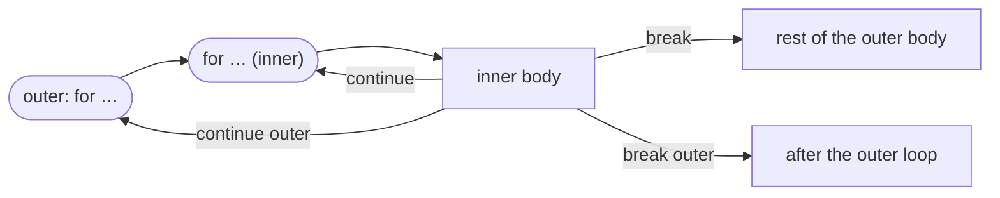

# Label

::note
<!-- sync:needs:start -->

**You'll need**: [For](/docs/learn/for), [Break](/docs/learn/break), [Continue](/docs/learn/continue)
<!-- sync:needs:end -->

::

A plain `break` or `continue` acts on the innermost loop around it. With one loop inside another, that is sometimes the wrong one. A search through a grid of rows and columns wants to stop the _whole_ search once it finds a match — not just the current row, only for the outer loop to start the next one. A **label** gives a loop a name, so `break` and `continue` can say which loop they mean.

## Naming a loop

Write the label before the loop, followed by a colon. Then `break` or `continue` with that name acts on that loop:

```rux
var checks: int32 = 0;
search: for a in 1..10 {
    for b in a..10 {
        checks += 1;
        if a * a + b * b == 100 {
            PrintLine("{}^2 + {}^2 = 100", a, b);
            break search;
        }
    }
}
PrintLine("found after {} checks", checks);
```

The program looks for two numbers below 10 whose squares add up to 100. When it finds 6 and 8, `break search;` leaves the loop named `search` — and every loop inside it — and goes straight to the `PrintLine` after it. Without the label, `break` would end only the inner loop over `b`, and the outer loop would go on searching after the answer was found. (The inner range starts at `a`, so each pair is tried only once: 6 and 8, never 8 and 6 as well.)

## continue with a label

`continue search;` abandons the inner loops and starts the next pass of the labelled one. The second example reports, for each row of a times table, the first product above 10:

```rux
rows: for row in 1..=4 {
    for column in 1..=9 {
        if row * column > 10 {
            PrintLine("row {}: {} x {} = {}", row, row, column, row * column);
            continue rows;
        }
    }
    PrintLine("row {}: no product above 10", row);
}
```

`continue rows` skips the rest of the row — including the line after the inner loop. So `no product above 10` prints only for a row where the inner loop ran to its end without finding anything, which here is row 1.

## Where each jump goes



| Inside the inner loop | Goes to                                  |
| --------------------- | ---------------------------------------- |
| `break;`              | the rest of the outer loop's body        |
| `continue;`           | the next pass of the inner loop          |
| `break outer;`        | the first statement after the outer loop |
| `continue outer;`     | the next pass of the outer loop          |

Labels work on `while`, `do`-`while` and `loop` too, not only `for`.

## Labels are checked names

A label is checked like any other name, so a misspelling is caught at compile time instead of jumping somewhere unexpected. And a nested loop may not reuse the label of a loop around it, which would leave `break outer;` naming two loops at once.

## The program

The whole lesson is one package in the [Examples repository](https://github.com/rux-lang/Examples/tree/main/ControlFlow/Label). Its comments explain every step.

<!-- sync:program:start -->

```rux [Src/Main.rux]
// A plain `break` or `continue` acts on the innermost loop around it. With nested loops, that is
// sometimes the wrong one: a search through a grid wants to stop the *whole* search once it finds
// a match, not just the current row.
//
// A label names a loop. Write it before the loop with a colon, `search: for ...`, and then
// `break search;` leaves that loop and every loop inside it, while `continue search;` abandons
// the inner loops and starts the next pass of the labeled one. Labels work on `while`, `do` and
// `loop` too.
//
// A label is checked like any other name, so a misspelling is caught:
//
//     break serach;
//         error: 'break' refers to unknown loop label 'serach'
//
// And a nested loop may not reuse the label of a loop around it, which would leave `break outer;`
// naming two loops at once:
//
//     outer: for i in 0..3 { outer: for j in 0..3 { break outer; } }
//         error: loop label 'outer' shadows an enclosing loop label
//         help: give the inner loop a different label
import Io::PrintLine;

func Main() -> int {
    // Find two numbers below 10 whose squares add up to 100. Without the label, `break` would
    // end only the inner loop, and the outer one would go on searching after the answer was found.
    var checks: int32 = 0;
    search: for a in 1..10 {
        for b in a..10 {
            checks += 1;
            if a * a + b * b == 100 {
                PrintLine("{}^2 + {}^2 = 100", a, b);
                break search;
            }
        }
    }
    PrintLine("found after {} checks", checks);

    // For each row of a times table, report the first product above 10 and move on to the next
    // row. `continue rows` skips the rest of the row, including the line after the inner loop,
    // which therefore prints only for a row where nothing was found.
    rows: for row in 1..=4 {
        for column in 1..=9 {
            if row * column > 10 {
                PrintLine("row {}: {} x {} = {}", row, row, column, row * column);
                continue rows;
            }
        }
        PrintLine("row {}: no product above 10", row);
    }
    return 0;
}
```

<!-- sync:program:end -->

## Run it

```sh
cd Examples/ControlFlow/Label
rux run
```

<!-- sync:output:start -->

```
6^2 + 8^2 = 100
found after 38 checks
row 1: no product above 10
row 2: 2 x 6 = 12
row 3: 3 x 4 = 12
row 4: 4 x 3 = 12
```

<!-- sync:output:end -->

## Common mistakes

::warning
**Misspelling the label.**\
`break serach;` fails with `error: 'break' refers to unknown loop label 'serach'`. The label must match the one written before the loop.
::

::warning
**Reusing a label on a nested loop.**\
`outer: for i in 0..3 { outer: for j in 0..3 { break outer; } }` fails with `error: loop label 'outer' shadows an enclosing loop label`, and the help says to give the inner loop a different label.
::

::warning
**Forgetting the label.**\
A plain `break` in the inner loop leaves only the inner loop. The search then carries on, and `checks` counts far more than it needed to.
::

## Try it yourself

1. Remove `search` from `break search;` and compare the number of checks.
2. Change the search to find two numbers whose squares add up to `65`. How many pairs exist below 10, and which one does the program report?
3. Label a `while` loop and use `break` with its name from inside a nested `loop`.

## Learn more

- [`loop`](/docs/lang/statements/loop) and [`break` / `continue`](/docs/lang/statements/break-continue) in the Rux Reference
- [Break](/docs/learn/break) and [Continue](/docs/learn/continue) — the unlabelled forms
- [Match](/docs/learn/match) — the next lesson, choosing a branch by value
