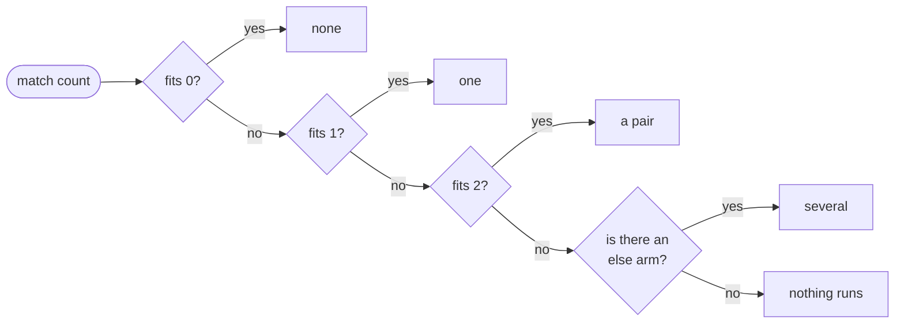

# Match

::note
<!-- sync:needs:start -->

**You'll need**: [Else if](/docs/learn/else-if)
<!-- sync:needs:end -->

::

An `else if` chain that compares one value with a list of constants — `if status == 200 … else if status == 404 … else if status == 500 …` — repeats the same name in every condition, and the reader has to check each line to be sure it really is the same value. `match` says it once. It compares one value against a list of **arms** and runs the first arm whose pattern fits.

## Arms and patterns

```rux
let count: int32 = 2;
match count {
    0 => PrintLine("none"),
    1 => PrintLine("one"),
    2 => PrintLine("a pair"),
    else => PrintLine("several")
}
```

After `match` comes the value being examined, then the arms in braces. Each arm is `pattern => what to do`, and arms are separated by commas. The patterns here are literals — the arm `2` fits when `count` is 2.

## How an arm is chosen

The arms are tried from the top. The first one that fits runs, and the rest are skipped — exactly like an `else if` chain. Whichever arm runs, or none, the program then carries on after the match:



The last arm may be `else`, which fits any value the arms above it did not name. The default arm is always spelled `else` — the `_` that other languages use is refused.

## An arm with a block

An arm that needs more than one statement takes a block in braces. The comma still follows it:

```rux
match status {
    200 => PrintLine("ok"),
    404 => {
        PrintLine("not found");
        PrintLine("check the address");
    },
    else => PrintLine("status {}", status)
}
```

## Covering every value

A `bool` has only two values, so naming both covers everything, and no `else` is needed:

```rux
match ready {
    true => PrintLine("ready"),
    false => PrintLine("not ready yet")
}
```

An integer has far too many values to name, and here is the caveat: an integer that fits no arm is **not** an error. Nothing runs, and the program carries on after the match:

```rux
let missed: int32 = 99;
match missed {
    1 => PrintLine("one"),
    2 => PrintLine("two")
}
```

Write an `else` arm whenever every value ought to be handled. A match that produces a value is held to a stricter rule, as the [next lesson](/docs/learn/match-expression) shows.

## What match checks for you

`match` is stricter than an `else if` chain in a useful way. A chain will happily run with a condition that can never be reached, but `match` refuses arms that cannot run:

| Mistake                        | `else if` chain    | `match`                                                                          |
| ------------------------------ | ------------------ | -------------------------------------------------------------------------------- |
| The same case written twice    | the second is dead | `error: duplicate pattern in match`                                              |
| A catch-all before other cases | the rest are dead  | `error: match arm is unreachable because an earlier pattern matches every value` |

An arm holds exactly one pattern. There is no `6 | 7 =>`: two values that share an outcome are written as two arms. Later parts add richer patterns — [characters](/docs/learn/character-pattern), [ranges](/docs/learn/range-pattern) such as `1..=9 =>`, and [guards](/docs/learn/guard) that add a condition to an arm.

## The program

The whole lesson is one package in the [Examples repository](https://github.com/rux-lang/Examples/tree/main/ControlFlow/Match). Its comments explain every step.

<!-- sync:program:start -->

```rux [Src/Main.rux]
// `match` compares one value against a list of arms and runs the first arm whose pattern fits.
// It says the same as an `if` / `else if` chain of `==` tests, but names the value once instead
// of repeating it in every condition.
//
// Each arm is `pattern => what to do`, and arms are separated by commas. The last arm may be
// `else`, which fits any value the arms above it did not name. The default arm is always spelled
// `else`; the `_` other languages use is refused:
//
//     error: use 'else' for the default match arm
//
// An arm holds exactly one pattern. There is no `1 | 2 =>`: two values that share an outcome are
// written as two arms.
import Io::PrintLine;

func Main() -> int {
    // Literal patterns, and `else` for everything else.
    let count: int32 = 2;
    match count {
        0 => PrintLine("none"),
        1 => PrintLine("one"),
        2 => PrintLine("a pair"),
        else => PrintLine("several")
    }

    // An arm that needs more than one statement takes a block.
    let status: int32 = 404;
    match status {
        200 => PrintLine("ok"),
        404 => {
            PrintLine("not found");
            PrintLine("check the address");
        },
        else => PrintLine("status {}", status)
    }

    // A `bool` has only two values, so naming both covers everything and no `else` is needed.
    let ready = false;
    match ready {
        true => PrintLine("ready"),
        false => PrintLine("not ready yet")
    }

    // The caveat: an integer that fits no arm is not an error. Nothing runs, and the program
    // carries on after the match. Write an `else` arm whenever every value ought to be handled.
    // (A match that produces a value is held to more than this, as the next lesson shows.)
    let missed: int32 = 99;
    match missed {
        1 => PrintLine("one"),
        2 => PrintLine("two")
    }
    PrintLine("99 fit no arm, so that match did nothing");
    return 0;
}
```

<!-- sync:program:end -->

## Run it

```sh
cd Examples/ControlFlow/Match
rux run
```

<!-- sync:output:start -->

```
a pair
not found
check the address
not ready yet
99 fit no arm, so that match did nothing
```

<!-- sync:output:end -->

## Common mistakes

::warning
**Using `_` for the default arm.**\
`_ => PrintLine("other")` fails with `error: use 'else' for the default match arm`.
::

::warning
**Combining values in one arm.**\
`6 | 7 => …` is not a pattern in Rux; the parser stops with `error: expected '=>' after the match arm pattern before '|'`. Write one arm for each value.
::

::warning
**Forgetting the comma between arms.**\
Every arm except the last ends with a comma — including an arm whose body is a block. Without it: `error: expected ',' between match arms before 'else'`.
::

::warning
**Putting `else` first.**\
`else` fits everything, so arms after it could never run: `error: match arm is unreachable because an earlier pattern matches every value`. Keep `else` last.
::

::warning
**Leaving out `else` by accident.**\
An integer match with no `else` silently does nothing for a value no arm names. If every value should be handled, add the `else` arm.
::

## Try it yourself

1. Write a match on an `int32` `day` that prints the name of the day for 1 to 7 and `"no such day"` for anything else.
2. Rewrite the `status` match as an `else if` chain and compare how often `status` is named.
3. Set `missed` to `2` and run again, then add an `else` arm that prints the value.
4. Write the same case twice in one match and read the error.

## Learn more

- [`match`](/docs/lang/statements/match) in the Rux Reference
- [Match expression](/docs/learn/match-expression) — `match` as a value
- [Exhaustive](/docs/learn/exhaustive) — when a match must cover every case
