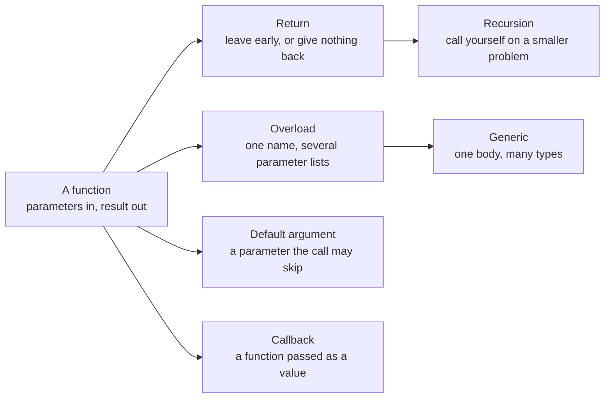

# Part 4: Functions

A function gives a piece of work a name, so it can be written once and run from anywhere. This part starts with the plain shape — parameters in, a result out — and then shows every way Rux lets one function do more: return early, call itself, share a name, leave arguments out, work for many types, and take another function as an argument. By the end, `Main` stops being the whole program and becomes the place that calls the parts.

## What you will learn

- Declaring functions with typed parameters and a result, and calling them.
- Leaving a function early with `return`, and writing functions with no result.
- Recursion: a function that calls itself, and the base case that stops it.
- Overloading: several functions with one name, chosen by their arguments.
- Default arguments that let a call leave the usual value out.
- Generic functions with a type parameter `<T>`, inferred or given explicitly.
- Passing a function as a value, typed by its shape: `func(int32) -> int32`.

## One idea, many shapes



## Lessons

<!-- sync:lessons:start -->

|     | Lesson                                           | What you will learn                                                        |
| --- | ------------------------------------------------ | -------------------------------------------------------------------------- |
| 4.1 | [Function](/docs/learn/function)                 | declare functions with parameters and a return value, and call them        |
| 4.2 | [Return](/docs/learn/return)                     | return early, and write functions that return nothing                      |
| 4.3 | [Recursion](/docs/learn/recursion)               | a function that calls itself, and the base case that stops it              |
| 4.4 | [Overload](/docs/learn/overload)                 | give several functions one name, and let the arguments choose between them |
| 4.5 | [Default argument](/docs/learn/default-argument) | give a parameter a default value so callers may leave it out               |
| 4.6 | [Generic](/docs/learn/generic)                   | write one function that works for many types                               |
| 4.7 | [Callback](/docs/learn/callback)                 | pass a function to another function as an ordinary value                   |

<!-- sync:lessons:end -->

## Before you start

Finish [Part 1: Basics](/docs/learn/basics) and [Part 3: Control flow](/docs/learn/control-flow) first — the lessons here use `var`, `if` and `for` throughout, and [Part 2: Operators](/docs/learn/operators) for the arithmetic inside them. Each lesson's package is in the Examples repository's `Functions/` folder:

```sh
cd Examples/Functions/Function
rux run
```

## After this part

[Part 5: Sequences](/docs/learn/sequences) passes whole arrays, slices and tuples to the functions you can now write — including functions that take any number of arguments. You are also ready for the checkpoint project [Temperature](/docs/learn/temperature).

For the full rules behind this part, see [Functions](/docs/lang/functions/declaration), [Function declaration](/docs/lang/functions/declaration), [Generic functions](/docs/lang/generics/overview) and [Function type aliases](/docs/lang/functions/function-types) in the Rux Reference.
