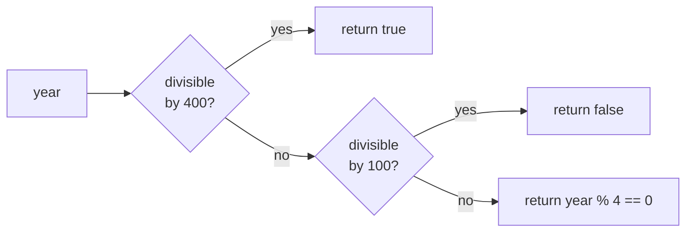

# Return

::note
<!-- sync:needs:start -->

**You'll need**: [Function](/docs/learn/function), [If](/docs/learn/if), [For](/docs/learn/for)
<!-- sync:needs:end -->

::

`return` does two jobs at once: it hands back the result, and it leaves the function on the spot. Nothing after it runs. That makes it a way to answer **early** — the moment the function knows the answer — instead of carrying a result down to the last line. This lesson also meets functions that have no result at all, the ones you call for what they _do_.

## Answering early

Each `if` here answers one case and leaves. By the time the last line runs, the other cases have already been ruled out, so it needs no condition of its own:

```rux
func Sign(value: int) -> int {
    if value > 0 {
        return 1;
    }
    if value < 0 {
        return -1;
    }
    return 0;
}
```

The same style turns a set of rules into a straight list. A leap year is decided by three rules, most specific first, and every rule that settles the answer returns at once — no `else` anywhere:

```rux
func IsLeapYear(year: int) -> bool {
    if year % 400 == 0 {
        return true;
    }
    if year % 100 == 0 {
        return false;
    }
    return year % 4 == 0;
}
```



## Returning from inside a loop

`return` inside a loop leaves the loop **and** the function together. The line after the loop runs only when the loop finished without finding anything:

```rux
func SmallestDivisor(number: int) -> int {
    for candidate in 2..number {
        if number % candidate == 0 {
            return candidate;
        }
    }
    return number;
}
```

| Statement  | Leaves                     | Then runs                           |
| ---------- | -------------------------- | ----------------------------------- |
| `continue` | the rest of this iteration | the next iteration                  |
| `break`    | the loop                   | the first line after the loop       |
| `return`   | the loop and the function  | the caller, with the returned value |

## Functions with no result

Some functions are called for their effect, such as printing. They leave off the `->` and the result type entirely. A bare `return;` still leaves early, and reaching the closing brace is the ordinary way out:

```rux
func Countdown(from: int) {
    if from < 1 {
        PrintLine("nothing to count");
        return;
    }
    for i in 0..from {
        Print("{} ", from - i);
    }
    PrintLine("liftoff");
}
```

A function without a result is called as a statement on its own — `Countdown(5);` — because there is no value to bind or print.

## Every path must return

A function with a result type has to return a value of that type on every way through its body. The compiler checks this: if `Sign` lost its final `return 0;`, a value of exactly zero would reach the closing brace with nothing to give back, and the function is refused.

## The program

The whole lesson is one package in the [Examples repository](https://github.com/rux-lang/Examples/tree/main/Functions/Return). Its comments explain every step.

<!-- sync:program:start -->

```rux [Src/Main.rux]
// `return` does two things at once: it hands back the result, and it leaves
// the function on the spot. Nothing after it runs. That makes it a way to
// answer early — as soon as the function knows the answer — instead of
// carrying a result down to the last line.
//
// And some functions have no result at all. They are called for what they do,
// such as printing, and leave the `->` and the result type off entirely.
import Io::{ Print, PrintLine };

// Each `if` answers one case and leaves. By the time the last line is reached,
// the earlier cases have been ruled out, so it needs no condition of its own.
func Sign(value: int) -> int {
    if value > 0 {
        return 1;
    }
    if value < 0 {
        return -1;
    }
    return 0;
}

// A leap year in three rules, most specific first. Every rule that decides the
// answer returns at once, so no `else` is needed anywhere.
func IsLeapYear(year: int) -> bool {
    if year % 400 == 0 {
        return true;
    }
    if year % 100 == 0 {
        return false;
    }
    return year % 4 == 0;
}

// `return` inside a loop leaves the loop and the function together — further
// than `break` goes. The line after the loop runs only if nothing was found.
func SmallestDivisor(number: int) -> int {
    for candidate in 2..number {
        if number % candidate == 0 {
            return candidate;
        }
    }
    return number;
}

// No `->`, so no result. A bare `return;` still leaves early; falling off the
// closing brace is the ordinary way out.
func Countdown(from: int) {
    if from < 1 {
        PrintLine("nothing to count");
        return;
    }
    for i in 0..from {
        Print("{} ", from - i);
    }
    PrintLine("liftoff");
}

func Main() -> int {
    PrintLine("Sign(-4) {}   Sign(0) {}   Sign(9) {}", Sign(-4), Sign(0), Sign(9));
    PrintLine("IsLeapYear(2024) {}", IsLeapYear(2024));
    PrintLine("IsLeapYear(1900) {}", IsLeapYear(1900));
    PrintLine("IsLeapYear(2000) {}", IsLeapYear(2000));
    PrintLine("SmallestDivisor(91) {}", SmallestDivisor(91));
    PrintLine("SmallestDivisor(97) {}", SmallestDivisor(97));

    // A function without a result is called as a statement on its own.
    Countdown(5);
    Countdown(0);

    // The compiler checks that a function with a result returns one on every
    // path. Leave out the final `return 0;` in `Sign` and it says:
    //
    //     error: function 'Sign' must return a value of type 'int' on every
    //            control-flow path
    //
    // The opposite mistake, `return 5;` in a function with no `->`, is also
    // refused: 'return' cannot have a value in a function with no return type.
    return 0;
}
```

<!-- sync:program:end -->

## Run it

```sh
cd Examples/Functions/Return
rux run
```

<!-- sync:output:start -->

```
Sign(-4) -1   Sign(0) 0   Sign(9) 1
IsLeapYear(2024) true
IsLeapYear(1900) false
IsLeapYear(2000) true
SmallestDivisor(91) 7
SmallestDivisor(97) 97
5 4 3 2 1 liftoff
nothing to count
```

<!-- sync:output:end -->

## Common mistakes

::mistake
**A path that never returns.**\
Leave out the final `return 0;` in `Sign` and the compiler says:

```text
error: function 'Sign' must return a value of type 'int' on every control-flow path
```

Make sure the last line returns something, even when the `if`s above it cover every case you can think of.
::

::mistake
**A value in a function with no result.**\
`return 5;` inside `Countdown` fails with:

```text
error: 'return' cannot have a value in a function with no return type
```

Either drop the value, or give the function a `->` and a result type.
::

::mistake
**Printing a function that has no result.**\
`PrintLine("{}", Countdown(3))` is refused with:

```text
has type '()', but variadic parameter 'args' requires 'Display'
```

`()` is the empty type of "no result", and there is nothing in it to print.
::

## Try it yourself

1. Write `Max(first: int, second: int) -> int` with one `if` and two `return`s.
2. Write `IsPrime(number: int) -> bool` using `SmallestDivisor`. Remember that numbers below 2 are not prime — answer them first and return early.
3. Delete the final `return 0;` from `Sign` and read the error.
4. Give `Countdown` a second early exit that prints `too many` and returns when `from` is greater than 10.

## Learn more

- [Function declaration](/docs/lang/functions/declaration) in the Rux Reference
- [Break](/docs/learn/break) and [Continue](/docs/learn/continue) — leaving a loop without leaving the function
- [Recursion](/docs/learn/recursion) — a function whose early return is what stops it
