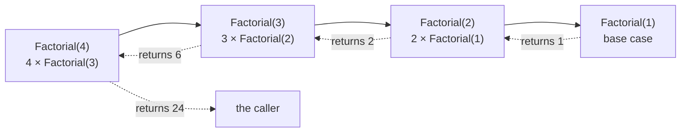

# Recursion

::note
<!-- sync:needs:start -->

**You'll need**: [Function](/docs/learn/function), [Return](/docs/learn/return)
<!-- sync:needs:end -->

::

A function may call itself. That is _recursion_, and it suits any problem that contains a smaller copy of itself: 5! is 5 × 4!, and 4! is 4 × 3!. Instead of describing the steps of a loop, a recursive function describes how a big answer is built from a smaller one — and trusts the smaller call to do the rest.

## Base case and recursive case

Every recursive function has two parts:

- The **base case** is small enough to answer directly. It stops the descent.
- The **recursive case** calls the same function on a smaller problem and builds its answer from the result.

The [For](/docs/learn/for) lesson built a factorial with a loop. Here is the same definition written recursively — `n <= 1` is the base case, and every other `n` is answered in terms of `n - 1`:

```rux
func Factorial(n: int) -> int {
    if n <= 1 {
        return 1;
    }
    return n * Factorial(n - 1);
}
```

`Factorial(4)` cannot finish until `Factorial(3)` has, which waits on `Factorial(2)`, and so on down to the base case. Then the answers travel back up, each call multiplying in its own `n`:



## Shrinking the problem

The recursive case does not have to subtract one. Euclid's greatest common divisor swaps in a smaller pair on every call:

```rux
func Gcd(first: int, second: int) -> int {
    if second == 0 {
        return first;
    }
    return Gcd(second, first % second);
}
```

| Call          | `first % second` | Next call     |
| ------------- | ---------------- | ------------- |
| `Gcd(48, 18)` | 12               | `Gcd(18, 12)` |
| `Gcd(18, 12)` | 6                | `Gcd(12, 6)`  |
| `Gcd(12, 6)`  | 0                | `Gcd(6, 0)`   |
| `Gcd(6, 0)`   | —                | base case: 6  |

The remainder is always smaller than `second`, so the pair keeps shrinking and `second == 0` is always reached.

## Each call has its own variables

Every call gets its own `n`, kept safe while the deeper calls run. That is visible when a function does work both before and after its recursive call:

```rux
func Descend(n: int) {
    if n == 0 {
        Print("| ");
        return;
    }
    Print("{} ", n);
    Descend(n - 1);
    Print("{} ", n);
}
```

The first `Print` happens on the way down: 4, 3, 2, 1. The second waits until every deeper call has returned, so it happens on the way back up — in reverse order, 1, 2, 3, 4. `Descend(4)` prints `4 3 2 1 | 1 2 3 4`.

## The base case must be reached

Every recursive call must move closer to the base case. `Factorial(-3)` is safe only because the test is `n <= 1`; with `n == 1`, the calls would count down past zero and never stop. Each waiting call takes up a little memory on the _stack_, and when the stack is full the program crashes. The compiler cannot catch this for you — it is the one thing to check every time you write a recursive function.

## The program

The whole lesson is one package in the [Examples repository](https://github.com/rux-lang/Examples/tree/main/Functions/Recursion). Its comments explain every step.

<!-- sync:program:start -->

```rux [Src/Main.rux]
// A function may call itself. That is recursion, and it suits any problem that
// contains a smaller copy of itself: 5! is 5 times 4!, and 4! is 4 times 3!.
//
// Every recursive function has two parts. The *base case* is small enough to
// answer directly and stops the descent. The *recursive case* calls the same
// function on a smaller problem and builds its answer from the result.
import Io::{ Print, PrintLine };

// The For lesson built a factorial with a loop. This is the same definition
// written recursively: `n <= 1` is the base case, and every other `n` is
// answered in terms of `n - 1`.
func Factorial(n: int) -> int {
    if n <= 1 {
        return 1;
    }
    return n * Factorial(n - 1);
}

// Euclid's greatest common divisor. Each call swaps in a smaller pair, and the
// pair always shrinks, so the base case `second == 0` is always reached.
func Gcd(first: int, second: int) -> int {
    if second == 0 {
        return first;
    }
    return Gcd(second, first % second);
}

// Each call has its own `n`, kept while the deeper calls run. The first
// `Print` happens on the way down; the second waits until every deeper call
// has returned, so it happens on the way back up, in reverse order.
func Descend(n: int) {
    if n == 0 {
        Print("| ");
        return;
    }
    Print("{} ", n);
    Descend(n - 1);
    Print("{} ", n);
}

func Main() -> int {
    for i in 1..=6 {
        PrintLine("Factorial({}) = {}", i, Factorial(i));
    }

    PrintLine("Gcd(48, 18) = {}", Gcd(48, 18));
    PrintLine("Gcd(17, 5) = {}", Gcd(17, 5));

    Descend(4);
    PrintLine();

    // Watch out for a missing or unreachable base case. `Factorial(-3)` is
    // safe only because the test is `n <= 1` rather than `n == 1`; with `==`
    // the calls would count down past zero forever, until the program runs
    // out of stack space and crashes. Every recursive call must move closer
    // to the base case.
    return 0;
}
```

<!-- sync:program:end -->

## Run it

```sh
cd Examples/Functions/Recursion
rux run
```

<!-- sync:output:start -->

```
Factorial(1) = 1
Factorial(2) = 2
Factorial(3) = 6
Factorial(4) = 24
Factorial(5) = 120
Factorial(6) = 720
Gcd(48, 18) = 6
Gcd(17, 5) = 1
4 3 2 1 | 1 2 3 4
```

<!-- sync:output:end -->

## Common mistakes

::warning
**A base case that can be skipped.**\
A test like `n == 1` is missed by any argument that starts below 1, and the recursion runs until the program crashes. Prefer a test that covers everything at or below the bottom, such as `n <= 1`.
::

::warning
**A recursive call that does not shrink the problem.**\
`return n * Factorial(n);` calls itself with the same argument forever. Each call must pass something strictly closer to the base case.
::

::warning
**Calling yourself but forgetting `return`.**\
Writing `Gcd(second, first % second);` as a bare statement throws the answer away, and the compiler reports `error: function 'Gcd' must return a value of type 'int' on every control-flow path`. The recursive case has to return what the deeper call gives back.
::

## Try it yourself

1. Write a recursive `Power(base: int, exponent: int) -> int`. What is the base case when `exponent` is 0?
2. Write `SumDigits(number: int) -> int`, so that `SumDigits(1234)` is 10. Use `number % 10` for the last digit and `number / 10` for the rest.
3. Write `Fibonacci(n: int) -> int`, where the first two values are 0 and 1, and print the first ten.
4. Change `n <= 1` to `n == 1` in `Factorial`, call `Factorial(-3)`, and watch what happens.

## Learn more

- [Functions](/docs/lang/functions/overview) in the Rux Reference
- [For](/docs/learn/for) — the loop version of factorial
- [Return](/docs/learn/return) — the early return that every base case relies on
