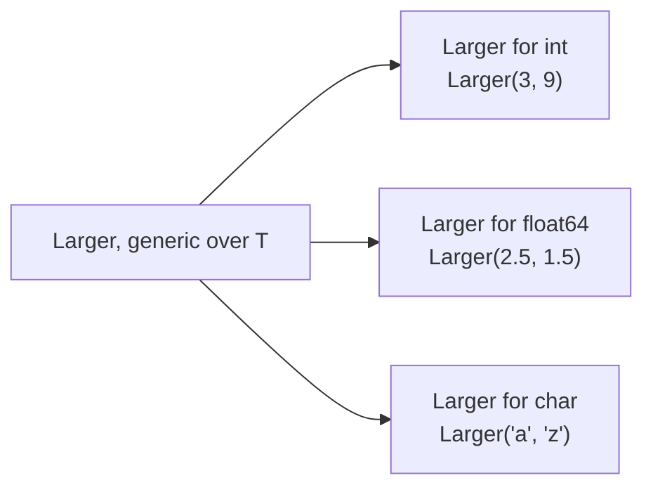

# Generic

::note
<!-- sync:needs:start -->

**You'll need**: [Overload](/docs/learn/overload), [Convert](/docs/learn/convert)
<!-- sync:needs:end -->

::

The [Overload](/docs/learn/overload) lesson wrote one function per type: an `Area` for `int` and another for `float64`, with the same body. That works, but every new type means another copy. A _generic_ function writes the body once, with a placeholder where the type goes.

## A type parameter

A name in angle brackets after the function name is a **type parameter**. It stands for a type the caller supplies:

```rux
func Larger<T>(first: T, second: T) -> T {
    if first > second {
        return first;
    }
    return second;
}
```

Read it as "for some type `T`, take two `T`s and give back a `T`". Both arguments must be the same type, and the result is that type too — two `int` values give back an `int`, two `float64` values a `float64`.

Nothing is converted at run time. The compiler produces a separate version of the function for each type that is actually used, as if you had written the overloads by hand:



A body that does nothing with its values except pass them along accepts any type at all — even text:

```rux
func Pick<T>(useFirst: bool, first: T, second: T) -> T {
```

## Inferred or explicit

Usually `T` is inferred from the arguments, so a call looks like any other:

```rux
PrintLine("Larger(3, 9)                  {}", Larger(3, 9));
```

You can also give `T` yourself, in angle brackets at the call. That matters when the arguments alone would choose a different type. Bare literals become `int`, but with `<uint8>` they become `uint8` — and so does the result, which is why adding 100 wraps around past 255 to 44:

```rux
PrintLine("Larger(200, 7) + 100          {}", Larger(200, 7) + 100);
PrintLine("Larger<uint8>(200, 7) + 100   {}", Larger<uint8>(200, 7) + 100);
```

## What T is allowed to do

`Larger` uses `>` on a `T` it knows nothing about. That is checked once `T` is known, for each version the program asks for. Numbers, characters and booleans all have `>`, so those versions compile. A string does not, so `Larger("abc", "abd")` is rejected — with a note naming the call that asked for that version.

The same reasoning stops a generic function from printing its value. `PrintLine("{}", first)` inside `Larger` is refused, because `{}` needs a type known to be printable and an unconstrained `T` promises nothing. That is why each function here returns its value for `Main` to print. A _bound_ such as `<T: Display>` is how `T` makes that promise; it is taught in [Generic bound](/docs/learn/generic-bound).

## The program

The whole lesson is one package in the [Examples repository](https://github.com/rux-lang/Examples/tree/main/Functions/Generic). Its comments explain every step.

<!-- sync:program:start -->

```rux [Src/Main.rux]
// The Overload lesson wrote one function per type: an `Area` for `int` and
// another for `float64`, with the same body. A generic function writes that
// body once.
//
// A name in angle brackets after the function name is a type parameter. It
// stands for a type the caller supplies, and the compiler produces a separate
// version of the function for each type actually used.
import Io::PrintLine;

// Both arguments must be the same type `T`, and the result is that type too,
// so two `int` values give back an `int` and two `float64` values a `float64`.
func Larger<T>(first: T, second: T) -> T {
    if first > second {
        return first;
    }
    return second;
}

// Nothing in this body depends on what `T` can do, so it accepts any type.
func Pick<T>(useFirst: bool, first: T, second: T) -> T {
    if useFirst {
        return first;
    }
    return second;
}

func Main() -> int {
    // Usually `T` is inferred from the arguments. Four types and no conversion
    // anywhere: each type used compiles its own version of the function.
    PrintLine("Larger(3, 9)                  {}", Larger(3, 9));
    PrintLine("Larger(2.5, 1.5)              {}", Larger(2.5, 1.5));
    PrintLine("Larger('a', 'z')              {}", Larger('a', 'z'));
    PrintLine("Pick(true, \"yes\", \"no\")       {}", Pick(true, "yes", "no"));

    // `T` can also be given explicitly in angle brackets at the call. That
    // matters when the arguments alone would choose a different type. Bare
    // literals become `int`, but with `<uint8>` they become `uint8`, and so
    // does the result — which is why adding 100 wraps around here.
    PrintLine("Larger(200, 7) + 100          {}", Larger(200, 7) + 100);
    PrintLine("Larger<uint8>(200, 7) + 100   {}", Larger<uint8>(200, 7) + 100);

    // `Larger` uses `>` on a `T` it knows nothing about. That is checked once
    // `T` is known: calling `Larger` with a type that has no `>` is rejected
    // when that version of `Larger` is compiled.
    //
    // Watch out: a function with an unconstrained `T` cannot print its value.
    // `PrintLine("{}", first)` inside `Larger` is refused, because `{}` needs
    // a type known to be printable and `T` promises nothing. That is why each
    // function here returns its value for `Main` to print. A bound such as
    // `<T: Display>`, taught in the Generics part, is how `T` makes that promise.
    return 0;
}
```

<!-- sync:program:end -->

## Run it

```sh
cd Examples/Functions/Generic
rux run
```

<!-- sync:output:start -->

```
Larger(3, 9)                  9
Larger(2.5, 1.5)              2.5
Larger('a', 'z')              z
Pick(true, "yes", "no")       yes
Larger(200, 7) + 100          300
Larger<uint8>(200, 7) + 100   44
```

<!-- sync:output:end -->

## Common mistakes

::warning
**Arguments that disagree about T.**\
`Larger(3, 2.5)` is refused with `error: argument 1 to 'Larger' has type 'int', but parameter 'first' requires 'T'` — both parameters are the same `T`, and an `int` and a `float64` cannot both be it. Write `Larger(3.0, 2.5)`.
::

::warning
**A type that cannot do what the body needs.**\
`Larger("abc", "abd")` fails with `error: operator '>' is not defined for slice type 'char8[..]'`, followed by `note: in 'Larger' instantiated with T = char8[..]`. The error points into the generic body; the note tells you which call caused it.
::

::warning
**Printing a T.**\
`PrintLine("{}", value)` inside a generic function fails with `has type 'T', but variadic parameter 'args' requires 'Display'`. Return the value and print it where its type is known, or add a bound later in the course.
::

## Try it yourself

1. Write `Smaller<T>` and call it with integers, floats and characters.
2. Write `Clamp<T>(value: T, low: T, high: T) -> T` and call it with `int` and `float64` values.
3. Try `Larger<uint8>(300, 7)`. Why is `300` refused?
4. Call `Larger("abc", "abd")` and read both the error and its note.

## Learn more

- [Generic functions](/docs/lang/functions/generic) in the Rux Reference
- [Overload](/docs/learn/overload) — the hand-written alternative
- [Generic bound](/docs/learn/generic-bound) — promising what `T` can do, such as being printable
- [Wrapping arithmetic](/docs/learn/wrapping-arithmetic) — why `uint8` 200 + 100 is 44
