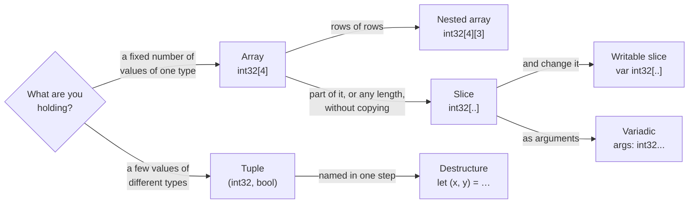

# Part 5: Sequences

So far every variable has held one value. This part is about holding many: a fixed row of values of one type in an **array**, a view into part of one in a **slice**, and a small group of values of different types in a **tuple**. Along the way you will write functions that accept arrays of any length, change the caller's elements through a view, take any number of arguments, and hand back more than one result.

## What you will learn

- Arrays: a fixed count of one element type, stored inline, indexed from zero, copied whole.
- Filling an array with one repeated value, `[0; 16]`, and nesting arrays into a grid.
- Slices: read-only views, `int32[..]`, that serve arrays of every length without copying.
- Writable views, `var int32[..]`, and why a view's writability is separate from its binding.
- Variadic functions that collect any number of arguments into a slice, and spreading with `...`.
- Tuples for grouping values of different types, and destructuring them into names.

## Which sequence?



## Lessons

<!-- sync:lessons:start -->

|     | Lesson                                       | What you will learn                                                          |
| --- | -------------------------------------------- | ---------------------------------------------------------------------------- |
| 5.1 | [Array](/docs/learn/array)                   | an inline array holding a fixed number of values of one type                 |
| 5.2 | [Array repeat](/docs/learn/array-repeat)     | fill an array with one repeated value: `[0; 16]`                             |
| 5.3 | [Array nested](/docs/learn/array-nested)     | arrays of arrays: a grid with rows and columns                               |
| 5.4 | [Slice](/docs/learn/slice)                   | view part of an array without copying it, and pass it to a function          |
| 5.5 | [Writable slice](/docs/learn/writable-slice) | change an array through a `var T[..]` view                                   |
| 5.6 | [Variadic](/docs/learn/variadic)             | accept any number of arguments, the way `PrintLine` does                     |
| 5.7 | [Tuple](/docs/learn/tuple)                   | group a few values without declaring a type, and return more than one result |
| 5.8 | [Destructure](/docs/learn/destructure)       | unpack a tuple into separate names with `let (x, y) = ...`                   |

<!-- sync:lessons:end -->

## Before you start

Finish [Part 3: Control flow](/docs/learn/control-flow) and [Part 4: Functions](/docs/learn/functions) first — every lesson here walks a sequence with `for` and passes it to functions of its own. [Convert](/docs/learn/convert) from Part 1 matters too, because lengths and indices are `uint`. Each lesson's package is in the Examples repository's `Sequences/` folder:

```sh
cd Examples/Sequences/Array
rux run
```

## After this part

[Part 6: Types](/docs/learn/types) declares types of your own — structs, enums and variants — for the groups of values that deserve names rather than `.0` and `.1`. You are also ready for the checkpoint project [Prime](/docs/learn/prime).

For the full rules behind this part, see [Arrays](/docs/lang/arrays/overview), [Slices](/docs/lang/slices/overview), [Ranges](/docs/lang/ranges/overview), [Variadic functions](/docs/lang/functions/variadic) and [Tuples](/docs/lang/tuples/overview) in the Rux Reference.
