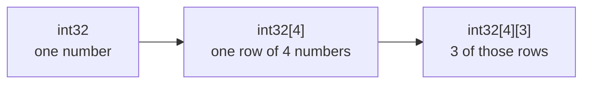

# Array nested

::note
<!-- sync:needs:start -->

**You'll need**: [Array](/docs/learn/array), [Array repeat](/docs/learn/array-repeat)
<!-- sync:needs:end -->

::

An array's element type can be another array, and that is all a two-dimensional array is. A grid of three rows of four numbers is an array of three rows, where each row is an `int32[4]`. Boards, tables, images and spreadsheets all start out this way.

## Built inside out, read outside in

The surprise is the order in the type. Each `[n]` wraps everything written before it, so the type is built inside out:



Indexing reads the other way, outside in: `grid[row]` picks a row, and `grid[row][column]` picks a number within it.

```rux
let grid: int32[4][3] = [
    [1, 2, 3, 4],
    [5, 6, 7, 8],
    [9, 10, 11, 12]
];
```

|           | column 0 | column 1 | column 2 | column 3 |
| --------- | -------- | -------- | -------- | -------- |
| **row 0** | 1        | 2        | 3        | 4        |
| **row 1** | 5        | 6        | 7        | 8        |
| **row 2** | 9        | 10       | 11       | 12       |

So `grid[2][1]` is row 2, column 1: `10`. The outer `length` counts rows and a row's `length` counts columns:

```rux
PrintLine("{} rows of {} columns", grid.length, grid[0].length);
```

## Walking by rows

`for` over the grid yields whole rows, and an inner `for` walks each row:

```rux
for row in grid {
    var sum: int32 = 0;
    for value in row {
        sum += value;
    }
    PrintLine("row {} {} {} {} adds up to {}", row[0], row[1], row[2], row[3], sum);
}
```

`row` is an ordinary `int32[4]`, so it has a `length`, it can be indexed, and it can be walked like any other array.

## Walking by columns

There is no "column" value to loop over — columns cut across the rows. Going down a column means holding the column fixed and stepping through the rows by index:

```rux
for column in 0..grid[0].length {
    var total: int32 = 0;
    for row in 0..grid.length {
        total += grid[row][column];
    }
    PrintLine("column {} adds up to {}", column, total);
}
```

## Repeating a row

A repeated array nests too. `[0; 3]` is a row of three zeros, and `[[0; 3]; 3]` is three copies of that row — a blank board to fill in:

```rux
var board: int32[3][3] = [[0; 3]; 3];
for i in 0..board.length {
    board[i][i] = 1;
}
```

Setting `board[i][i]` for each `i` puts a 1 on the diagonal. Because each row is a separate copy, changing one row never touches another.

## The program

The whole lesson is one package in the [Examples repository](https://github.com/rux-lang/Examples/tree/main/Sequences/ArrayNested). Its comments explain every step.

<!-- sync:program:start -->

```rux [Src/Main.rux]
// An array's element type can be another array, and that is all a two-dimensional array is. A
// grid of three rows of four numbers is an array of three rows, where each row is an `int32[4]`.
//
// The surprise is the order in the type. Each `[n]` wraps everything written before it, so the
// type is built inside out: `int32[4]` is one row, and `int32[4][3]` is three of those rows.
// Indexing reads the other way, outside in: `grid[row]` picks a row, and `grid[row][column]`
// picks a number within it.
import Io::PrintLine;

func Main() -> int {
    // Three rows, each a literal of four numbers.
    let grid: int32[4][3] = [
        [1, 2, 3, 4],
        [5, 6, 7, 8],
        [9, 10, 11, 12]
    ];

    // The outer length counts rows; a row's length counts columns.
    PrintLine("{} rows of {} columns", grid.length, grid[0].length);
    PrintLine("grid[2][1] is {}", grid[2][1]);

    // `for` over the grid yields whole rows, and an inner `for` walks each row.
    for row in grid {
        var sum: int32 = 0;
        for value in row {
            sum += value;
        }
        PrintLine("row {} {} {} {} adds up to {}", row[0], row[1], row[2], row[3], sum);
    }

    // Going down a column means holding the column fixed and stepping through the rows.
    for column in 0..grid[0].length {
        var total: int32 = 0;
        for row in 0..grid.length {
            total += grid[row][column];
        }
        PrintLine("column {} adds up to {}", column, total);
    }

    // A repeated array nests too: three copies of a row of three zeros, filled in afterwards.
    var board: int32[3][3] = [[0; 3]; 3];
    for i in 0..board.length {
        board[i][i] = 1;
    }
    for row in board {
        PrintLine("{} {} {}", row[0], row[1], row[2]);
    }
    return 0;
}
```

<!-- sync:program:end -->

## Run it

```sh
cd Examples/Sequences/ArrayNested
rux run
```

<!-- sync:output:start -->

```
3 rows of 4 columns
grid[2][1] is 10
row 1 2 3 4 adds up to 10
row 5 6 7 8 adds up to 26
row 9 10 11 12 adds up to 42
column 0 adds up to 15
column 1 adds up to 18
column 2 adds up to 21
column 3 adds up to 24
1 0 0
0 1 0
0 0 1
```

<!-- sync:output:end -->

## Common mistakes

::warning
**Writing the dimensions in reading order.**\
Three rows of four is `int32[4][3]`, not `int32[3][4]`. The wrong order fails with `error: cannot assign 'int[4][3]' to 'int32[3][4]'` — the message shows the shape the literal really has.
::

::warning
**One index with a comma.**\
`grid[1, 2]` is a syntax error: `expected ']' to close the index expression before ','`. Each level takes its own brackets: `grid[1][2]`.
::

::warning
**Rows of different lengths.**\
Every row has the same type, so a short row is refused: `error: array element 2 has type 'int[3]', but the array's element type is 'int32[4]'`.
::

## Try it yourself

1. Add up every number in `grid` with two nested `for` loops.
2. Print `grid` with its rows and columns swapped, so that the first line reads `1 5 9`.
3. Build a multiplication table, `var table: int32[10][10] = [[0; 10]; 10];`, and fill it with `(row + 1) * (column + 1)`. The indices are `uint`, so the product needs `as int32`.
4. Change the type of `grid` to `int32[3][4]` and read the error.

## Learn more

- [Arrays](/docs/lang/arrays/overview) and [Indexing and iteration](/docs/lang/arrays/overview#indexing) in the Rux Reference
- [Array repeat](/docs/learn/array-repeat) — the `[value; count]` form used for `board`
- [Slice](/docs/learn/slice) — passing arrays of any length to one function
