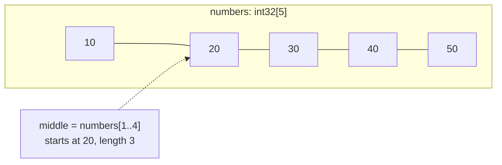

# Slice

::note
<!-- sync:needs:start -->

**You'll need**: [Array](/docs/learn/array), [Function](/docs/learn/function)
<!-- sync:needs:end -->

::

An array's length is part of its type, so a function taking an `int32[5]` accepts arrays of exactly five — no more, no fewer. A _slice_, written `int32[..]`, removes that limit. It is a **view** into an array: where the elements start and how many there are, with no elements of its own. One function taking a slice serves arrays of every size, and making a view copies nothing.

## A view, not a copy

A slice is two numbers — a position and a length — pointing into an array that already exists:



The `..` in `int32[..]` reads as "some number of": the element type is fixed, the count is not.

## One function for every length

An array passed where a slice is wanted becomes a view of all of itself:

```rux
func Total(values: int32[..]) -> int32 {
    var sum: int32 = 0;
    for value in values {
        sum += value;
    }
    return sum;
}
```

```rux
PrintLine("numbers        {}", Total(numbers));
PrintLine("more           {}", Total(more));
```

`numbers` has five elements and `more` has three, yet both calls reach the same function. Inside it, `values` has a `length`, can be indexed and can be walked with `for`, just like an array.

## Part of an array

Indexing with a [range](/docs/learn/range) gives a view of part of the array. As everywhere else, `..` stops before its upper bound and `..=` includes it, and either end may be left out:

| Expression       | Elements       | Meaning                       |
| ---------------- | -------------- | ----------------------------- |
| `numbers[1..4]`  | 20, 30, 40     | indices 1 up to, not incl., 4 |
| `numbers[1..=4]` | 20, 30, 40, 50 | indices 1 to 4 inclusive      |
| `numbers[2..]`   | 30, 40, 50     | from index 2 to the end       |
| `numbers[..2]`   | 10, 20         | from the start up to 2        |
| `numbers[..]`    | all five       | the whole array               |

A slice can be sliced again. Its indices count from the start of the **view**, not the array:

```rux
let inner = middle[1..];
```

`middle` starts at 20, so `middle[1..]` starts at 30, and `inner[0]` is 30.

## Strings are slices

A string literal has been a slice all along: `char8[..]`, a view of UTF-8 bytes. That is why `.length` counts bytes:

```rux
let greeting: char8[..] = "hello";
```

## Read-only by default

A plain slice can look at the elements but never change them — `Total` cannot write into `values`. Writing through a view is the subject of the next lesson, [Writable slice](/docs/learn/writable-slice).

## The program

The whole lesson is one package in the [Examples repository](https://github.com/rux-lang/Examples/tree/main/Sequences/Slice). Its comments explain every step.

<!-- sync:program:start -->

```rux [Src/Main.rux]
// An array's length is part of its type, so a function taking an `int32[5]` accepts arrays of
// exactly five. A slice, written `int32[..]`, removes that limit. It is a view into an array: a
// position and a length, with no elements of its own. One function taking a slice serves arrays
// of every size, and making a view copies nothing.
import Io::PrintLine;

// Every call below reaches this one function, whatever the length of what it is given.
func Total(values: int32[..]) -> int32 {
    var sum: int32 = 0;
    for value in values {
        sum += value;
    }
    return sum;
}

func Main() -> int {
    let numbers: int32[5] = [10, 20, 30, 40, 50];
    let more: int32[3] = [1, 2, 3];

    // An array passed where a slice is wanted becomes a view of all of itself.
    PrintLine("numbers        {}", Total(numbers));
    PrintLine("more           {}", Total(more));

    // Indexing with a range gives a view of part of the array. As everywhere else, `..` stops
    // before its upper bound, so this is elements 1, 2 and 3; `..=` would include the end.
    let middle = numbers[1..4];
    PrintLine("numbers[1..4]  {} over {} elements", Total(middle), middle.length);
    PrintLine("numbers[1..=4] {}", Total(numbers[1..=4]));

    // Either end may be left out, meaning "from the start" or "to the end".
    PrintLine("numbers[2..]   {}", Total(numbers[2..]));
    PrintLine("numbers[..2]   {}", Total(numbers[..2]));

    // A slice can be sliced again. Its indices count from the start of the view, not the array.
    let inner = middle[1..];
    PrintLine("middle[1..]    {}, starting at {}", Total(inner), inner[0]);

    // A string literal has been a slice all along: `char8[..]`, a view of UTF-8 bytes.
    let greeting: char8[..] = "hello";
    PrintLine("\"{}\" is {} bytes", greeting, greeting.length);
    return 0;
}
```

<!-- sync:program:end -->

## Run it

```sh
cd Examples/Sequences/Slice
rux run
```

<!-- sync:output:start -->

```
numbers        150
more           6
numbers[1..4]  90 over 3 elements
numbers[1..=4] 140
numbers[2..]   120
numbers[..2]   30
middle[1..]    70, starting at 30
"hello" is 5 bytes
```

<!-- sync:output:end -->

## Common mistakes

::warning
**Writing through a read-only slice.**\
`values[0] = 1;` inside `Total` fails with `error: cannot modify elements through read-only slice 'int32[..]'`, and the compiler points to `var T[..]` — see [Writable slice](/docs/learn/writable-slice).
::

::warning
**A range that runs backwards or past the end.**\
`numbers[3..1]` fails with `error: range start cannot be greater than its end`. A range past the end, such as `numbers[1..9]`, is checked when the program runs and stops it with `Panic: index out of range`.
::

::warning
**Comparing two slices with `==`.**\
`a == b` on two `int32[..]` values fails with `error: operator '==' is not defined for slice type 'int32[..]'`. A slice is a view, so comparing views would compare where they point rather than what they contain. Compare the elements one at a time.
::

## Try it yourself

1. Write `Largest(values: int32[..]) -> int32` and call it with `numbers`, `more` and `numbers[1..3]`.
2. Print `Total(numbers[..])` and check that it matches `Total(numbers)`.
3. Write `CountAbove(values: int32[..], limit: int32) -> int32` that counts the elements greater than `limit`, and call it on `numbers[1..]`.
4. Try `numbers[3..1]` and read the error.

## Learn more

- [Slices](/docs/lang/slices/overview) and [Arrays as slices](/docs/lang/arrays/overview#arrays-as-slices) in the Rux Reference
- [Using ranges](/docs/lang/ranges/overview#in-a-for-loop) — ranges as loop bounds and slice indices
- [String literal](/docs/learn/string-literal) — more on `char8[..]`
