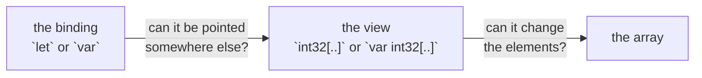

# Writable slice

::note
<!-- sync:needs:start -->

**You'll need**: [Slice](/docs/learn/slice)
<!-- sync:needs:end -->

::

A plain slice, `int32[..]`, is read-only: it can look at the elements but never change them. A _writable slice_, `var int32[..]`, may also write through to the array it views. That is how a function changes the elements of an array it was given — fill it, sort it, scale it — without copying it first.

## Two kinds of view

Which kind you get depends on the array you take it from:

| Taken from        | Example              | Type            | Can write elements? |
| ----------------- | -------------------- | --------------- | ------------------- |
| a `var` array     | `storage[1..4]`      | `var int32[..]` | yes                 |
| a `let` array     | `numbers[1..4]`      | `int32[..]`     | no                  |
| any array, passed | `Show("…", storage)` | `int32[..]`     | no                  |

A writable view writes straight into the array behind it:

```rux
var storage: int32[5] = [1, 2, 3, 4, 5];
```

```rux
let view = storage[1..4];
view[0] = 20;
```

`view` starts at index 1 of `storage`, so `view[0] = 20` changes `storage[1]` from 2 to 20.

## A function that changes its argument

A function that writes into its argument's elements asks for a writable view:

```rux
func Fill(values: var int32[..], value: int32) {
    for i in 0..values.length {
        values[i] = value;
    }
}
```

A function that only reads asks for a read-only view — and a writable one is accepted there too, so `Show` takes both.

There is one asymmetry. An array becomes a read-only view on its own, but a writable one has to be **asked for** with a range, so that changing the caller's array is always visible at the call:

```rux
Fill(storage[3..], 0);
```

`storage[..]` would fill all of it.

## The view and its binding

The surprise is that a view's writability has nothing to do with how the view itself is bound. Two separate questions are being answered:



`let view = storage[1..4];` is a writable view in an immutable binding: `view[0] = 20` is fine, because it changes the array, but `view = …` is rejected, because it would change the binding. A `var` binding of a read-only view is the reverse — it may move along the array, but never write an element:

```rux
var cursor: int32[..] = storage[..2];
PrintLine("cursor  starts at {}", cursor[0]);
cursor = storage[2..];
```

| Binding | View            | Point it elsewhere? | Write elements? |
| ------- | --------------- | ------------------- | --------------- |
| `let`   | `int32[..]`     | no                  | no              |
| `let`   | `var int32[..]` | no                  | yes             |
| `var`   | `int32[..]`     | yes                 | no              |
| `var`   | `var int32[..]` | yes                 | yes             |

## Views see later writes

A writable view may be stored as a read-only one. Both look at the same array, so the read-only view sees what is written through the other afterwards:

```rux
let reader: int32[..] = view;
view[1] = 30;
PrintLine("reader  sees {}", reader[1]);
```

## The program

The whole lesson is one package in the [Examples repository](https://github.com/rux-lang/Examples/tree/main/Sequences/WritableSlice). Its comments explain every step.

<!-- sync:program:start -->

```rux [Src/Main.rux]
// A plain slice, `int32[..]`, is read-only: it can look at the elements but never change them.
// A writable slice, `var int32[..]`, may also write through to the array it views. Taking a
// range of a `var` array gives a writable view; taking one of a `let` array gives a read-only
// one.
//
// The surprise is that the view's writability has nothing to do with how the view itself is
// bound. `let view = storage[..];` is a writable view held in an immutable binding: `view[0] = 1`
// is fine, because it changes the array, while `view = ...` is rejected, because it would change
// the binding. A `var` binding of a read-only view is the reverse: it can be pointed somewhere
// else, but it can never write an element.
import Io::PrintLine;

// A function that changes its argument's elements asks for a writable view.
func Fill(values: var int32[..], value: int32) {
    for i in 0..values.length {
        values[i] = value;
    }
}

// A function that only reads asks for a read-only view, and a writable one is accepted too.
func Show(label: char8[..], values: int32[..]) {
    PrintLine("{} {} {} {} {} {}", label, values[0], values[1], values[2], values[3], values[4]);
}

func Main() -> int {
    var storage: int32[5] = [1, 2, 3, 4, 5];
    Show("start  ", storage);

    // A `let` binding, a writable view. Writing through it writes the array.
    let view = storage[1..4];
    view[0] = 20;
    Show("view   ", storage);

    // The function writes through its view, so the change shows up in `storage`. An array
    // becomes a read-only view on its own, but a writable one has to be asked for with a range.
    // `Fill(storage[..], 0)` would fill all of it, while `Fill(storage, 0)` stops with
    //     error: no matching overload for 'Fill' with argument types (int32[5], int)
    Fill(storage[3..], 0);
    Show("filled ", storage);

    // A `var` binding, a read-only view. It may move along the array, but `cursor[0] = 9`
    // would be rejected.
    var cursor: int32[..] = storage[..2];
    PrintLine("cursor  starts at {}", cursor[0]);
    cursor = storage[2..];
    PrintLine("cursor  moved to {}", cursor[0]);

    // A writable view may be stored as a read-only one, which then sees later writes too.
    let reader: int32[..] = view;
    view[1] = 30;
    PrintLine("reader  sees {}", reader[1]);
    return 0;
}
```

<!-- sync:program:end -->

## Run it

```sh
cd Examples/Sequences/WritableSlice
rux run
```

<!-- sync:output:start -->

```
start   1 2 3 4 5
view    1 20 3 4 5
filled  1 20 3 0 0
cursor  starts at 1
cursor  moved to 3
reader  sees 30
```

<!-- sync:output:end -->

## Common mistakes

::mistake
**Passing the array itself to a writable parameter.**\
`Fill(storage, 0)` fails with:

```text
error: no matching overload for 'Fill' with argument types (int32[5], int)
```

An array only becomes a read-only view on its own; write `Fill(storage[..], 0)` to hand over a writable one.
::

::mistake
**Taking a writable view of a `let` array.**\
With `let fixed: int32[3] = [1, 2, 3];`, the call `Fill(fixed[..], 0)` fails with:

```text
has type 'int32[..]', but parameter 'values' requires 'var int32[..]'
```

A view can never grant more than the array allows.
::

::mistake
**Confusing the binding with the view.**\
Even though `cursor` is `var`, `cursor[0] = 9;` fails with:

```text
error: cannot modify elements through read-only slice 'int32[..]'
```

And even though `view` can write elements, `view = storage[..2];` fails with:

```text
error: cannot modify immutable variable 'view'
```
::

## Try it yourself

1. Write `Scale(values: var int32[..], factor: int32)` that multiplies every element, and call it on `storage[..]`.
2. Write `Reverse(values: var int32[..])` that swaps elements from both ends towards the middle.
3. Call `Fill(storage, 0)` and read the error, then fix the call.
4. Change `storage` to a `let` array and see which lines stop compiling.

## Learn more

- [Slices](/docs/lang/slices/overview) and [Indexing and iteration](/docs/lang/slices/overview#indexing-and-iteration) in the Rux Reference
- [Mutable](/docs/learn/mutable) — `let` and `var` bindings
- [Mutable reference](/docs/learn/mutable-reference) — the same "may this change?" question for a single value
