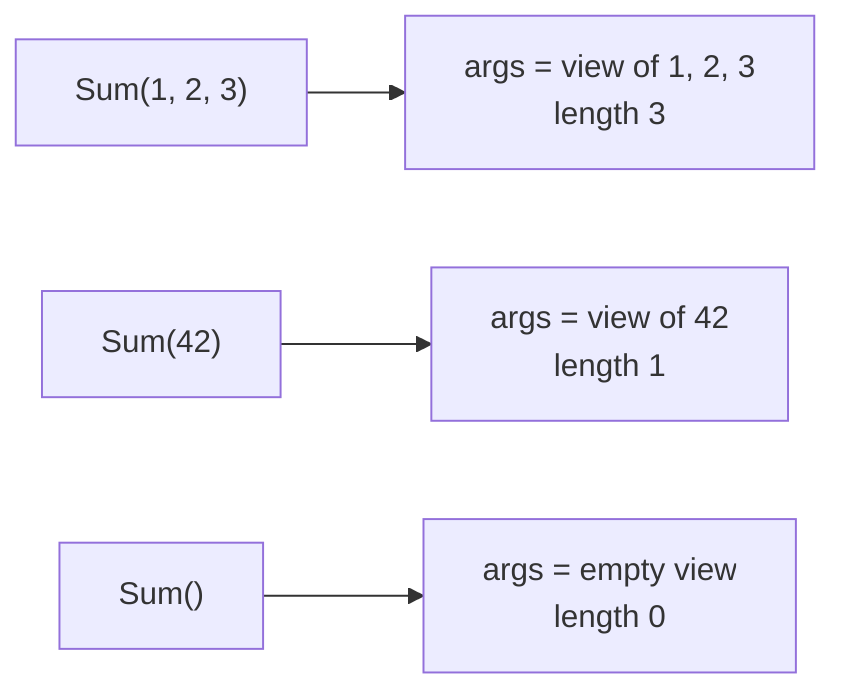

# Variadic

::note
<!-- sync:needs:start -->

**You'll need**: [Slice](/docs/learn/slice), [Convert](/docs/learn/convert)
<!-- sync:needs:end -->

::

Some functions cannot say in advance how many arguments they take. A sum of some numbers, the largest of a few values — the work is the same whether there are two arguments or twenty. A _variadic_ function accepts any count, zero included. You have been calling one since the first lesson: `PrintLine` takes a format string and then as many values as it has `{}` placeholders.

## Collecting the rest

A last parameter written `args: int32...` collects every remaining argument into one slice:

```rux
func Sum(args: int32...) -> int32 {
    var total: int32 = 0;
    for value in args {
        total += value;
    }
    return total;
}
```

Inside the function, `args` is an ordinary `int32[..]` — the [Slice](/docs/learn/slice) lesson's read-only view. It has a `length`, it can be indexed, and `for` walks it. So one function serves every count:



`Sum()` is perfectly valid: the loop simply runs zero times and the total stays 0.

## Ordinary parameters first

Ordinary parameters may come before the variadic one; only the last parameter can collect the rest:

```rux
func Largest(first: int32, args: int32...) -> int32 {
```

Here `first` is required, so `Largest` needs **at least** one argument — there is always a value to start from — and any more land in `args`.

## Spreading a slice back out

Going the other way, `args...` at a call spreads a slice back out into separate arguments. That is how one variadic function hands everything it received to another:

```rux
func Average(args: int32...) -> int32 {
    if args.length == 0 {
        return 0;
    }
    return Sum(args...) / (args.length as int32);
}
```

`args.length` is a `uint`, so it is converted with `as` before dividing an `int32` by it. An array can be spread too: it becomes a view of all its elements, just as it does when passed to a slice parameter:

```rux
let scores: int32[4] = [70, 85, 90, 95];
PrintLine("Average(scores...)      {}", Average(scores...));
```

| Call                 | `args` inside `Average` |
| -------------------- | ----------------------- |
| `Average(2, 4, 9)`   | 2, 4, 9                 |
| `Average(scores...)` | 70, 85, 90, 95          |
| `Average()`          | empty                   |

## PrintLine is variadic

The `PrintLine` you have been calling with a format string is declared with a variadic parameter of its own — `args: Display...`. `Display` is not one type but a promise, "can be printed", which is why one call can mix an `int`, a `float64` and a string. How such promises work is the subject of [Display](/docs/learn/display) in the Interfaces part.

## The program

The whole lesson is one package in the [Examples repository](https://github.com/rux-lang/Examples/tree/main/Sequences/Variadic). Its comments explain every step.

<!-- sync:program:start -->

```rux [Src/Main.rux]
// Some functions cannot say in advance how many arguments they take. A last parameter written
// `args: int32...` collects every remaining argument into one slice, so a single function serves
// any count, zero included. Inside the function, `args` is an ordinary `int32[..]`: it has a
// length, it can be indexed, and `for` walks it.
//
// Going the other way, `args...` at a call spreads a slice back out into separate arguments,
// which is how one variadic function hands everything it received to another.
import Io::PrintLine;

func Sum(args: int32...) -> int32 {
    var total: int32 = 0;
    for value in args {
        total += value;
    }
    return total;
}

// Ordinary parameters may come first; only the last one can collect the rest.
func Largest(first: int32, args: int32...) -> int32 {
    var largest = first;
    for value in args {
        if value > largest {
            largest = value;
        }
    }
    return largest;
}

// `args...` passes what this function was given straight on to `Sum`.
func Average(args: int32...) -> int32 {
    if args.length == 0 {
        return 0;
    }
    return Sum(args...) / (args.length as int32);
}

func Main() -> int {
    // The same function with three arguments, with one, and with none at all.
    PrintLine("Sum(1, 2, 3)            {}", Sum(1, 2, 3));
    PrintLine("Sum(42)                 {}", Sum(42));
    PrintLine("Sum()                   {}", Sum());

    PrintLine("Largest(4, 9, 2)        {}", Largest(4, 9, 2));
    PrintLine("Largest(7)              {}", Largest(7));
    PrintLine("Average(2, 4, 9)        {}", Average(2, 4, 9));

    // An array can be spread too: it becomes a slice of all its elements, just as it does when
    // passed to a slice parameter.
    let scores: int32[4] = [70, 85, 90, 95];
    PrintLine("Average(scores...)      {}", Average(scores...));
    return 0;
}
```

<!-- sync:program:end -->

## Run it

```sh
cd Examples/Sequences/Variadic
rux run
```

<!-- sync:output:start -->

```
Sum(1, 2, 3)            6
Sum(42)                 42
Sum()                   0
Largest(4, 9, 2)        9
Largest(7)              7
Average(2, 4, 9)        5
Average(scores...)      85
```

<!-- sync:output:end -->

## Common mistakes

::warning
**Passing an array without spreading it.**\
`Sum(scores)` fails with `error: argument 1 to 'Sum' has type 'int32[4]', but variadic parameter 'args' requires 'int32'` — each argument must be one `int32`. Write `Sum(scores...)`.
::

::warning
**Mixing a spread with other arguments.**\
`Sum(1, scores...)` fails with `error: spread argument to 'Sum' must be the only argument for variadic parameter 'args'`. Either list the values one by one or spread a single slice.
::

::warning
**Leaving out a required parameter.**\
`Largest()` fails with `error: call to 'Largest' expects at least 1 argument, but 0 were provided`. Only the variadic parameter may receive nothing.
::

## Try it yourself

1. Write `Smallest(first: int32, args: int32...) -> int32`.
2. Write `CountAbove(limit: int32, args: int32...) -> int32` and call it as `CountAbove(80, scores...)`.
3. Print `Sum(scores[1..]...)` — a spread works on any slice, not only a whole array.
4. Call `Sum(scores)` without the `...` and read the error.

## Learn more

- [Variadic functions](/docs/lang/functions/variadic) in the Rux Reference
- [Indexing and iteration](/docs/lang/slices/overview#indexing-and-iteration) in the Reference — including spreading a slice into arguments
- [Console](/docs/learn/console) — `PrintLine` and its placeholders
