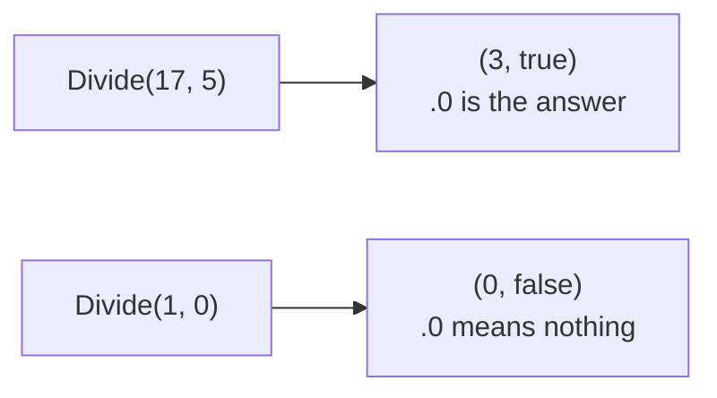

# Tuple

::note
<!-- sync:needs:start -->

**You'll need**: [Slice](/docs/learn/slice), [Return](/docs/learn/return)
<!-- sync:needs:end -->

::

A _tuple_ groups a few values without declaring a type for them first. Its type is the list of its members' types in parentheses — `(int32, bool)` — and a value is written the same way, `(17, true)`. Arrays hold many values of **one** type; a tuple holds a fixed handful of values of **any** types, side by side.

## Writing and reading a tuple

The members are reached by position: `.0` is the first, `.1` the second, and so on:

```rux
let pair: (int32, float64) = (3, 2.5);
PrintLine("pair.0 is {} and pair.1 is {}", pair.0, pair.1);
```

| Collection | Element types | How many           | Reached by     |
| ---------- | ------------- | ------------------ | -------------- |
| Array      | all the same  | fixed, any number  | `values[i]`    |
| Tuple      | each its own  | fixed, usually few | `pair.0`, `.1` |

Like an array, a tuple is a plain value: assigning it copies every member, and `let` freezes the members too.

## Several results from one function

The everyday use is returning more than one result. A function has a single return type, and a tuple lets that one type carry several values. `Divide` returns the quotient and whether it means anything — there is no number to return for a division by zero, so the second member says whether the first is real:

```rux
func Divide(numerator: int32, denominator: int32) -> (int32, bool) {
    if denominator == 0 {
        return (0, false);
    }
    return (numerator / denominator, true);
}
```



The caller checks the second member before trusting the first:

```rux
let good = Divide(17, 5);
if good.1 {
    PrintLine("17 / 5 is {}", good.0);
}
```

The members need not share a type. `Smallest` returns the smallest value, an `int32`, and its position, a `uint`:

```rux
func Smallest(values: int32[..]) -> (int32, uint) {
```

## Comparing tuples

Tuples of the same type compare member by member: equal when every member is equal. A tuple literal takes its member types from the other side, just as a lone `3` would:

```rux
PrintLine("good == (3, true)  {}", good == (3, true));
```

## A tuple inside a tuple

A member may itself be a tuple. The indexes chain, so `outer.0.1` is the second member of the first member:

```rux
let outer: ((int32, int32), char8[..]) = ((3, 4), "point");
PrintLine("{} at {}, {}", outer.1, outer.0.0, outer.0.1);
```

Once a tuple's members need names to be understood — or it has more than two or three of them — it is time for a [struct](/docs/learn/struct), or at least for the next lesson, [Destructure](/docs/learn/destructure).

## The program

The whole lesson is one package in the [Examples repository](https://github.com/rux-lang/Examples/tree/main/Sequences/Tuple). Its comments explain every step.

<!-- sync:program:start -->

```rux [Src/Main.rux]
// A tuple groups a few values without declaring a type for them first. Its type is the list of
// its members' types in parentheses — `(int32, bool)` — and a value is written the same way,
// `(17, true)`. The members are reached by position: `.0` is the first, `.1` the second.
//
// The everyday use is returning more than one result from a function. A function has a single
// return type, and a tuple lets that one type carry several values.
import Io::PrintLine;

// Two results from one call: the quotient, and whether it means anything. There is no number to
// return for a division by zero, so the second member says whether the first is real.
func Divide(numerator: int32, denominator: int32) -> (int32, bool) {
    if denominator == 0 {
        return (0, false);
    }
    return (numerator / denominator, true);
}

// The members need not share a type.
func Smallest(values: int32[..]) -> (int32, uint) {
    var smallest = values[0];
    var position: uint = 0;
    for i in 1..values.length {
        if values[i] < smallest {
            smallest = values[i];
            position = i;
        }
    }
    return (smallest, position);
}

func Main() -> int {
    // Written out in full: the type, then the value.
    let pair: (int32, float64) = (3, 2.5);
    PrintLine("pair.0 is {} and pair.1 is {}", pair.0, pair.1);

    // Check the second member before trusting the first.
    let good = Divide(17, 5);
    if good.1 {
        PrintLine("17 / 5 is {}", good.0);
    }
    let bad = Divide(1, 0);
    if !bad.1 {
        PrintLine("1 / 0 has no answer");
    }

    let temperatures: int32[5] = [12, 9, 4, 7, 11];
    let coldest = Smallest(temperatures);
    PrintLine("coldest {} at position {}", coldest.0, coldest.1);

    // Tuples of the same type compare member by member. The literal `(3, true)` takes its member
    // types from the other side, just as a lone `3` would.
    PrintLine("good == (3, true)  {}", good == (3, true));
    PrintLine("bad == (3, true)   {}", bad == (3, true));

    // A tuple may hold another tuple. The indexes chain, so `outer.0.1` is the second member of
    // the first member.
    let outer: ((int32, int32), char8[..]) = ((3, 4), "point");
    PrintLine("{} at {}, {}", outer.1, outer.0.0, outer.0.1);
    return 0;
}
```

<!-- sync:program:end -->

## Run it

```sh
cd Examples/Sequences/Tuple
rux run
```

<!-- sync:output:start -->

```
pair.0 is 3 and pair.1 is 2.5
17 / 5 is 3
1 / 0 has no answer
coldest 4 at position 2
good == (3, true)  true
bad == (3, true)   false
point at 3, 4
```

<!-- sync:output:end -->

## Common mistakes

::warning
**A member that does not exist.**\
`pair.2` fails with `error: tuple index 2 is out of range for a tuple with 2 elements`. Members count from `.0`, like array indices.
::

::warning
**Comparing tuples of different types.**\
`good == (1, 2)` fails with `error: operator '==' cannot compare left operand '(int32, bool8)' with right operand '(int, int)'` and the note `two tuples compare as one type`. Both sides must have the same member types in the same order.
::

::warning
**Returning a bare value from a tuple function.**\
`return (numerator / denominator);` in `Divide` fails with `'return' value must have type '(int32, bool8)', but found 'int32'`. Parentheses around one value do not make a tuple — every member must be there.
::

::warning
**Printing a whole tuple.**\
`PrintLine("{}", pair)` is refused, because a tuple is not printable as one value. Print its members.
::

## Try it yourself

1. Write `MinMax(values: int32[..]) -> (int32, int32)` and print both members for `temperatures`.
2. Declare `var point = (1, 2);`, change `point.0`, and print both members.
3. Copy a `var` tuple into a second variable, change the original, and check that the copy kept its old values.
4. Compare `good == (1, 2)` and read the error.

## Learn more

- [Tuples](/docs/lang/tuples/overview) and [Tuples vs. structs](/docs/lang/tuples/vs-struct) in the Rux Reference
- [Destructure](/docs/learn/destructure) — naming a tuple's members in one step
- [Tuple pattern](/docs/learn/tuple-pattern) — matching on tuples in `match`
