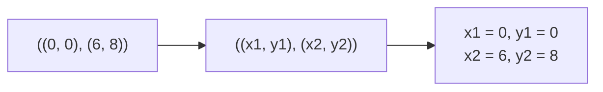

# Destructure

::note
<!-- sync:needs:start -->

**You'll need**: [Tuple](/docs/learn/tuple)
<!-- sync:needs:end -->

::

`.0` and `.1` work, but they say nothing about what each member _means_, and a function that uses a tuple's members many times fills up with them. _Destructuring_ unpacks a tuple into named bindings in one step: `let (x, y) = pair;` declares `x` from `pair.0` and `y` from `pair.1`.

## One name per member

The pattern on the left of `=` mirrors the tuple's shape, with one name per member:

```rux
let pair = (3, 4);
let (x, y) = pair;
```

It reads best straight off a function that returns several results. Compare `result.0` and `result.1` with names that say what they are:

```rux
let (quotient, remainder) = Divide(17, 5);
PrintLine("17 / 5 is {} remainder {}", quotient, remainder);
```

## Skipping a member with `_`

`_` stands for a member that is not wanted. `Bounds` returns both the lowest and the highest value, but only the high one is needed here:

```rux
let (_, high) = Bounds(readings);
```

The skipped member is not bound to anything, so there is no unused name lying around.

## `var` makes every name mutable

`var` in front of the pattern makes every name it declares mutable, just as it does for a single binding:

```rux
var (low, top) = Bounds(readings);
low -= 1;
top += 1;
```

## Patterns nest

A nested pattern unpacks a tuple inside a tuple, all the way down. The pattern has exactly the shape of the value:

```rux
let segment = ((0, 0), (6, 8));
let ((x1, y1), (x2, y2)) = segment;
```



## It only declares

Destructuring always declares **new** names. It cannot assign to names that already exist, so the swap other languages write as `(a, b) = (b, a);` is rejected: the left side of `=` has to be a single place, such as a variable or an element.

## The program

The whole lesson is one package in the [Examples repository](https://github.com/rux-lang/Examples/tree/main/Sequences/Destructure). Its comments explain every step.

<!-- sync:program:start -->

```rux [Src/Main.rux]
// `.0` and `.1` work, but they say nothing about what each member means, and a function that
// uses a tuple's members many times fills up with them. Destructuring unpacks a tuple into named
// bindings in one step: `let (x, y) = pair;` declares `x` from `pair.0` and `y` from `pair.1`.
//
// The pattern on the left mirrors the tuple's shape. It needs one name per member, it may nest
// to unpack a tuple inside a tuple, and `_` stands for a member that is not wanted.
import Io::PrintLine;

func Divide(numerator: int32, denominator: int32) -> (int32, int32) {
    return (numerator / denominator, numerator % denominator);
}

func Bounds(values: int32[..]) -> (int32, int32) {
    var low = values[0];
    var high = values[0];
    for value in values {
        if value < low {
            low = value;
        }
        if value > high {
            high = value;
        }
    }
    return (low, high);
}

func Main() -> int {
    // The basic form: one name per member.
    let pair = (3, 4);
    let (x, y) = pair;
    PrintLine("x {} y {}", x, y);

    // It reads best straight off a function call that returns several results.
    let (quotient, remainder) = Divide(17, 5);
    PrintLine("17 / 5 is {} remainder {}", quotient, remainder);

    // `_` skips a member. Only the high bound is needed here.
    let readings: int32[6] = [12, 9, 15, 4, 7, 11];
    let (_, high) = Bounds(readings);
    PrintLine("highest reading {}", high);

    // `var` makes every name mutable, just as it does for a single binding.
    var (low, top) = Bounds(readings);
    low -= 1;
    top += 1;
    PrintLine("padded range {}..={}", low, top);

    // A nested pattern unpacks a tuple inside a tuple, all the way down.
    let segment = ((0, 0), (6, 8));
    let ((x1, y1), (x2, y2)) = segment;
    PrintLine("from {},{} to {},{}", x1, y1, x2, y2);

    // Destructuring only declares new names. Assigning to existing ones, `(a, b) = (b, a);`,
    // is rejected: the left side of `=` has to be a single place.
    return 0;
}
```

<!-- sync:program:end -->

## Run it

```sh
cd Examples/Sequences/Destructure
rux run
```

<!-- sync:output:start -->

```
x 3 y 4
17 / 5 is 3 remainder 2
highest reading 15
padded range 3..=16
from 0,0 to 6,8
```

<!-- sync:output:end -->

## Common mistakes

::warning
**A pattern of the wrong size.**\
`let (a, b) = (1, 2, 3);` fails with `error: tuple pattern has 2 elements but type '(int, int, int)' has 3`. Name every member, or skip the ones you do not need with `_`.
::

::warning
**Destructuring something that is not a tuple.**\
`let (x, y) = 5;` fails with `error: cannot destructure non-tuple type 'int'`.
::

::warning
**Assigning to existing names.**\
`(a, b) = (b, a);` fails with `error: operator '=' requires an assignable target, but its left operand has type '(int, int)'`. Assign the names one at a time, through a temporary.
::

::warning
**The same name twice.**\
`let (p, p) = (1, 2);` fails with `error: variable 'p' is already declared in this scope` — each name in a pattern is a separate declaration.
::

## Try it yourself

1. Keep only the remainder from `Divide(23, 4)` using `_`.
2. Write `let (year, month, day) = (2026, 10, 5);` and print the date as `2026-10-5`.
3. Swap two `var` variables `a` and `b` using a temporary, then try `(a, b) = (b, a);` and read the error.
4. Write a function that returns `((int32, int32), int32)` — a point and a radius — and unpack it with one nested pattern.

## Learn more

- [Destructuring](/docs/lang/tuples/destructuring) in the Rux Reference
- [Tuple](/docs/learn/tuple) — the values being unpacked
- [Tuple pattern](/docs/learn/tuple-pattern) — the same patterns inside `match`
