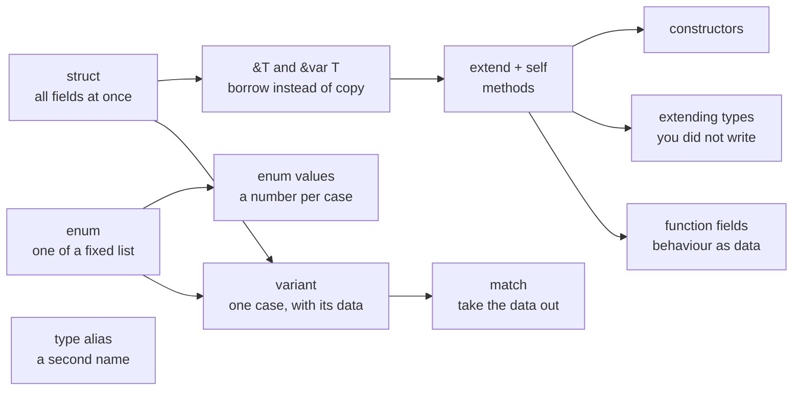

# Part 6: Types

Until now every value has had a built-in type — a number, a string, an array, a tuple. This part lets you declare types of your own, shaped to the problem: a `Point` with an `x` and a `y`, a `Direction` that is one of four, a `Command` that carries exactly the data its case needs. By the end you can give those types behaviour of their own and pass them around without copying them.

## What you will learn

- Grouping named fields into a `struct`, and building values with a struct literal.
- Borrowing a value with `&T` to read it, and with `&var T` to change the caller's value in place.
- Giving a type methods in an `extend` block, with a `self` receiver that reads or writes.
- Building a valid value in one place with a constructor, and adding methods to types you did not write.
- Naming a fixed set of cases with `enum`, and choosing the number behind each case.
- Letting each case carry its own data with `variant`, and taking it apart with `match`.
- Giving a type a second name with `type`, and storing a function in a field.

## How the ideas fit together



Structs are the "and" of types — a point has an `x` **and** a `y`. Enums and variants are the "or" — a direction is north **or** east **or** south **or** west. Most programs need both, and the [Patterns](/docs/learn/patterns) part that follows is all about taking them apart.

## Lessons

<!-- sync:lessons:start -->

|      | Lesson                                             | What you will learn                                                  |
| ---- | -------------------------------------------------- | -------------------------------------------------------------------- |
| 6.1  | [Struct](/docs/learn/struct)                       | group related values into a struct with named fields                 |
| 6.2  | [Reference](/docs/learn/reference)                 | borrow a value with `&T` instead of copying it                       |
| 6.3  | [Mutable reference](/docs/learn/mutable-reference) | let a function change the caller's value through `&var T`            |
| 6.4  | [Method](/docs/learn/method)                       | give a struct behaviour with `extend` and a `self` receiver          |
| 6.5  | [Mutating method](/docs/learn/mutating-method)     | a method that changes its receiver through `self: &var T`            |
| 6.6  | [Constructor](/docs/learn/constructor)             | build a valid value in one place with a constructor                  |
| 6.7  | [Extension](/docs/learn/extension)                 | add methods to a type you did not write                              |
| 6.8  | [Enum](/docs/learn/enum)                           | name a fixed set of cases                                            |
| 6.9  | [Enum value](/docs/learn/enum-value)               | give an enum an explicit underlying type and convert to and from it  |
| 6.10 | [Variant](/docs/learn/variant)                     | attach data to each case                                             |
| 6.11 | [Variant match](/docs/learn/variant-match)         | take a variant apart in a `match` arm                                |
| 6.12 | [Type alias](/docs/learn/type-alias)               | give an existing type a second name to make a signature read clearly |
| 6.13 | [Function field](/docs/learn/function-field)       | store a function in a struct field and call it later                 |

<!-- sync:lessons:end -->

## Before you start

Finish Parts 1–5 first. This part leans most on [Part 4: Functions](/docs/learn/functions) — overloads and callbacks come back as constructors and function fields — and on [Part 5: Sequences](/docs/learn/sequences), whose tuples, arrays and slices appear as fields, receivers and extended types. `match` from [Part 3: Control flow](/docs/learn/control-flow) is how enums and variants are read.

Each lesson's package is in the Examples repository's `Types/` folder:

```sh
cd Examples/Types/Struct
rux run
```

## After this part

[Part 7: Patterns](/docs/learn/patterns) shows everything a `match` arm can say — guards, ranges, tuples and struct patterns — on top of the enums and variants you can now declare. [Part 8: Optionals](/docs/learn/optionals) and [Part 9: Errors](/docs/learn/errors) then build on variants' idea of "one of several cases" for values that may be missing and operations that may fail. After Part 9, the checkpoint project [Calculator](/docs/learn/calculator) puts a variant to work describing what went wrong.

For the full rules behind this part, see [Structures](/docs/lang/structs/overview), [Methods](/docs/lang/structs/methods), [Enumerations](/docs/lang/enums/overview), [Variants with data](/docs/lang/enums/data) and [Type aliases](/docs/lang/aliases/overview) in the Rux Reference.
