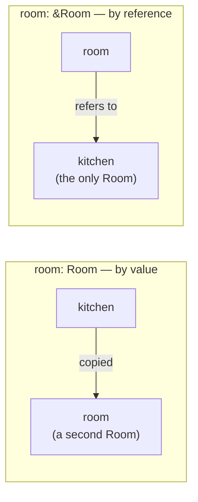

# Reference

::note
<!-- sync:needs:start -->

**You'll need**: [Struct](/docs/learn/struct)
<!-- sync:needs:end -->

::

Passing a struct to a function, as the [Struct](/docs/learn/struct) lesson did, hands the function a copy. For two numbers that costs nothing, but a struct can be large, and copying it only so a function can _read_ it is wasted work.

A **reference**, written `&T`, borrows the caller's value instead. The function reads the original through the reference, and nothing is copied. A plain `&` is read-only: the function may look at the value but not change it, so the caller can lend it out without worrying.

## Borrowing a value

The `&` goes in front of the parameter's type:

```rux
func Area(room: &Room) -> float64 {
    return room.width * room.length;
}
```



Two things keep references light to use:

- **The call site writes nothing extra.** `Describe(kitchen)` borrows `kitchen` because the parameter asks for a `&Room`. The function's signature decides, not the caller.
- **A reference is followed automatically.** `room.width` reads the field of the borrowed room — there is no separate operator to "go through" the reference first.

## Read-only, and passed on

A function that borrows a value may lend it on. `Describe` hands the room it borrowed straight to `Area`:

```rux
func Describe(room: &Room) {
    PrintLine("{}: {} by {} metres, {} square metres", room.name, room.width, room.length,
        Area(room));
}
```

What it may not do is change it. `room.width = 0.0;` inside `Describe` is refused: a `&Room` is a promise to the caller that their room comes back untouched. Lending for writing is a different kind of reference, `&var`, and the subject of the [next lesson](/docs/learn/mutable-reference).

## Anything can be borrowed

A reference is not only for structs. An array of three floats is worth borrowing too:

```rux
func Widest(widths: &float64[3]) -> float64 {
    var widest = widths[0];
    for i in 1..3 {
        if widths[i] > widest {
            widest = widths[i];
        }
    }
    return widest;
}
```

Inside, `widths[i]` indexes the caller's array directly, just as `room.width` read the caller's field.

## A reference as a local

A reference can also be a local variable — a second name for a value that already exists:

```rux
let chosen: &Room = kitchen;
PrintLine("chosen: the {}", chosen.name);
```

`chosen` is not a new room. It is another way to reach `kitchen`.

| Parameter     | What the function gets      | Copies the value | Can change the caller's value | What can be passed       |
| ------------- | --------------------------- | ---------------- | ----------------------------- | ------------------------ |
| `room: Room`  | its own copy                | yes              | no                            | any `Room` value         |
| `room: &Room` | the caller's value, to read | no               | no                            | a named `Room` to borrow |

## The program

The whole lesson is one package in the [Examples repository](https://github.com/rux-lang/Examples/tree/main/Types/Reference). Its comments explain every step.

<!-- sync:program:start -->

```rux [Src/Main.rux]
// Passing a struct to a function, as the Struct lesson did, hands the function a copy. For two
// numbers that costs nothing, but a struct can be large, and copying it only so a function can
// read it is wasted work.
//
// A reference, written `&T`, borrows the caller's value instead. The function reads the original
// through the reference and nothing is copied. A plain `&` is read-only: the function may look at
// the value but not change it, so the caller can lend it out without worrying.
//
// Two things keep references light to use. The call site writes nothing extra: `Area(kitchen)`
// borrows `kitchen` because the parameter asks for a `&Room`. And a reference is followed
// automatically, so `room.width` reads the field of the borrowed room.
import Io::PrintLine;

struct Room {
    name: char8[..];
    width: float64;
    length: float64;
}

func Area(room: &Room) -> float64 {
    return room.width * room.length;
}

// A reference can be passed on: `Describe` lends the room it borrowed to `Area`. Assigning through
// it is another matter, and `room.width = 0.0;` here would be rejected.
func Describe(room: &Room) {
    PrintLine("{}: {} by {} metres, {} square metres", room.name, room.width, room.length,
        Area(room));
}

// Any type can be borrowed, an array included.
func Widest(widths: &float64[3]) -> float64 {
    var widest = widths[0];
    for i in 1..3 {
        if widths[i] > widest {
            widest = widths[i];
        }
    }
    return widest;
}

func Main() -> int {
    let kitchen = Room { name: "kitchen", width: 3.5, length: 4.0 };
    let hall = Room { name: "hall", width: 1.5, length: 6.0 };
    Describe(kitchen);
    Describe(hall);

    // A reference can also be a local: a second name for a value that already exists.
    let chosen: &Room = kitchen;
    PrintLine("chosen: the {}", chosen.name);

    let widths: float64[3] = [3.5, 1.5, 2.75];
    PrintLine("widest: {} metres", Widest(widths));

    // A borrow needs something to borrow from. A struct built on the spot has no name to lend,
    // so `Area(Room { ... })` stops with
    //     error: argument 1 to 'Area' has type 'Room', but parameter 'room' requires '&Room'
    // Bind it with `let` first, as above.
    return 0;
}
```

<!-- sync:program:end -->

## Run it

```sh
cd Examples/Types/Reference
rux run
```

<!-- sync:output:start -->

```
kitchen: 3.5 by 4.0 metres, 14.0 square metres
hall: 1.5 by 6.0 metres, 9.0 square metres
chosen: the kitchen
widest: 3.5 metres
```

<!-- sync:output:end -->

## Common mistakes

::warning
**Borrowing something that has no name.**\
A borrow needs a value to borrow from. `Area(Room { name: "x", width: 1.0, length: 2.0 })` fails with `error: argument 1 to 'Area' has type 'Room', but parameter 'room' requires '&Room'`, and so does passing a plain literal to a `&int` parameter. Bind the value with `let` first, then pass the name.
::

::warning
**Writing through a `&`.**\
`room.width = 0.0;` in a function that takes `room: &Room` fails with `error: cannot modify data through immutable reference '&Room'`. If the function really must change the caller's value, it needs a `&var Room` — see [Mutable reference](/docs/learn/mutable-reference).
::

::warning
**Changing a value while a reference to it is in use.**\
With `var kitchen` and `let chosen: &Room = kitchen;`, assigning `kitchen.width = 9.0;` and then reading `chosen.width` fails with `error: cannot modify 'kitchen.width' while it is immutably borrowed`. The compiler will not let a value change under a reader that is still looking at it. Finish with `chosen` first; once its last use is behind you, `kitchen` is free to change. [Exclusivity](/docs/learn/exclusivity) covers the rule in full.
::

## Try it yourself

1. Write `func Perimeter(room: &Room) -> float64` and add the perimeter to what `Describe` prints.
2. Write `func Narrowest(widths: &float64[3]) -> float64` next to `Widest`.
3. Add `room.width = 0.0;` to `Describe` and read the error.
4. Call `Area` with a struct literal, read the error, then fix it with a `let`.

## Learn more

- [Function declaration](/docs/lang/functions/declaration) — parameters and return types, in the Rux Reference
- [Mutable reference](/docs/learn/mutable-reference) — lending a value for writing
- [Exclusivity](/docs/learn/exclusivity) — why a borrowed value cannot change under its reader
- [Pointer](/docs/learn/pointer) — the lower-level relative of a reference
