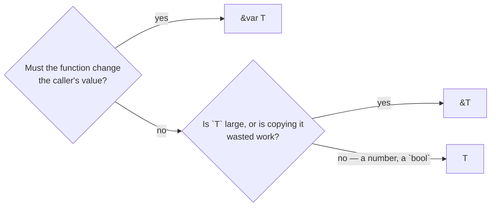

# Mutable reference

::note
<!-- sync:needs:start -->

**You'll need**: [Reference](/docs/learn/reference)
<!-- sync:needs:end -->

::

A `&T` reference lets a function look at the caller's value. A `&var T` reference lets it **change** that value: the writes land in the caller's own storage, so the caller sees them as soon as the call returns. Nothing is copied in, and nothing needs to be handed back.

This is how a function updates something it was given — a bank balance, a counter, a game's score — without the caller having to write `account = Deposit(account, 50);`.

## Writing through &var

The parameter's type is `&var` and the type being lent:

```rux
func Deposit(account: &var Account, amount: int) {
    account.balance += amount;
    account.deposits += 1;
}
```

As with `&`, the call site writes nothing extra, and the changes are visible right after:

```rux
Deposit(alice, 50);
Deposit(alice, 25);
```

After those two calls `alice` itself has a balance of 175 and two deposits.

## Both ends have to agree

The parameter says `&var`, and the value passed in must be a `var`. A binding declared with `let` was promised never to change, and lending it out for writing would break that promise:

```rux
var alice = Account { owner: "Alice", balance: 100, deposits: 0 };
```

Had `alice` been a `let`, every `Deposit(alice, …)` would be refused.

## Replacing the whole value

Assigning to a field changes that field. Assigning to the reference itself replaces the caller's whole value in one step:

```rux
func Close(account: &var Account) {
    account = Account { owner: account.owner, balance: 0, deposits: 0 };
}
```

## Any type can be lent

A `&var` is not only for structs. A plain integer can be lent for writing too:

```rux
func Tick(count: &var int) {
    count += 1;
}
```

Three calls to `Tick(visits)` leave `visits` at 3.

## One writer at a time

Two _different_ accounts may be lent for writing in the same call:

```rux
Transfer(alice, bob, 70);
```

The same account twice, `Transfer(alice, alice, 5)`, is refused. Inside `Transfer`, `from` and `to` would be two names for one value, and every write through one would silently change what the other sees. The rule behind this — while something may write a value, nothing else may touch it — is [Exclusivity](/docs/learn/exclusivity), in the Ownership part.

## Choosing a parameter type

You now have three ways to take an argument:

| Parameter         | What the function gets        | Can change the caller's value | The caller passes   |
| ----------------- | ----------------------------- | ----------------------------- | ------------------- |
| `a: Account`      | its own copy, read-only       | no                            | any `Account` value |
| `a: &Account`     | the caller's value, to read   | no                            | a named `Account`   |
| `a: &var Account` | the caller's value, to change | yes                           | a `var` `Account`   |



## The program

The whole lesson is one package in the [Examples repository](https://github.com/rux-lang/Examples/tree/main/Types/MutableReference). Its comments explain every step.

<!-- sync:program:start -->

```rux [Src/Main.rux]
// A `&T` reference lets a function look at the caller's value. A `&var T` reference lets it change
// that value: the writes land in the caller's own storage, so the caller sees them once the call
// returns. Nothing is copied in, and nothing needs to be handed back.
//
// Both ends have to agree. The parameter says `&var`, and the value passed in must be a `var`. A
// binding declared with `let` was promised never to change, and lending it out for writing would
// break that promise, so `Deposit(savings, 10)` with a `let savings` is rejected.
import Io::PrintLine;

struct Account {
    owner: char8[..];
    balance: int;
    deposits: int;
}

// Writing a field through the reference changes that field of the caller's account.
func Deposit(account: &var Account, amount: int) {
    account.balance += amount;
    account.deposits += 1;
}

// Two different accounts may be borrowed for writing in the same call. The same account twice,
// `Transfer(alice, alice, 5)`, is rejected: two writers to one value at once is the kind of
// conflict the Ownership part is about.
func Transfer(from: &var Account, to: &var Account, amount: int) {
    from.balance -= amount;
    to.balance += amount;
}

// Assigning to the reference itself replaces the caller's whole value in one step.
func Close(account: &var Account) {
    account = Account { owner: account.owner, balance: 0, deposits: 0 };
}

// Any type can be lent this way, a plain integer included.
func Tick(count: &var int) {
    count += 1;
}

func Show(account: &Account) {
    PrintLine("{}: balance {}, deposits {}", account.owner, account.balance, account.deposits);
}

func Main() -> int {
    var alice = Account { owner: "Alice", balance: 100, deposits: 0 };
    var bob = Account { owner: "Bob", balance: 20, deposits: 0 };

    // As with `&`, the call site writes nothing extra. The changes are visible right after.
    Deposit(alice, 50);
    Deposit(alice, 25);
    Deposit(bob, 5);
    Show(alice);
    Show(bob);

    Transfer(alice, bob, 70);
    Show(alice);
    Show(bob);

    Close(bob);
    Show(bob);

    var visits = 0;
    Tick(visits);
    Tick(visits);
    Tick(visits);
    PrintLine("visits: {}", visits);
    return 0;
}
```

<!-- sync:program:end -->

## Run it

```sh
cd Examples/Types/MutableReference
rux run
```

<!-- sync:output:start -->

```
Alice: balance 175, deposits 2
Bob: balance 25, deposits 1
Alice: balance 105, deposits 2
Bob: balance 95, deposits 1
Bob: balance 0, deposits 0
visits: 3
```

<!-- sync:output:end -->

## Common mistakes

::mistake
**Lending a `let` for writing.**\
With `let savings = Account { … };`, the call `Deposit(savings, 10)` fails with:

```text
error: argument 1 to 'Deposit' cannot borrow immutable 'savings' as '&var Account'
```

The compiler suggests declaring `savings` with `var`.
::

::mistake
**Changing a by-value parameter.**\
`func Tick(count: int) { count += 1; }` fails with:

```text
error: cannot modify parameter 'count'
```

A parameter is read-only, and even if it were not, it would be the function's own copy — the caller would never see the change. The compiler's help says it: take `count` as `&var int` to change the caller's value.
::

::mistake
**Lending one value twice.**\
`Transfer(alice, alice, 5)` fails with:

```text
error: call arguments create overlapping exclusive borrows of 'alice'
```

Each `&var` argument must be a different value.
::

::mistake
**Passing a literal to `&var`.**\
`Tick(5)` fails with:

```text
error: argument 1 to 'Tick' has type 'int', but parameter 'count' requires '&var int'
```

There is nowhere for the change to land: a `&var` needs a variable to write into.
::

## Try it yourself

1. Write `func Withdraw(account: &var Account, amount: int) -> bool` that refuses (returns `false`) when the balance is too small, and try it on both accounts.
2. Declare `var counts: int[3] = [0, 0, 0];` and call `Tick(counts[1])` twice, then print the three elements. An array element is a place, so it can be lent for writing too.
3. Change `var bob` to `let bob` and read the errors.
4. Write `func Swap(a: &var int, b: &var int)` and use it to swap two variables. Give the temporary its type, `let saved: int = a;` — written as plain `let saved = a;`, it would be one more reference to `a` rather than a copy of its number, and the compiler would refuse the swap.

## Learn more

- [Reference](/docs/learn/reference) — the read-only kind
- [Mutating method](/docs/learn/mutating-method) — a method that changes the value it is called on
- [Exclusivity](/docs/learn/exclusivity) — why one value cannot be lent for writing twice
- [Out parameter](/docs/learn/out-parameter) — the same idea with pointers
