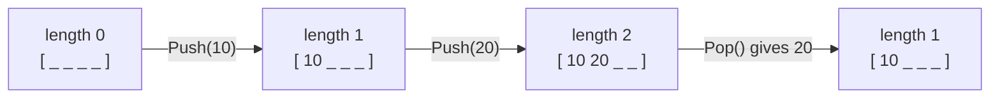

# Mutating method

::note
<!-- sync:needs:start -->

**You'll need**: [Method](/docs/learn/method), [Mutable reference](/docs/learn/mutable-reference)
<!-- sync:needs:end -->

::

The methods in the last lesson only looked at their rectangle. A method that **changes** the value it is called on takes `self: &var T` — the writable reference from [Mutable reference](/docs/learn/mutable-reference). Its writes land in the value before the dot.

This is where methods start to pay off. A `Stack` is an array plus a count of how much of it is in use, and the two must change together:

```rux
struct Stack {
    items: int[4];
    length: uint;
}
```

If every caller updated `items` and `length` by hand, one of them would sooner or later forget the count. With `Push` and `Pop` as the only code that changes them, they stay in step.

## Reading and writing receivers

The receiver's type says what a method may do:

```rux
func IsEmpty(self: &Stack) -> bool {
    return self.length == 0;
}
```

```rux
func Push(self: &var Stack, value: int) -> bool {
    if self.IsFull() {
        return false;
    }
    self.items[self.length] = value;
    self.length += 1;
    return true;
}
```

`IsEmpty` takes `&Stack` and only reads. `Push` takes `&var Stack`, so it may assign `self.items[…]` and `self.length`. A writing method may also return a value — here, whether the push happened, since a full stack has no room left.

`Push` calls `self.IsFull()` on its own receiver: a writing method can always use the reading ones.

## How the stack moves

`Push` writes at position `length` and then counts the new item; `Pop` uncounts the top item and then reads it. The last value in is the first one out:



`Pop` does not erase the old value — it stays in the array, but past `length` it no longer counts.

## The caller needs a var

A writing method needs a `var` to work on, just as assigning a field would:

```rux
var stack = Stack { items: [0; 4], length: 0 };
```

| Method              | Receiver     | On a `let stack` | On a `var stack` |
| ------------------- | ------------ | ---------------- | ---------------- |
| `IsEmpty`, `IsFull` | `&Stack`     | allowed          | allowed          |
| `Push`, `Pop`       | `&var Stack` | refused          | allowed          |

## A rule the caller keeps

`Pop` has a precondition: it is only to be called on a stack that is not empty. The program keeps it by asking first:

```rux
while !stack.IsEmpty() {
    PrintLine("pop  {}", stack.Pop());
}
```

Making a method report "there was nothing to pop" in its return type is what [Optionals](/docs/learn/optionals) are for, a couple of parts on.

## The program

The whole lesson is one package in the [Examples repository](https://github.com/rux-lang/Examples/tree/main/Types/MutatingMethod). Its comments explain every step.

<!-- sync:program:start -->

```rux [Src/Main.rux]
// A method that changes the value it is called on takes `self: &var T`, the writable reference
// from the MutableReference lesson. Its writes land in the value before the dot.
//
// This is where methods start to pay off. A `Stack` is an array plus a count of how much of it is
// in use, and the two must change together. If every caller updated them by hand, one would
// sooner or later forget the count. With `Push` and `Pop` as the only code that changes them,
// they stay in step.
import Io::PrintLine;

struct Stack {
    items: int[4];
    length: uint;
}

extend Stack {
    // A reading method still takes `&Stack`, and can be called on any stack.
    func IsEmpty(self: &Stack) -> bool {
        return self.length == 0;
    }

    func IsFull(self: &Stack) -> bool {
        return self.length == 4;
    }

    // A writing method takes `&var Stack`. It may also return a value: here, whether the push
    // happened, since a full stack has no room left.
    func Push(self: &var Stack, value: int) -> bool {
        if self.IsFull() {
            return false;
        }
        self.items[self.length] = value;
        self.length += 1;
        return true;
    }

    // Only to be called on a stack that is not empty; the caller checks `IsEmpty` first.
    func Pop(self: &var Stack) -> int {
        self.length -= 1;
        return self.items[self.length];
    }
}

func Main() -> int {
    // A writing method needs a `var` to work on, just as assigning a field would. Had `stack`
    // been declared with `let`, every `Push` and `Pop` below would be rejected, while `IsEmpty`
    // and `IsFull` would still be allowed.
    var stack = Stack { items: [0; 4], length: 0 };

    for value in 1..=5 {
        let pushed = stack.Push(value * 10);
        PrintLine("push {}  accepted {}", value * 10, pushed);
    }
    PrintLine("full {}", stack.IsFull());

    while !stack.IsEmpty() {
        PrintLine("pop  {}", stack.Pop());
    }
    PrintLine("empty {}", stack.IsEmpty());
    return 0;
}
```

<!-- sync:program:end -->

## Run it

```sh
cd Examples/Types/MutatingMethod
rux run
```

<!-- sync:output:start -->

```
push 10  accepted true
push 20  accepted true
push 30  accepted true
push 40  accepted true
push 50  accepted false
full true
pop  40
pop  30
pop  20
pop  10
empty true
```

<!-- sync:output:end -->

## Common mistakes

::warning
**Calling a writing method on a `let`.**\
With `let stack = …`, the call `stack.Push(1)` fails with `error: cannot call 'Push' on immutable 'stack'`. A note points out that `Push` declares a writable receiver `&var Stack`, and the help suggests declaring `stack` with `var`. `stack.IsEmpty()` is still fine.
::

::warning
**Writing through a read-only receiver.**\
A `Clear` method declared as `func Clear(self: &Stack)` that assigns `self.length = 0;` fails with `error: cannot modify data through immutable reference '&Stack'`.
::

::warning
**Taking the receiver by value.**\
`func Clear(self: Stack)` would get a copy, and changing a copy would change nothing. The compiler refuses the write with `error: cannot modify immutable receiver 'self'`, and its help says what to do: take the receiver as `self: &var Stack` to change the caller's value.
::

::warning
**Popping an empty stack.**\
`Pop` does not check. On an empty stack, `self.length -= 1` takes a `uint` below zero, it wraps round to a huge number, and the read stops the program with `Panic: index out of range`. Check `IsEmpty` first.
::

## Try it yourself

1. Add `func Peek(self: &Stack) -> int` that returns the top item without removing it. Which receiver does it need?
2. Add `func Clear(self: &var Stack)` and use it to empty a full stack in one call.
3. Change `var stack` to `let stack` and read which lines the compiler refuses — and which it still accepts.
4. Add a `Size(self: &Stack) -> uint` method and print the size after every push.

## Learn more

- [Methods](/docs/lang/structs/methods) in the Rux Reference
- [Mutable reference](/docs/learn/mutable-reference) — the `&var` behind the receiver
- [Constructor](/docs/learn/constructor) — building a valid value in one place
- [Optional](/docs/learn/optional) — a `Pop` that can say "nothing here"
