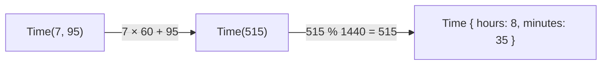

# Constructor

::note
<!-- sync:needs:start -->

**You'll need**: [Method](/docs/learn/method), [Overload](/docs/learn/overload)
<!-- sync:needs:end -->

::

A struct literal names every field at every place a value is built. That is fine for a `Point`, but some types have rules. A time of day has minutes from 0 to 59, and a literal will happily accept `Time { hours: 7, minutes: 95 }`.

A **constructor** is a function that builds the value for you, so the rules are written once instead of at every literal. It is called by the type's name, like a function: `Time(9, 30)`.

## Declaring a constructor

A constructor lives in the type's `extend` block, beside its methods, and differs from them in three ways:

- it has the **same name as the type**;
- it takes **no `self`** — there is no value yet to call it on;
- it **returns the type**.

```rux
extend Time {
    func Time(hours: int, minutes: int) -> Time {
        return Time(hours * 60 + minutes);
    }

    // The second constructor and the methods follow.
}
```

| Kind of function | Name           | First parameter              | Called as      |
| ---------------- | -------------- | ---------------------------- | -------------- |
| Method           | anything       | `self: &Time` or `&var Time` | `start.Show()` |
| Constructor      | `Time`, always | none                         | `Time(9, 30)`  |

## Constructors overload

A type can have several constructors, told apart by their parameters — the [overloading](/docs/learn/overload) you already know from ordinary functions. This one takes a single count of minutes and does the real work:

```rux
func Time(totalMinutes: int) -> Time {
    let inDay = totalMinutes % (24 * 60);
    return Time { hours: inDay / 60, minutes: inDay % 60 };
}
```

The two-argument constructor turns its hours and minutes into a total and hands it to this one, so the wrapping is written exactly once:



At the end, the struct literal is still how the value is finally made. A constructor does not replace literals; it decides what goes into one.

## Building new values from old ones

Since a constructor accepts any count of minutes, "135 minutes later" is just another call:

```rux
let later = Time(start.TotalMinutes() + 135);
```

And past midnight the clock wraps, because `% (24 * 60)` keeps the total inside one day.

## A convenience, not a lock

The struct literal is still allowed, rules or no rules: `Time { hours: 7, minutes: 95 }` compiles and makes a time that is not a time. A constructor is a convenience the type offers; it does not lock the door. Hiding the fields so the constructor is the only way in is what [Visibility](/docs/learn/visibility) is about.

## The program

The whole lesson is one package in the [Examples repository](https://github.com/rux-lang/Examples/tree/main/Types/Constructor). Its comments explain every step.

<!-- sync:program:start -->

```rux [Src/Main.rux]
// A struct literal names every field at every place a value is built. That is fine for a `Point`,
// but some types have rules: a time of day has minutes from 0 to 59, and a literal will happily
// accept `Time { hours: 7, minutes: 95 }`.
//
// A constructor is a function that builds the value for you. It is declared inside the type's
// `extend` block, has the same name as the type, takes no `self` (there is no value yet), and
// returns the type. It is called by the type's name, like a function: `Time(9, 30)`.
import Io::PrintLine;

struct Time {
    hours: int;
    minutes: int;
}

extend Time {
    // The plain form: one argument per field, wrapped round the clock so the fields stay valid.
    func Time(hours: int, minutes: int) -> Time {
        return Time(hours * 60 + minutes);
    }

    // Constructors overload like any function. This one does real work, splitting a count of
    // minutes into hours and minutes, which is what the other constructor relies on. The struct
    // literal is still how the value is finally made.
    func Time(totalMinutes: int) -> Time {
        let inDay = totalMinutes % (24 * 60);
        return Time { hours: inDay / 60, minutes: inDay % 60 };
    }

    func TotalMinutes(self: &Time) -> int {
        return self.hours * 60 + self.minutes;
    }

    func Show(self: &Time) {
        PrintLine("{:02}:{:02}", self.hours, self.minutes);
    }
}

func Main() -> int {
    let start = Time(9, 30);
    start.Show();

    // Minutes past 59 carry into the hours, which a struct literal would not do.
    let odd = Time(7, 95);
    odd.Show();

    // Building a new value from an old one is a matter of calling a constructor again.
    let later = Time(start.TotalMinutes() + 135);
    later.Show();

    // Past midnight, the clock wraps.
    let overnight = Time(later.TotalMinutes() + 14 * 60);
    overnight.Show();

    // The struct literal is still allowed, rules or no rules. A constructor is a convenience the
    // type offers; it does not lock the door. Hiding the fields so the constructor is the only
    // way in is what the Visibility lesson is about.
    return 0;
}
```

<!-- sync:program:end -->

## Run it

```sh
cd Examples/Types/Constructor
rux run
```

<!-- sync:output:start -->

```
09:30
08:35
11:45
01:45
```

<!-- sync:output:end -->

## Common mistakes

::warning
**Calling a type that has no constructor.**\
Without a constructor, `Point(1, 2)` fails with `error: type 'Point' cannot be called because it has no declared constructor`. The help names both ways out: declare a receiverless constructor in its `extend` block, or build the value with a struct literal.
::

::warning
**Declaring the constructor outside `extend`.**\
A top-level `func Time(…) -> Time` fails with `error: name 'Time' cannot be declared as a function because it is already a type in this scope`. A constructor belongs inside the type's `extend` block.
::

::warning
**Returning something other than the type.**\
`func Time(hours: int, minutes: int) -> int` in `extend Time` fails with `error: constructor 'Time' must return exactly 'Time'`.
::

::warning
**No constructor matches the arguments.**\
With only the two-argument constructor declared, `Time(9)` fails with `error: call to 'Time' expects 2 arguments, but 1 was provided`. Each set of arguments needs a constructor of its own.
::

## Try it yourself

1. Write `Time { hours: 7, minutes: 95 }` as a literal, call `Show` on it, and compare with `Time(7, 95)`.
2. Add a method `func Later(self: &Time, minutes: int) -> Time` that uses a constructor, and print `start.Later(45)`.
3. Add `func Midnight() -> Time` to the `extend` block — no `self`, and a name that is not the type's. Call it as `Time::Midnight()`.
4. Make the one-argument constructor handle a negative count, so that `Time(-30)` shows `23:30`.

## Learn more

- [Methods](/docs/lang/structs/methods) in the Rux Reference
- [Overload](/docs/learn/overload) — several functions with one name
- [Visibility](/docs/learn/visibility) — making the constructor the only way in
- [Struct](/docs/learn/struct) — the struct literal a constructor fills in
