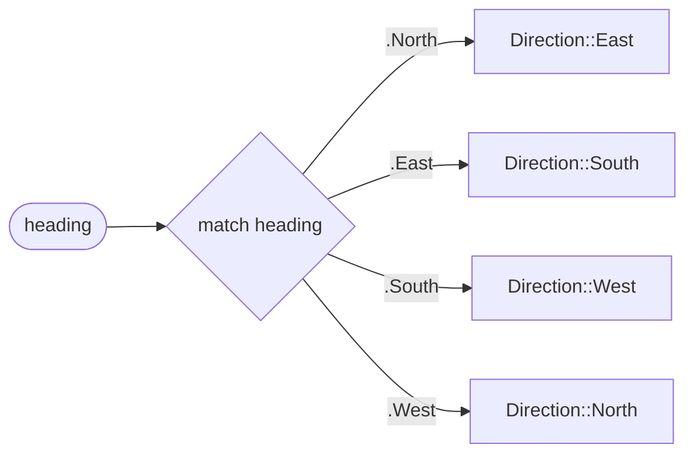

# Enum

::note
<!-- sync:needs:start -->

**You'll need**: [Match expression](/docs/learn/match-expression), [Method](/docs/learn/method)
<!-- sync:needs:end -->

::

An **enum** is a type with a fixed list of named values, called its **cases**. A direction is north, east, south or west, and nothing else. Stored as an `int`, a direction could just as well be 47, and nothing would notice; stored as a `Direction`, it cannot — the type has exactly four values, and the compiler knows all of them.

## Declaring an enum

The declaration is `enum`, a name, and the cases separated by commas:

```rux
enum Direction {
    North,
    East,
    South,
    West
}
```

The cases carry no data; each one is simply itself. A case that needs to carry something — a number, a name — is a [variant](/docs/learn/variant), two lessons on.

## Naming a case

Outside a pattern, a case is named through its type, with `::`:

```rux
var heading = Direction::North;
```

Cases compare with `==` and `!=`:

```rux
PrintLine("back to north: {}", heading == Direction::North);
```

## Matching on an enum

A `match` on a `Direction` already knows the type, so its patterns may use the short form `.North`:

```rux
func TurnRight(self: Direction) -> Direction {
    return match self {
        .North => Direction::East,
        .East => Direction::South,
        .South => Direction::West,
        .West => Direction::North
    };
}
```

The short form is for **patterns only**. The value an arm produces is written in full — `Direction::East`, not `.East`.

| Where                                | Spelling           |
| ------------------------------------ | ------------------ |
| A `match` pattern on a `Direction`   | `.North`           |
| Anywhere else: a value, a comparison | `Direction::North` |

## Every case, no else

Neither `match` in the program has an `else` arm, and neither needs one. Naming all four cases covers every value a `Direction` can hold:



This is the best thing about enums. Add a fifth case, `Up`, and every `match` that does not handle it stops compiling, pointing at the case it is missing. An `else` arm would have swallowed `Up` silently — so leave `else` out when you mean "every case".

## Methods on an enum

An enum can be extended with methods like any other type. Taking `self` by value is natural here: a case is as small as a number. The program gives `Direction` a `TurnRight` and a `Name`, because an enum cannot be printed with `{}` directly.

## The program

The whole lesson is one package in the [Examples repository](https://github.com/rux-lang/Examples/tree/main/Types/Enum). Its comments explain every step.

<!-- sync:program:start -->

```rux [Src/Main.rux]
// An enum is a type with a fixed list of named values, called its cases. A direction is north,
// east, south or west, and nothing else. Stored as an `int`, a direction could just as well be
// 47, and nothing would notice; stored as a `Direction`, it cannot.
//
// The cases carry no data; each one is simply itself. A case that needs to carry something is a
// `variant`, two lessons on.
import Io::PrintLine;

enum Direction {
    North,
    East,
    South,
    West
}

// An enum can be extended with methods like any other type. Taking `self` by value is natural
// here: a case is as small as a number.
extend Direction {
    // Inside a `match` on a `Direction`, the type is already known, so a pattern may be written
    // `.North` rather than `Direction::North`. A value outside a pattern is written in full:
    // `.North => .East` stops with
    //     error: '.East' must be written in full, as in 'Direction::East'
    func TurnRight(self: Direction) -> Direction {
        return match self {
            .North => Direction::East,
            .East => Direction::South,
            .South => Direction::West,
            .West => Direction::North
        };
    }

    // An enum cannot be printed with `{}` directly, so it is given a name to print.
    func Name(self: Direction) -> char8[..] {
        return match self {
            .North => "north",
            .East => "east",
            .South => "south",
            .West => "west"
        };
    }
}

func Main() -> int {
    // A case is named through its type.
    var heading = Direction::North;
    PrintLine("start facing {}", heading.Name());

    for turn in 1..=4 {
        heading = heading.TurnRight();
        PrintLine("turn {}: facing {}", turn, heading.Name());
    }

    // Cases compare with `==` and `!=`.
    PrintLine("back to north: {}", heading == Direction::North);
    PrintLine("facing east:   {}", heading == Direction::East);

    // Neither `match` above needs an `else`: naming all four cases covers every value a
    // `Direction` can hold. Add a fifth case, and both stop compiling until they handle it.
    return 0;
}
```

<!-- sync:program:end -->

## Run it

```sh
cd Examples/Types/Enum
rux run
```

<!-- sync:output:start -->

```
start facing north
turn 1: facing east
turn 2: facing south
turn 3: facing west
turn 4: facing north
back to north: true
facing east:   false
```

<!-- sync:output:end -->

## Common mistakes

::warning
**The short form outside a pattern.**\
`.North => .East` fails with `error: '.East' must be written in full, as in 'Direction::East'`. The same happens to `let d: Direction = .North;`. Only patterns may drop the type name.
::

::warning
**A case without its type.**\
`let d = North;` fails with `error: name 'North' is not defined in this scope`. Cases live inside their enum: `Direction::North`.
::

::warning
**Leaving a case out of a `match`.**\
A `match` naming only three directions fails with `error: match on 'Direction' is not exhaustive; missing Direction::West`.
::

::warning
**Printing an enum with `{}`.**\
`PrintLine("{}", heading)` fails with `error: argument 2 to 'PrintLine' has type 'Direction', but variadic parameter 'args' requires 'Display'`. Give the enum a `Name` method, as the program does.
::

## Try it yourself

1. Add a `TurnLeft` method, and check that turning left then right comes back to the same heading.
2. Add `func Opposite(self: Direction) -> Direction`.
3. Add a fifth case, `Up`, and read the errors from both `match`es. Then handle it.
4. Declare `enum Suit { Clubs, Diamonds, Hearts, Spades }` with a `Name` method, and print all four.

## Learn more

- [Enumerations](/docs/lang/enums/overview) in the Rux Reference
- [Match expression](/docs/learn/match-expression) — the `match` that produces a value
- [Enum value](/docs/learn/enum-value) — the number behind each case
- [Exhaustive](/docs/learn/exhaustive) — how the compiler checks that every case is handled
