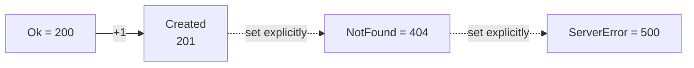
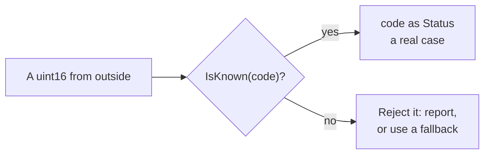

# Enum value

::note
<!-- sync:needs:start -->

**You'll need**: [Enum](/docs/learn/enum), [Convert](/docs/learn/convert)
<!-- sync:needs:end -->

::

Behind every enum case is a number. Usually nobody needs to know it — the [Enum](/docs/learn/enum) lesson never mentioned it. But sometimes the number is the point: a web server answers 404 for "not found", and a program that reads or writes such codes needs its cases to be exactly those numbers.

An enum can say how its numbers are stored, with an **underlying type** after a colon, and which number each case has. `as` then converts between a case and its number, in both directions.

## Underlying type and explicit numbers

```rux
enum Status: uint16 {
    Ok = 200,
    Created,
    NotFound = 404,
    ServerError = 500
}
```

`: uint16` stores each `Status` in a `uint16`. A case may give its number with `=`. A case without a number of its own takes the one after the case before it, so `Created` is 201. With no numbers given at all, the cases count up from zero — which is why `Direction::South as int` would be 2.



## From a case to its number, and back

```rux
PrintLine("Ok          is {}", Status::Ok as uint16);
```

```rux
let received: uint16 = 404;
let status = received as Status;
```

A case is not its number, though. `Status::Ok == 200` is refused: compare a case with a case, or convert first.

## Cases are ordered

Cases order by their numbers, so a range of codes is a pair of comparisons:

```rux
PrintLine("NotFound is an error: {}", status >= Status::NotFound);
```

## as does not check

Here is the surprise. `418 as Status` compiles and runs, and gives a `Status` that is none of its four cases. Nothing goes wrong until something asks which case it is — then a `match` naming all four has no arm for it, and the program stops with `Panic: no match arm matched value of 'Status'`.

So a number from outside — a file, the network, the user — is checked **before** it becomes a case:

```rux
func IsKnown(code: uint16) -> bool {
    return match code {
        200 => true,
        201 => true,
        404 => true,
        500 => true,
        else => false
    };
}
```



## Numbers are a promise

Once other programs read these numbers, they are part of your interface. Inserting a case without a number in the middle of the list would quietly renumber every unnumbered case after it. When the numbers matter, write them all out.

## The program

The whole lesson is one package in the [Examples repository](https://github.com/rux-lang/Examples/tree/main/Types/EnumValue). Its comments explain every step.

<!-- sync:program:start -->

```rux [Src/Main.rux]
// Behind every enum case is a number. Usually nobody needs to know it, but sometimes the number is
// the point: a web server answers 404 for "not found", and a program that reads or writes such
// codes needs its cases to be exactly those numbers.
//
// An enum can say how its numbers are stored, with an underlying type after a colon, and which
// number each case has. `as` converts between a case and its number, in both directions.
import Io::PrintLine;

// A case without a number of its own takes the one after the case before it, so `Created` is 201.
// With no numbers given at all, the cases count up from zero.
enum Status: uint16 {
    Ok = 200,
    Created,
    NotFound = 404,
    ServerError = 500
}

// A code read from outside should be checked before it becomes a `Status`, because `as` trusts it.
func IsKnown(code: uint16) -> bool {
    return match code {
        200 => true,
        201 => true,
        404 => true,
        500 => true,
        else => false
    };
}

func Main() -> int {
    // From a case to its number.
    PrintLine("Ok          is {}", Status::Ok as uint16);
    PrintLine("Created     is {}", Status::Created as uint16);
    PrintLine("NotFound    is {}", Status::NotFound as uint16);
    PrintLine("ServerError is {}", Status::ServerError as uint16);

    // From a number to a case.
    let received: uint16 = 404;
    let status = received as Status;
    PrintLine("{} means not found: {}", received, status == Status::NotFound);

    // Cases order by their numbers, so a range of codes is a pair of comparisons.
    PrintLine("NotFound is an error: {}", status >= Status::NotFound);
    PrintLine("Created is an error:  {}", Status::Created >= Status::NotFound);

    // The surprise: `as` does not check. `418 as Status` compiles and runs, and gives a `Status`
    // that is none of its four cases. A `match` naming all four has no arm for it, so the program
    // stops there with `Panic: no match arm matched value of 'Status'`. So check first.
    let strange: uint16 = 418;
    PrintLine("{} is a known status: {}", received, IsKnown(received));
    PrintLine("{} is a known status: {}", strange, IsKnown(strange));

    // The numbers are now a promise to whoever reads them. Inserting a case without a number in
    // the middle of the list would quietly renumber the ones after it.
    return 0;
}
```

<!-- sync:program:end -->

## Run it

```sh
cd Examples/Types/EnumValue
rux run
```

<!-- sync:output:start -->

```
Ok          is 200
Created     is 201
NotFound    is 404
ServerError is 500
404 means not found: true
NotFound is an error: true
Created is an error:  false
404 is a known status: true
418 is a known status: false
```

<!-- sync:output:end -->

## Common mistakes

::warning
**Trusting `as` with an unchecked number.**\
`as` never refuses. `418 as Status` makes a value that no `match` arm fits, and the program stops later with `Panic: no match arm matched value of 'Status'` — far from the line that made it. Check the number first, as `IsKnown` does.
::

::warning
**Comparing a case with a number.**\
`Status::Ok == 200` fails with `error: operator '==' cannot compare left operand 'Status' with right operand 'int'`. Write `Status::Ok as uint16 == 200`, or compare with another case.
::

::warning
**Inserting a case in a numbered list.**\
Add `Accepted` between `Ok` and `Created`, and `Accepted` becomes 201 while `Created` moves to 202 — no error, just different numbers. Give every case whose number matters an explicit `=`.
::

## Try it yourself

1. Add `Accepted = 202` and `NoContent = 204`, update `IsKnown`, and print their numbers.
2. Write `func IsError(self: Status) -> bool` in an `extend Status` block, using a comparison rather than a `match`.
3. Write `func Name(self: Status) -> char8[..]` and use it to print the name of `received as Status`. What happens if you call it on `strange as Status`?
4. Declare `enum Level: uint8 { Low, Medium, High }` and print each case's number.

## Learn more

- [Backing type and explicit values](/docs/lang/enums/overview#backing-type-and-values) in the Rux Reference
- [Convert](/docs/learn/convert) — `as` between numeric types
- [Variant](/docs/learn/variant) — cases that carry data
- [Checked convert](/docs/learn/checked-convert) — conversions that report whether the value fits
