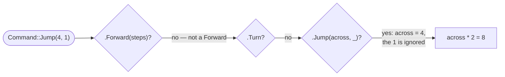

# Variant match

::note
<!-- sync:needs:start -->

**You'll need**: [Variant](/docs/learn/variant), [Match expression](/docs/learn/match-expression)
<!-- sync:needs:end -->

::

A variant's data can only be read once it is known which case is held. `match` does both in one step: an arm such as `.Forward(steps)` fits only a `Forward` value, and when it fits, the name in the parentheses is a **new binding** holding that case's data, ready to use in the arm.

That is the guarantee a variant gives. There is no way to read the steps of a `Turn`, because no arm can both fit a `Turn` and bind a `Forward`'s data.

## A list of commands

The program walks a robot through five commands. Each command carries what it needs and nothing more:

```rux
variant Command {
    Forward(int),
    Turn,
    Jump(int, int),
    Stop
}
```

## Binding the data

A match that produces a value, as in [Match expression](/docs/learn/match-expression):

```rux
func Cost(command: Command) -> int {
    return match command {
        .Forward(steps) => steps,
        .Turn => 1,
        .Jump(across, _) => across * 2,
        .Stop => 0
    };
}
```



The arms are tried in order, and the first whose case fits is the one that runs. Each pattern has one name per value the case carries:

| Pattern            | Fits          | Binds                                            |
| ------------------ | ------------- | ------------------------------------------------ |
| `.Forward(steps)`  | any `Forward` | `steps` — its one `int`                          |
| `.Turn`            | `Turn`        | nothing; the case carries nothing                |
| `.Jump(across, _)` | any `Jump`    | `across` — the first value; `_` skips the second |
| `.Stop`            | `Stop`        | nothing                                          |

`_` binds nothing. It is the way to say "a value goes here, and this arm does not need it" — the count of names must still match the case.

## A match as a statement

When each case calls for actions rather than a value, the arms are blocks:

```rux
.Jump(across, up) => {
    x += across;
    y += up;
},
```

The bindings exist only inside their own arm: `steps` is unknown in the `.Jump` arm, and `across` in all the others.

## Every case, named

There is no `else` arm in either match, and none is needed. Every case is named, and a match on a variant must name them all — leave one out, and it does not compile. As with [enums](/docs/learn/enum), that is a feature: add a fifth command, and the compiler lists every `match` that has yet to handle it.

## The program

The whole lesson is one package in the [Examples repository](https://github.com/rux-lang/Examples/tree/main/Types/VariantMatch). Its comments explain every step.

<!-- sync:program:start -->

```rux [Src/Main.rux]
// A variant's data can only be read once it is known which case is held. `match` does both in
// one step: an arm such as `.Forward(steps)` fits only a `Forward` value, and when it fits, the
// name in the parentheses is a new binding holding that case's data, ready to use in the arm.
//
// That is the guarantee a variant gives. There is no way to read the steps of a `Turn`, because
// no arm can both fit a `Turn` and bind a `Forward`'s data.
import Io::PrintLine;

// A walk is a list of commands, and each command carries what it needs and nothing more.
variant Command {
    Forward(int),
    Turn,
    Jump(int, int),
    Stop
}

// A match producing a value, as in the MatchExpression lesson. A case with several values binds
// them by position, one name each. `_` binds nothing: it is the way to say "a value goes here,
// and this arm does not need it". A case with no data has nothing to bind.
func Cost(command: Command) -> int {
    return match command {
        .Forward(steps) => steps,
        .Turn => 1,
        .Jump(across, _) => across * 2,
        .Stop => 0
    };
}

func Main() -> int {
    let walk: Command[5] = [
        Command::Forward(3),
        Command::Turn,
        Command::Jump(4, 1),
        Command::Forward(2),
        Command::Stop
    ];

    var x = 0;
    var y = 0;
    var facingEast = true;
    var cost = 0;
    for command in walk {
        // A match as a statement, with a block for each arm. The bindings exist only inside
        // their own arm: `steps` is unknown in the `.Jump` arm, and `across` in the others.
        match command {
            .Forward(steps) => {
                if facingEast {
                    x += steps;
                } else {
                    y += steps;
                }
            },
            .Turn => {
                facingEast = !facingEast;
            },
            .Jump(across, up) => {
                x += across;
                y += up;
            },
            .Stop => {
                PrintLine("stopped");
            }
        }
        cost += Cost(command);
        PrintLine("at ({}, {}), cost so far {}", x, y, cost);
    }

    // There is no `else` arm in either match, and none is needed. Every case is named, and a
    // match on a variant must name them all: leave one out, and it does not compile.
    return 0;
}
```

<!-- sync:program:end -->

## Run it

```sh
cd Examples/Types/VariantMatch
rux run
```

<!-- sync:output:start -->

```
at (3, 0), cost so far 3
at (3, 0), cost so far 4
at (7, 1), cost so far 12
at (7, 3), cost so far 14
stopped
at (7, 3), cost so far 14
```

<!-- sync:output:end -->

## Common mistakes

::warning
**Leaving a case out.**\
Drop the `.Stop` arm from `Cost` and it fails with `error: match on 'Command' is not exhaustive; missing Command::Stop`.
::

::warning
**The wrong number of names.**\
`.Jump(across)` fails with `error: pattern for 'Command::Jump' expects 2 fields, but found 1`. Every value the case carries needs a name or an `_`.
::

::warning
**Using a binding from another arm.**\
`.Turn => steps` fails with `error: name 'steps' is not defined in this scope`. `steps` was bound by the `.Forward` arm and exists only there.
::

::warning
**Reaching for `else` too soon.**\
`.Forward(steps) => steps, else => 0` compiles — and a new case added later falls silently into the `else`. When every case matters, name them all.
::

## Try it yourself

1. Add a case `Back(int)` that moves the other way, and handle it in both matches. Let the compiler tell you where.
2. Change `Cost` so that a `Jump` costs `across + up` instead, using both bindings.
3. Add a case with named fields, `Teleport { x: int; y: int; }`. A pattern for it names the fields in braces, and can bind them under new names: `.Teleport { x: toX, y: toY }` — handy here, where `x` and `y` already name the robot's position. Make it move the robot straight to that spot.
4. Count how many `Turn` commands the walk contains, using a `match` with a single interesting arm.

## Learn more

- [Variants with data](/docs/lang/enums/data) and [`match`](/docs/lang/statements/match) in the Rux Reference
- [Patterns](/docs/learn/patterns) — everything a match arm can say
- [Exhaustive](/docs/learn/exhaustive) — how the compiler checks that every case is handled
- [Error variant](/docs/learn/error-variant) — a variant used to describe what went wrong
