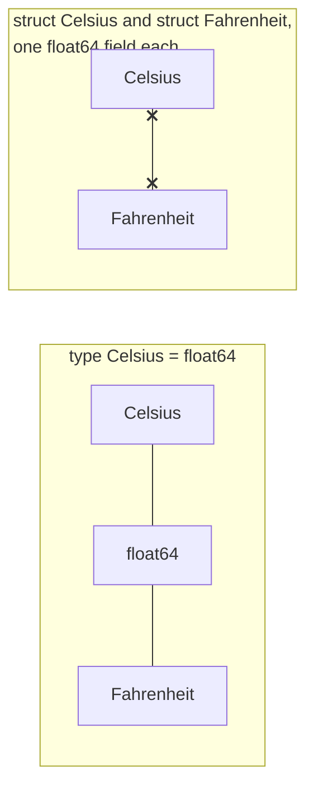

# Type alias

::note
<!-- sync:needs:start -->

**You'll need**: [Struct](/docs/learn/struct), [Slice](/docs/learn/slice)
<!-- sync:needs:end -->

::

`type` gives an existing type a **second name**. It creates nothing new: a value of the alias and a value of the aliased type are the same type, and can be used in place of each other without a conversion. What an alias buys is a spelling, written once — one that says what a value is for.

## Naming what a value means

A signature saying `Celsius` explains itself where one saying `float64` does not:

```rux
type Celsius = float64;
type Fahrenheit = float64;

func ToFahrenheit(temperature: Celsius) -> Fahrenheit {
    return temperature * 9.0 / 5.0 + 32.0;
}
```

Inside the function, `temperature` is a `float64` in every way — the arithmetic, the literals and the result all work as they would without the alias.

## Shortening compound types

An alias is most useful on compound types, where the full spelling is long and repeated:

```rux
type Bytes = uint8[..];
type Row = int32[3];
```

`func Sum(values: Bytes) -> uint` reads as "sum some bytes", and a `uint8[4]` array is passed to it exactly as it would be to a `uint8[..]` parameter.

## Same type, not a new type



Here is the trap worth knowing before relying on aliases for safety: an alias is only a spelling, so it gives **no protection at all**. `Celsius` and `Fahrenheit` are both `float64`, which makes them the same type, and nothing stops one being passed where the other is meant:

```rux
let mistake: Fahrenheit = 212.0;
PrintLine("this compiles and is wrong: {}F treated as Celsius is {}F",
    mistake, ToFahrenheit(mistake));
```

When two things must not be mixed up, they need to be different types. A struct with a single field, `struct Celsius { degrees: float64; }`, is one: two such structs are never the same type, whatever their fields. With structs, the same mistake is refused at compile time.

| You want…                                    | Use                         |
| -------------------------------------------- | --------------------------- |
| a shorter or clearer spelling of a type      | `type Name = …;`            |
| a value that cannot be confused with another | `struct Name { value: …; }` |

## The program

The whole lesson is one package in the [Examples repository](https://github.com/rux-lang/Examples/tree/main/Types/TypeAlias). Its comments explain every step.

<!-- sync:program:start -->

```rux [Src/Main.rux]
// `type` gives an existing type a second name. It creates nothing new: a value
// of the alias and a value of the aliased type are the same type, and can be
// used in place of each other without a conversion.
import Io::PrintLine;

// The point is a spelling written once. A signature saying `Celsius` explains
// itself where one saying `float64` does not.
type Celsius = float64;
type Fahrenheit = float64;

// It is most useful on compound types, where the full spelling is long and
// repeated. These two are the ones worth reaching for.
type Bytes = uint8[..];
type Row = int32[3];

func ToFahrenheit(temperature: Celsius) -> Fahrenheit {
    return temperature * 9.0 / 5.0 + 32.0;
}

func Sum(values: Bytes) -> uint {
    var total: uint = 0;
    for i in 0..values.length {
        total += values[i] as uint;
    }
    return total;
}

func Main() -> int {
    let boiling: Celsius = 100.0;
    PrintLine("{}C is {}F", boiling, ToFahrenheit(boiling));

    let data: uint8[4] = [ 1, 2, 3, 4 ];
    PrintLine("sum of bytes {}", Sum(data));

    let row: Row = [ 10, 20, 30 ];
    PrintLine("row {} {} {}", row[0], row[1], row[2]);

    // The trap worth knowing before relying on aliases for safety: an alias is
    // only a spelling, so it gives no protection at all. `Celsius` and
    // `Fahrenheit` are both `float64`, which makes them the same type, and
    // nothing stops one being passed where the other is meant:
    let mistake: Fahrenheit = 212.0;
    PrintLine("this compiles and is wrong: {}F treated as Celsius is {}F",
        mistake, ToFahrenheit(mistake));

    // When two things must not be mixed up, they need to be different types.
    // A struct with a single field, `struct Celsius { degrees: float64; }`, is
    // one: two such structs are never the same type, whatever their fields.
    return 0;
}
```

<!-- sync:program:end -->

## Run it

```sh
cd Examples/Types/TypeAlias
rux run
```

<!-- sync:output:start -->

```
100.0C is 212.0F
sum of bytes 10
row 10 20 30
this compiles and is wrong: 212.0F treated as Celsius is 413.6F
```

<!-- sync:output:end -->

## Common mistakes

::warning
**Expecting an alias to keep values apart.**\
`ToFahrenheit(mistake)` with a `Fahrenheit` argument compiles and gives a wrong answer. If the two must not mix, make them structs: with `struct Celsius` and `struct Fahrenheit`, the same call fails with `error: argument 1 to 'ToFahrenheit' has type 'Fahrenheit', but parameter 'temperature' requires 'Celsius'`.
::

::warning
**Being surprised by the full type in an error.**\
Error messages speak of the real type, not the alias. Passing an `int[3]` to `Sum` fails with `error: argument 1 to 'Sum' has type 'int[3]', but parameter 'values' requires 'uint8[..]'` — `Bytes` does not appear.
::

::warning
**Extending an alias.**\
`extend Celsius { … }` adds its methods to `float64` itself, so every `float64` in the package gains them — temperature or not. Methods belong on a type of their own.
::

## Try it yourself

1. Add `type Kelvin = float64;` and a function `ToKelvin(temperature: Celsius) -> Kelvin`.
2. Write `func RowSum(row: Row) -> int32` and print the sum of `row`.
3. Replace the two aliases with single-field structs, `struct Celsius { degrees: float64; }` and its twin, and make the program compile again. Which line now refuses to compile?
4. Write `type Name = char8[..];` and use it in a function that greets someone.

## Learn more

- [Type aliases](/docs/lang/aliases/overview) and [Using type aliases](/docs/lang/aliases/usage) in the Rux Reference
- [Function type aliases](/docs/lang/aliases/function-types) — naming a function type
- [Struct](/docs/learn/struct) — a new type rather than a new name
- [Function field](/docs/learn/function-field) — where a long function type is worth naming
