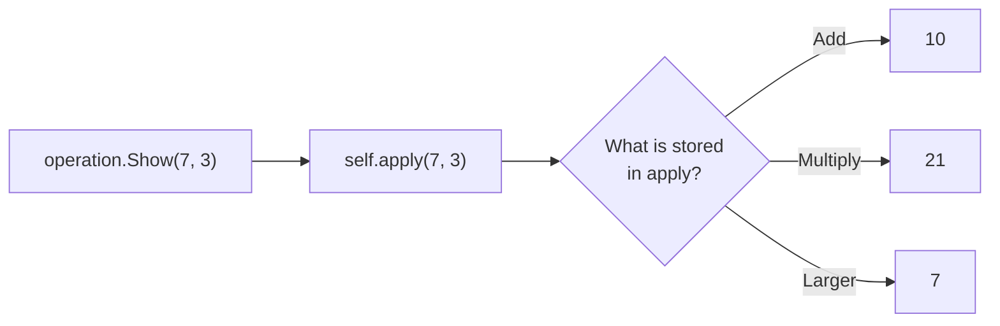

# Function field

::note
<!-- sync:needs:start -->

**You'll need**: [Callback](/docs/learn/callback), [Method](/docs/learn/method)
<!-- sync:needs:end -->

::

The [Callback](/docs/learn/callback) lesson passed a function as an argument and held one in a local. A struct field can hold one too. A value then carries its **behaviour** with it: an operation knows its symbol and also how to compute, and code that loops over operations needs to know neither in advance.

## A field of function type

The field's type is a function type, exactly as for a parameter — the parameter types in parentheses, then the return type:

```rux
struct Operation {
    symbol: char8[..];
    apply: func(int, int) -> int;
}
```

Any function that takes two `int`s and returns an `int` fits in `apply`: `Add`, `Subtract`, `Multiply` and `Larger` all do.

## Storing a function

A function is stored by its name, without parentheses — as when passing one to a callback parameter:

```rux
Operation { symbol: "+", apply: Add },
```

`Add` is the function itself; `Add(…)` would call it and store the result, which is an `int`, not a function.

## Calling through the field

Calling a field looks like calling a method, but `apply` is **data**: whatever function was stored in it is what runs.

```rux
func Show(self: &Operation, a: int, b: int) {
    PrintLine("{} {} {} = {}", a, self.symbol, b, self.apply(a, b));
}
```



The loop that prints all four lines names none of the four functions:

```rux
for operation in operations {
    operation.Show(7, 3);
}
```

Adding a fifth operation means adding one line to the array — the loop does not change.

## Method or function field?

| A method `Show`                     | A function field `apply`            |
| ----------------------------------- | ----------------------------------- |
| Declared once in `extend Operation` | Set separately in every value       |
| The same code for every `Operation` | Different code in each `Operation`  |
| Cannot be changed                   | Assigned like any field, on a `var` |

A function field is assigned like any other field, which changes what the value does from then on:

```rux
var changing = Operation { symbol: "?", apply: Add };
changing.Show(6, 4);
changing.apply = Multiply;
changing.Show(6, 4);
```

## The program

The whole lesson is one package in the [Examples repository](https://github.com/rux-lang/Examples/tree/main/Types/FunctionField). Its comments explain every step.

<!-- sync:program:start -->

```rux [Src/Main.rux]
// The Callback lesson passed a function as an argument and held one in a local. A struct field
// can hold one too. A value then carries its behaviour with it: an operation knows its symbol and
// also how to compute, and code that loops over operations needs to know neither in advance.
//
// The field's type is a function type, exactly as for a parameter: `func(int, int) -> int`.
import Io::PrintLine;

func Add(a: int, b: int) -> int {
    return a + b;
}

func Subtract(a: int, b: int) -> int {
    return a - b;
}

func Multiply(a: int, b: int) -> int {
    return a * b;
}

func Larger(a: int, b: int) -> int {
    return a > b ? a : b;
}

struct Operation {
    symbol: char8[..];
    apply: func(int, int) -> int;
}

extend Operation {
    // Calling a field looks like calling a method, but `apply` is data: whatever function was
    // stored in it is what runs.
    func Show(self: &Operation, a: int, b: int) {
        PrintLine("{} {} {} = {}", a, self.symbol, b, self.apply(a, b));
    }
}

func Main() -> int {
    // A function is stored by name, without parentheses, as when passing one.
    let operations: Operation[4] = [
        Operation { symbol: "+", apply: Add },
        Operation { symbol: "-", apply: Subtract },
        Operation { symbol: "*", apply: Multiply },
        Operation { symbol: "max", apply: Larger }
    ];

    // One loop, four behaviours. Nothing in it names any of the four functions.
    for operation in operations {
        operation.Show(7, 3);
    }

    // The field is called directly from outside a method too.
    let first = operations[0];
    PrintLine("through the field: {}", first.apply(20, 22));

    // A function field is assigned like any other field, which changes what the value does.
    var changing = Operation { symbol: "?", apply: Add };
    changing.Show(6, 4);
    changing.apply = Multiply;
    changing.Show(6, 4);
    return 0;
}
```

<!-- sync:program:end -->

## Run it

```sh
cd Examples/Types/FunctionField
rux run
```

<!-- sync:output:start -->

```
7 + 3 = 10
7 - 3 = 4
7 * 3 = 21
7 max 3 = 7
through the field: 42
6 ? 4 = 10
6 ? 4 = 24
```

<!-- sync:output:end -->

## Common mistakes

::warning
**Calling the function instead of storing it.**\
`apply: Add()` fails with `error: call to 'Add' expects 2 arguments, but 0 were provided`. Write the name alone: `apply: Add`.
::

::warning
**A function of the wrong shape.**\
A one-argument `Negate` cannot go in `apply`: `apply: Negate` fails with `error: field 'apply' in initializer for 'Operation' has type 'func(int) -> int', but its declaration requires 'func(int, int) -> int'`. The parameter types and the return type must all match.
::

::warning
**Calling the field with the wrong arguments.**\
`first.apply(1)` fails with `error: call to 'function value' expects 2 arguments, but 1 was provided`. The field's type says how it must be called, whatever function is inside.
::

::warning
**Reassigning the field of a `let`.**\
With `let op = Operation { … };`, the line `op.apply = Add;` fails with `error: cannot modify immutable variable 'op'`. A function field follows the same rule as every other field.
::

## Try it yourself

1. Write `func Smaller(a: int, b: int) -> int` and add a `min` operation to the array. Nothing else should need to change.
2. Write `func Power(a: int, b: int) -> int` with a loop, and add `^` to the array.
3. Name the function type with an alias, `type Binary = func(int, int) -> int;`, and use it in the struct.
4. Give `Operation` a second function field, `check: func(int, int) -> bool`, that says whether the operation is safe for its arguments — for example, a division that refuses a zero divisor.

## Learn more

- [Function type aliases](/docs/lang/functions/function-types) in the Rux Reference
- [Callback](/docs/learn/callback) — a function passed as an argument
- [Type alias](/docs/learn/type-alias) — a short name for a long function type
- [Interface](/docs/learn/interface) — behaviour shared by many types, chosen by type rather than stored per value
