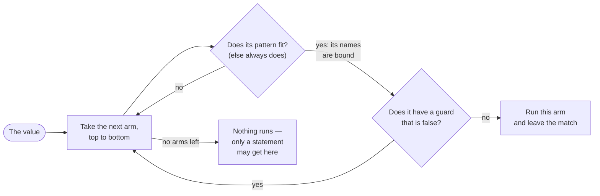

# Part 7: Patterns

[Part 3](/docs/learn/control-flow) introduced `match` with literal arms, and [Part 6](/docs/learn/types) used it to take variants apart. This part is about everything else an arm can say. A pattern can test a range of numbers, look at two values at once, pick fields out by name, recognise a character, and carry a condition of its own. By the end you can turn a page of `if` / `else if` tests into a `match` that reads like a table — and you will know why the compiler refuses a match that forgets a case.

## What you will learn

- Adding a condition to an arm with a guard, `pattern if condition =>`, and what happens when it is false.
- Matching a whole run of integers with `1..=9` and `0..10`.
- Deciding on several values at once by matching a tuple: `(0, 0)`, `(x, 0)`, `(_, y)`.
- Taking a variant case apart by field name: `.Circle { radius }`, `{ radius: r }`, `{ radius: 0 }`.
- Matching characters, and using a guard for a whole class of them.
- Why a match on a variant must name every case, and when `else` is needed — or harmful.

## How an arm is chosen

Each lesson adds a new kind of pattern, but the way a `match` uses them never changes:



The compiler checks the rest before the program ever runs. For a variant or a `bool`, every case must have an unguarded arm; a match that produces a value from a number must end with `else`. That is why a value-producing match can never reach "no arms left".

## Lessons

<!-- sync:lessons:start -->

|     | Lesson                                             | What you will learn                                                       |
| --- | -------------------------------------------------- | ------------------------------------------------------------------------- |
| 7.1 | [Guard](/docs/learn/guard)                         | add an `if` condition to a match arm                                      |
| 7.2 | [Range pattern](/docs/learn/range-pattern)         | match a whole range of numbers in one arm                                 |
| 7.3 | [Tuple pattern](/docs/learn/tuple-pattern)         | match several values at once as a tuple                                   |
| 7.4 | [Struct pattern](/docs/learn/struct-pattern)       | take a struct-shaped variant case apart by field name                     |
| 7.5 | [Character pattern](/docs/learn/character-pattern) | match single characters                                                   |
| 7.6 | [Exhaustive](/docs/learn/exhaustive)               | why a match on a variant must cover every case, and when `else` is needed |

<!-- sync:lessons:end -->

## Before you start

Finish [Part 3: Control flow](/docs/learn/control-flow) — especially [Match](/docs/learn/match) and [Match expression](/docs/learn/match-expression) — and [Part 6: Types](/docs/learn/types), whose [Variant](/docs/learn/variant) and [Variant match](/docs/learn/variant-match) lessons most of this part builds on. Tuples come from [Part 5](/docs/learn/sequences). Each lesson's package is in the Examples repository's `Patterns/` folder:

```sh
cd Examples/Patterns/Guard
rux run
```

## After this part

[Part 8: Optionals](/docs/learn/optionals) applies these patterns to a value that may be absent, `T?`, where the arm the compiler will never let you forget is `none`. [Part 10: Sum types](/docs/learn/sum-types) later adds patterns that match by type, such as `n: int32 =>`. The next checkpoint project, [Calculator](/docs/learn/calculator), comes after [Part 9: Errors](/docs/learn/errors).

For the full rules, see [`match`](/docs/lang/statements/match), [ranges](/docs/lang/ranges/overview) and [tuple destructuring](/docs/lang/tuples/destructuring) in the Rux Reference.
