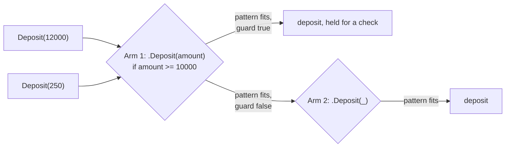

# Guard

::note
<!-- sync:needs:start -->

**You'll need**: [Variant match](/docs/learn/variant-match), [Match expression](/docs/learn/match-expression), [Comparison](/docs/learn/comparison)
<!-- sync:needs:end -->

::

A pattern describes the _shape_ of a value: "a deposit", "the number zero". Sometimes the shape is not enough, and what you really mean is "a deposit, but only a large one". A **guard** adds that extra condition to an arm. It is the first of the tools in this part for saying more in a `match` arm than a plain literal can.

## A condition after the pattern

Write `if` and a `bool` expression after the pattern, just before the `=>`:

```rux
.Deposit(amount) if amount >= 10000 => "deposit, held for a check",
```

The arm is taken only when the pattern matches **and** the guard is true. The guard runs after the pattern, so it can use the names the pattern has just bound — here `amount`, the data the `.Deposit` case carries.

## A false guard moves on

When the guard turns out false, nothing is lost: the match simply tries the next arm, exactly as if this one had not matched at all. That is what makes the pair of `.Deposit` arms in `Review` work:

```rux
func Review(entry: Transaction) -> char8[..] {
    return match entry {
        .Deposit(amount) if amount >= 10000 => "deposit, held for a check",
        .Deposit(_) => "deposit",
        .Withdrawal(amount) if amount > 500 => "withdrawal, over the daily limit",
        .Withdrawal(_) => "withdrawal",
        .Fee => "fee"
    };
}
```

Follow two deposits through it:



Arms are tried from top to bottom, so each guarded arm sits **above** the plain arm that catches the rest of the same case. The plain arm is the safety net for every deposit the guard turned away.

## A guard on a plain name

A plain name is a pattern too: it matches any value and binds it. Add a guard, and it becomes a condition on the whole value — something a literal pattern cannot express:

```rux
func Parity(number: int32) -> char8[..] {
    return match number {
        0 => "zero",
        value if value % 2 == 0 => "even",
        else => "odd"
    };
}
```

`0` is checked first and claims zero. Every other number reaches the second arm, is bound to `value`, and is accepted only if it is even. The odd ones fall through to `else`.

| Arm                          | Matches when                                      |
| ---------------------------- | ------------------------------------------------- |
| `0 =>`                       | the value is exactly 0                            |
| `value if value % 2 == 0 =>` | any value, bound to `value`, for which `% 2` is 0 |
| `.Deposit(amount) if … =>`   | a `Deposit`, and the guard holds for its `amount` |
| `else =>`                    | anything that no arm above it took                |

## The program

The whole lesson is one package in the [Examples repository](https://github.com/rux-lang/Examples/tree/main/Patterns/Guard). Its comments explain every step.

<!-- sync:program:start -->

```rux [Src/Main.rux]
// A pattern describes the shape of a value: "a deposit", "the number zero". Sometimes the shape is
// not enough, and you want "a deposit, but only a large one". A guard adds that condition: write
// `if` and a `bool` expression after the pattern, just before the `=>`.
//
// The arm is taken only when the pattern matches *and* the guard is true. The guard runs after the
// pattern, so it can use the names the pattern has just bound. When the guard turns out false,
// nothing is lost: the match moves on and tries the next arm, exactly as if this one had not
// matched at all.
import Io::PrintLine;

variant Transaction {
    Deposit(int32),
    Withdrawal(int32),
    Fee
}

// Arms are tried from top to bottom, so each guarded arm sits above the plain arm that catches the
// rest of the same case. Swap them and the guarded arm could never be reached.
func Review(entry: Transaction) -> char8[..] {
    return match entry {
        .Deposit(amount) if amount >= 10000 => "deposit, held for a check",
        .Deposit(_) => "deposit",
        .Withdrawal(amount) if amount > 500 => "withdrawal, over the daily limit",
        .Withdrawal(_) => "withdrawal",
        .Fee => "fee"
    };
}

// A plain name is a pattern too: it matches any value and binds it. Add a guard and it becomes a
// condition on the whole value, something a literal pattern cannot express.
func Parity(number: int32) -> char8[..] {
    return match number {
        0 => "zero",
        value if value % 2 == 0 => "even",
        else => "odd"
    };
}

func Main() -> int {
    let entries: Transaction[5] = [
        Transaction::Deposit(250),
        Transaction::Deposit(12000),
        Transaction::Withdrawal(80),
        Transaction::Withdrawal(900),
        Transaction::Fee
    ];
    for index in 0..5 {
        PrintLine("{}", Review(entries[index]));
    }

    PrintLine("0 is {}, 14 is {}, -7 is {}", Parity(0), Parity(14), Parity(-7));
    return 0;
}
```

<!-- sync:program:end -->

## Run it

```sh
cd Examples/Patterns/Guard
rux run
```

<!-- sync:output:start -->

```
deposit
deposit, held for a check
withdrawal
withdrawal, over the daily limit
fee
0 is zero, 14 is even, -7 is odd
```

<!-- sync:output:end -->

## Common mistakes

::warning
**A guarded arm below its plain arm.**\
Put `.Deposit(_)` above `.Deposit(amount) if amount >= 10000` and the program still compiles — but every deposit is taken by the plain arm first, so the guarded one can never run, and `Deposit(12000)` prints just `deposit`. The compiler does not warn about it. Specific arms go first.
::

::warning
**Counting a guarded arm as covering its case.**\
A guard might be false, so a guarded arm never counts towards covering a case. Delete `.Deposit(_) => "deposit",` and the match fails with `error: match on 'Transaction' is not exhaustive; missing Transaction::Deposit`, even though a `.Deposit` arm is still there.
::

::warning
**A guarded number match with no `else`.**\
Guards cannot prove that every integer is covered. Remove `else => "odd"` from `Parity` and the compiler stops with `error: match on 'int32' is not exhaustive; its arms do not cover every value`.
::

## Try it yourself

1. Swap the two `.Deposit` arms and predict what `Deposit(12000)` prints before you run it.
2. Add an arm to `Review` that labels a withdrawal of more than 5000 as `"withdrawal, blocked"`. Where must it go so that it can be reached?
3. Extend `Parity` so that even numbers above 100 print `"large even"`.

## Learn more

- [`match`](/docs/lang/statements/match) in the Rux Reference — its Guards section
- [Range pattern](/docs/learn/range-pattern) — matching a whole run of numbers, with or without a guard
- [Exhaustive](/docs/learn/exhaustive) — which arms count when the compiler checks that every case is covered
