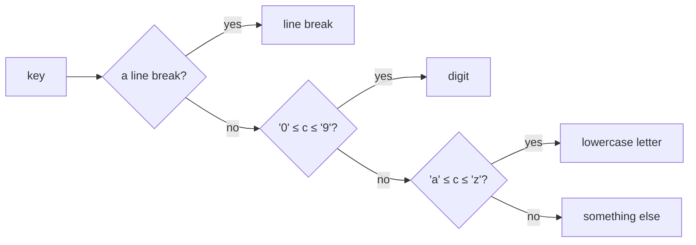

# Character pattern

::note
<!-- sync:needs:start -->

**You'll need**: [Character](/docs/learn/character), [Match](/docs/learn/match), [Guard](/docs/learn/guard)
<!-- sync:needs:end -->

::

A character literal is a pattern, just as a number is. That makes `match` the natural way to react to a key press, a command letter or a separator in some text: one arm per character, and `else` for the rest. This lesson shows the arms, the one rule about their type, and what to do when you need a whole class of characters such as "any digit".

## One arm per character

`'w' =>` matches the character w. Escapes work the same way they do in a [literal](/docs/learn/character): `' '` is a space and `'\n'` a line break, and any Unicode character can have an arm, `'λ'` included.

```rux
func Command(key: char32) -> char8[..] {
    return match key {
        'w' => "move up",
        'a' => "move left",
        's' => "move down",
        'd' => "move right",
        ' ' => "jump",
        'λ' => "cast a spell",
        else => "ignored"
    };
}
```

Uppercase and lowercase are different characters, so `'W'` does not reach the first arm. Anything without an arm of its own falls through to `else`. A match that produces a value from a character should always end with one: a `char32` has far too many values to list, and `else` is where you decide what all the others mean.

## The pattern and the value share a width

A pattern must have the same character width as the value it is matched against:

| Value type                               | Pattern | Example    |
| ---------------------------------------- | ------- | ---------- |
| `char32` — an unprefixed literal's type  | `'w'`   | `'w' =>`   |
| `char8` — such as a byte out of a string | `c8'w'` | `c8'w' =>` |

`Command` takes a `char32`, so its plain `'w'` patterns fit. A `char8` value is matched with the `c8` prefix you met in [Character](/docs/learn/character) — `c8'w'`. Every byte of a string literal is a `char8`, as [String literal](/docs/learn/string-literal) shows later in the course.

## A class of characters needs a guard

There is no character range pattern: `'a'..='z'` is refused. When you need a whole class, bind the character to a name and test it in a [guard](/docs/learn/guard):

```rux
func Kind(key: char32) -> char8[..] {
    return match key {
        '\n' => "line break",
        c if c >= '0' && c <= '9' => "digit",
        c if c >= 'a' && c <= 'z' => "lowercase letter",
        else => "something else"
    };
}
```

This works because characters compare by their code, and the digits, like the letters `a` to `z`, have consecutive codes. `'7'` lies between `'0'` and `'9'`; `'K'` is an uppercase letter, whose codes come before the lowercase ones, so it is "something else".



## The program

The whole lesson is one package in the [Examples repository](https://github.com/rux-lang/Examples/tree/main/Patterns/CharacterPattern). Its comments explain every step.

<!-- sync:program:start -->

```rux [Src/Main.rux]
// A character literal is a pattern, just as a number is. `'w' =>` matches the character w, and
// escapes work the same way they do in a literal: `' '` is a space, `'\n'` a line break.
//
// The pattern must have the same character width as the value. An unprefixed `'w'` is a `char32`,
// so it matches a `char32` value; a `char8` value, such as a byte read out of a text literal, is
// matched with `c8'w'` instead. Mix the two and the compiler stops with
//     error: pattern has type 'char32', but the matched value has type 'char8'
//
// There is no character range pattern. `'a'..='z' =>` stops with
//     error: range pattern cannot match value of type 'char32'
// When you need a whole class of characters, bind the character and test it in a guard.
import Io::PrintLine;

// One arm per key. Uppercase and lowercase are different characters, so `'W'` would not reach the
// first arm, and anything without an arm of its own falls through to `else`.
func Command(key: char32) -> char8[..] {
    return match key {
        'w' => "move up",
        'a' => "move left",
        's' => "move down",
        'd' => "move right",
        ' ' => "jump",
        'λ' => "cast a spell",
        else => "ignored"
    };
}

// A guard stands in for the missing range pattern. Characters compare by their code, and the
// digits, like the letters, have consecutive codes.
func Kind(key: char32) -> char8[..] {
    return match key {
        '\n' => "line break",
        c if c >= '0' && c <= '9' => "digit",
        c if c >= 'a' && c <= 'z' => "lowercase letter",
        else => "something else"
    };
}

func Main() -> int {
    let keys: char32[6] = ['w', 'd', ' ', 'λ', 'W', 'q'];
    for index in 0..6 {
        PrintLine("'{}' -> {}", keys[index], Command(keys[index]));
    }

    PrintLine("'7' is a {}, 'k' is a {}, 'K' is {}", Kind('7'), Kind('k'), Kind('K'));
    PrintLine("'\\n' is a {}", Kind('\n'));
    return 0;
}
```

<!-- sync:program:end -->

## Run it

```sh
cd Examples/Patterns/CharacterPattern
rux run
```

<!-- sync:output:start -->

```
'w' -> move up
'd' -> move right
' ' -> jump
'λ' -> cast a spell
'W' -> ignored
'q' -> ignored
'7' is a digit, 'k' is a lowercase letter, 'K' is something else
'\n' is a line break
```

<!-- sync:output:end -->

## Common mistakes

::warning
**A pattern of the wrong width.**\
Each character of a string literal is a `char8`, while an unprefixed `'a'` is a `char32`. Matching one with the other stops with `error: pattern has type 'char32', but the matched value has type 'char8'`. Write `c8'a'` for a `char8` value.
::

::warning
**A character range.**\
`'a'..='z' =>` stops with `error: range pattern cannot match value of type 'char32'` — ranges work on integers only. Bind the character and test it in a guard, as `Kind` does.
::

::warning
**Forgetting the other case.**\
`'w'` and `'W'` are different characters, so an arm for one never matches the other. Give each its own arm; an arm holds exactly one pattern, so there is no `'w' | 'W'`.
::

## Try it yourself

1. Make `Command` accept the uppercase keys `W`, `A`, `S` and `D` as well.
2. Extend `Kind` so that `'K'` is reported as an `"uppercase letter"`.
3. Loop over the text `"pattern matching"` with `for c in …` — each `c` is a `char8` — and count its vowels with arms such as `c8'a' =>`.

## Learn more

- [`char32`](/docs/lang/character/char32), [`char8`](/docs/lang/character/char8) and [`match`](/docs/lang/statements/match) in the Rux Reference
- [Character](/docs/learn/character) — character literals, escapes and widths
- [Word count](/docs/learn/word-count) — a checkpoint project that sorts characters into letters and the rest
